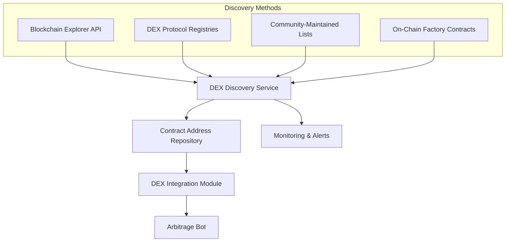
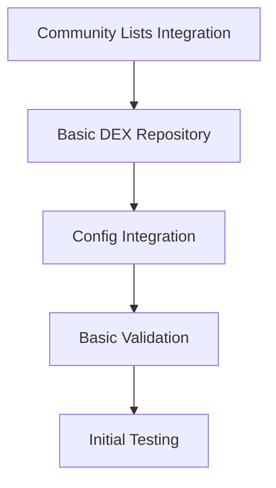
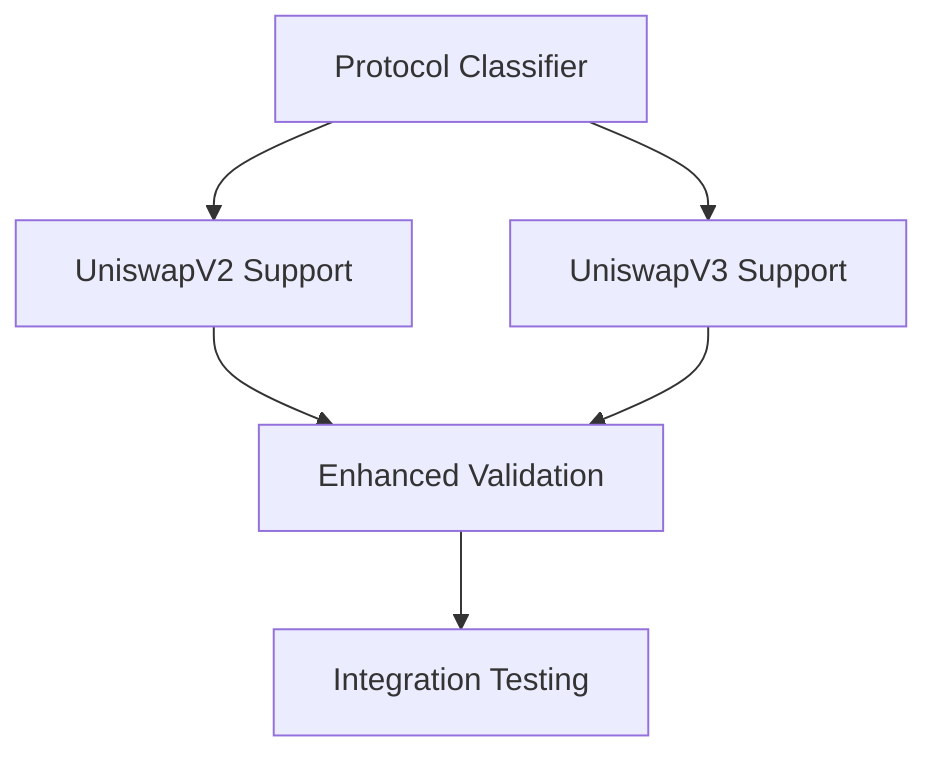
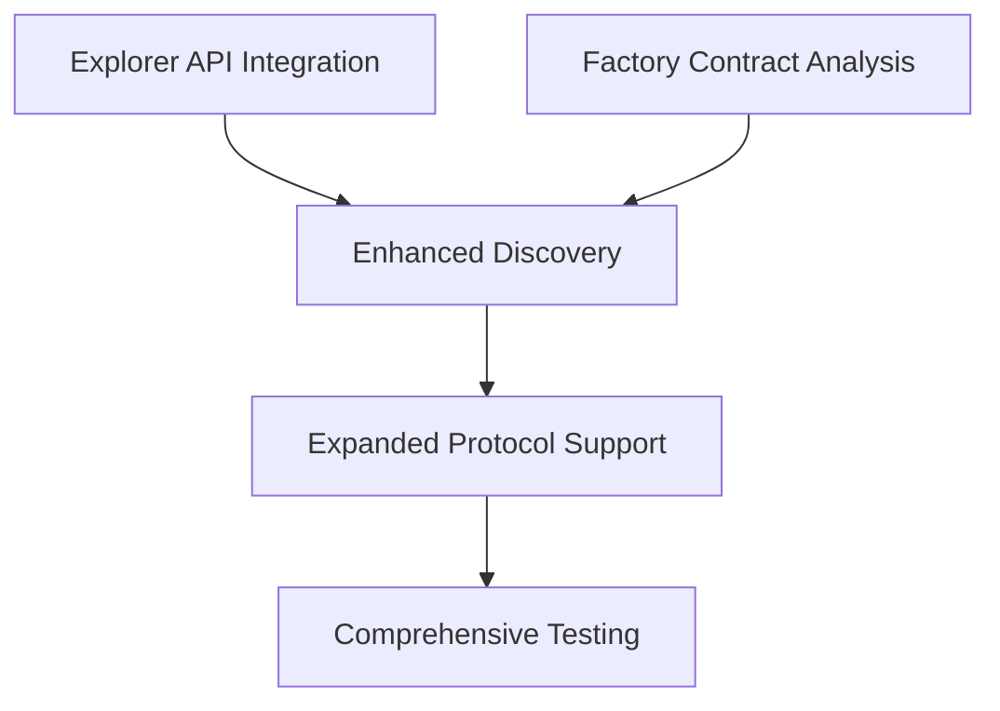
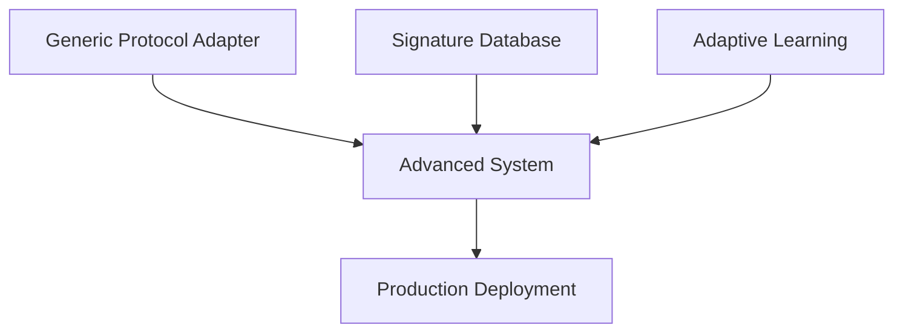
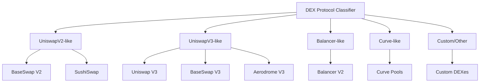
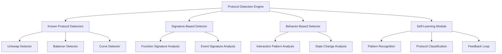
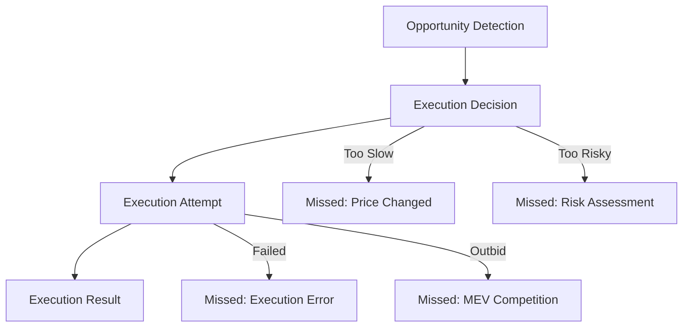

# DEX Discovery and Integration System
## Implementation Plan

## Problem Statement

The arbitrage bot is currently not detecting many opportunities for profitable trades due to insufficient DEX connections. Finding and configuring DEX contract addresses manually has proven difficult. This plan outlines an automated approach to discover, validate, and integrate DEX contracts on the Base network.

## Overview

We'll create a system that automatically discovers and integrates DEXes on the Base network, eliminating the need for manual contract address tracking. This will significantly increase the number of DEXes the bot can monitor, thereby increasing the likelihood of finding profitable arbitrage opportunities.



## Phased Implementation Plan

To manage complexity and deliver value quickly, we'll implement the system in phases:

### Phase 1: Community-Maintained Lists & Basic Discovery (1-2 days)


**Key Deliverables:**
1. **Community List Parser**: Integrate with DeFiLlama, DefiPulse, and other trusted sources
2. **Basic DEX Repository**: Simple storage for discovered DEXes
3. **Configuration Integration**: Update config system to use discovered DEXes
4. **Basic Validation**: Simple validation of discovered contracts
5. **Initial Testing**: Test with known DEXes

### Phase 2: Protocol Classification & V2/V3 Support (2-3 days)


**Key Deliverables:**
1. **Protocol Classifier**: Basic system to identify UniswapV2 vs UniswapV3 protocols
2. **UniswapV2 Support**: Specialized handling for V2-style DEXes
3. **UniswapV3 Support**: Specialized handling for V3-style DEXes
4. **Enhanced Validation**: Protocol-specific validation
5. **Integration Testing**: Test with real arbitrage scenarios

### Phase 3: Explorer API & Factory Contract Analysis (2-3 days)


**Key Deliverables:**
1. **Explorer API Integration**: Connect to Basescan API
2. **Factory Contract Analysis**: Discover pools from known factories
3. **Enhanced Discovery**: Combine multiple discovery methods
4. **Expanded Protocol Support**: Add Balancer and Curve-style protocols
5. **Comprehensive Testing**: Test across multiple protocol types

### Phase 4: Advanced Features (Optional, 3-4 days)


**Key Deliverables:**
1. **Generic Protocol Adapter**: For unknown protocols
2. **Signature Database**: Expandable function signature database
3. **Adaptive Learning**: Basic self-learning capabilities
4. **Production Deployment**: Full system deployment

## DEX Version Handling Strategy

### DEX Protocol Classification System

We'll implement a classification system that identifies and categorizes DEXes by their protocol type and version:



### Protocol-Specific Contract Detection

For each protocol type, we'll implement specialized detection logic:

#### UniswapV2-like DEXes
- **Factory Contract**: Identifies by `getPair(tokenA, tokenB)` function signature
- **Router Contract**: Identifies by `swapExactTokensForTokens()` function
- **Pair Contracts**: Identifies by `getReserves()` function
- **Fee Structure**: Typically fixed at 0.3% (30 bps)

#### UniswapV3-like DEXes
- **Factory Contract**: Identifies by `getPool(tokenA, tokenB, fee)` function signature
- **Router Contract**: Identifies by `exactInputSingle()` function
- **Pool Contracts**: Identifies by `slot0()` function
- **Fee Structure**: Multiple tiers (0.01%, 0.05%, 0.3%, 1%)

#### Balancer-like DEXes
- **Vault Contract**: Identifies by `swap()` function signature
- **Pool Registry**: Identifies by `getPool()` function
- **Pool Contracts**: Weighted, Stable, or Boosted pools
- **Fee Structure**: Configurable per pool

#### Curve-like DEXes
- **Factory Contract**: Identifies by `get_pool_from_lp_token()` function
- **Registry Contract**: Identifies by `get_n_coins()` function
- **Pool Contracts**: Identifies by `get_dy()` function
- **Fee Structure**: Typically very low (0.04%)

## Handling Custom and Unknown DEX Protocols

### Extensible Protocol Detection Framework

We'll implement an extensible framework that can adapt to new protocols:



### Generic Protocol Adapter

For unknown protocols, we'll implement a generic adapter that can work with minimal information:

```python
class GenericDEXAdapter:
    """Adapter for unknown DEX protocols."""
    
    async def analyze_contract(self, address: str) -> Dict[str, Any]:
        """Analyze contract to determine its capabilities."""
        # Detect common DEX patterns
        # Identify key functions
        # Map to internal representation
        
    async def create_interaction_model(self, analysis: Dict[str, Any]) -> Dict[str, Any]:
        """Create interaction model based on contract analysis."""
        # Map functions to standard operations
        # Determine price calculation method
        # Identify key parameters
```

## Success Metrics

### Phase 1: Community-Maintained Lists & Basic Discovery

**Input Metrics:**
- Number of community sources integrated
- Number of DEX lists parsed

**Process Metrics:**
- Processing time per list
- Validation success rate

**Output Metrics:**
- Number of new DEXes discovered
- Number of DEXes successfully validated
- Number of DEXes added to configuration

**Outcome Metrics:**
- Increase in unique trading pairs monitored
- Increase in arbitrage opportunities detected
- Reduction in "No profitable paths found" messages

**Profitability Metrics:**
- Average expected profit per opportunity (in ETH and USD)
- Median expected profit per opportunity
- Profit distribution (histogram of profit amounts)
- Profit-to-gas ratio for detected opportunities
- Total potential daily profit based on discovered opportunities

**Success Criteria:**
- At least 5 new DEXes discovered and integrated
- At least 20% increase in unique trading pairs
- At least 15% increase in arbitrage opportunities detected
- Average profit per opportunity increases by at least 10%
- At least 3 high-profit opportunities (>0.05 ETH) detected daily
- Profit-to-gas ratio improves by at least 15%

### Phase 2: Protocol Classification & V2/V3 Support

**Input Metrics:**
- Number of protocol signatures analyzed
- Number of DEXes classified by protocol

**Process Metrics:**
- Classification accuracy rate
- Protocol detection speed

**Output Metrics:**
- Number of DEXes with protocol-specific handling
- Number of V2 vs V3 protocols identified
- Validation success rate by protocol type

**Outcome Metrics:**
- Increase in successful price fetches
- Decrease in price calculation errors
- Increase in arbitrage opportunities between different protocol types

**Profitability Metrics:**
- Profit comparison between V2 and V3 DEX opportunities
- Protocol-specific profit analysis
- Cross-protocol arbitrage profit analysis
- Time-to-execution impact on realized profits
- Slippage impact on expected vs. realized profits

**Success Criteria:**
- At least 90% classification accuracy
- At least 10 DEXes with protocol-specific handling
- At least 25% increase in arbitrage opportunities detected
- Cross-protocol opportunities show 20% higher average profits
- Protocol-specific handling improves realized profit accuracy by 25%
- At least 5 high-profit (>0.1 ETH) cross-protocol opportunities detected daily

### Phase 3: Explorer API & Factory Contract Analysis

**Input Metrics:**
- Number of factory contracts analyzed
- Number of explorer API queries

**Process Metrics:**
- Factory contract analysis success rate
- Explorer API response time
- Pool discovery rate

**Output Metrics:**
- Number of pools discovered via factory contracts
- Number of DEXes discovered via explorer API
- Number of new protocol types supported

**Outcome Metrics:**
- Increase in total pools monitored
- Increase in cross-protocol arbitrage opportunities
- Improvement in price accuracy

**Profitability Metrics:**
- Profit potential from newly discovered pools
- Correlation between pool liquidity and profit potential
- Profit stability over time for different DEX types
- Profit opportunity duration analysis
- Competitive analysis (how quickly opportunities are taken by others)

**Success Criteria:**
- At least 50 new pools discovered
- At least 3 new protocol types supported
- At least 40% increase in arbitrage opportunities detected
- Newly discovered pools generate at least 30% of total profit opportunities
- Average profit per opportunity from newly discovered DEXes exceeds 0.03 ETH
- At least 3 "whale-sized" opportunities (>0.5 ETH profit) discovered weekly

### Phase 4: Advanced Features

**Input Metrics:**
- Number of unknown protocols analyzed
- Size of signature database

**Process Metrics:**
- Adapter generation success rate
- Learning system accuracy

**Output Metrics:**
- Number of custom protocols supported
- Number of automatically generated adapters
- Signature database coverage

**Outcome Metrics:**
- Increase in exotic arbitrage opportunities
- Reduction in manual configuration needs
- System adaptability to new protocols

**Profitability Metrics:**
- Profit from exotic/custom protocol opportunities
- Profit prediction accuracy
- Long-term profit trend analysis
- Market condition impact on profit opportunities
- Competitive advantage metrics (unique opportunities not visible to others)

**Success Criteria:**
- At least 3 custom protocols automatically supported
- At least 80% reduction in manual configuration needs
- At least 60% increase in total arbitrage opportunities detected
- Custom protocol opportunities generate at least 15% of total profits
- Profit prediction accuracy exceeds 85%
- At least 25% of profit opportunities are unique to our system

## Missed Opportunity Metrics



### Key Missed Opportunity Metrics

1. **Time-Based Missed Opportunities**
   - Number of opportunities that disappeared before execution
   - Average lifespan of profitable opportunities
   - Time between detection and execution decision
   - Profit potential of missed time-based opportunities

2. **Risk-Based Missed Opportunities**
   - Number of opportunities rejected due to risk assessment
   - Profit potential of risk-rejected opportunities
   - Post-analysis of risk-rejected opportunities (were they actually profitable?)
   - Risk threshold optimization metrics

3. **Execution-Based Missed Opportunities**
   - Number of failed execution attempts
   - Categorization of execution failures (gas issues, slippage, etc.)
   - Profit potential of execution-failed opportunities
   - Recovery rate (percentage of failed opportunities we could retry)

4. **Competition-Based Missed Opportunities**
   - Number of opportunities taken by competitors
   - MEV auction loss statistics
   - Gas price competition analysis
   - Profit potential of competition-lost opportunities

### Success Criteria Additions

- Reduce time-based missed opportunities by 30% by Phase 2
- Reduce execution-based missed opportunities by 50% by Phase 3
- Optimize risk thresholds to reduce false negatives by 25%
- Capture at least 15% more high-profit opportunities that would have been missed

## Implementation Timeline

1. **Phase 1: Community-Maintained Lists & Basic Discovery (1-2 days)**
   - Day 1: Implement community list integration and basic repository
   - Day 2: Implement configuration integration and basic validation

2. **Phase 2: Protocol Classification & V2/V3 Support (2-3 days)**
   - Day 3-4: Implement protocol classifier and V2/V3 support
   - Day 5: Implement enhanced validation and integration testing

3. **Phase 3: Explorer API & Factory Contract Analysis (2-3 days)**
   - Day 6-7: Implement explorer API integration and factory contract analysis
   - Day 8: Implement expanded protocol support and comprehensive testing

4. **Phase 4: Advanced Features (Optional, 3-4 days)**
   - Day 9-10: Implement generic protocol adapter and signature database
   - Day 11-12: Implement adaptive learning and production deployment

## Monitoring and Reporting

We'll implement a comprehensive monitoring and reporting system:

```python
class EnhancedDiscoveryMetrics:
    """Enhanced metrics with profitability focus."""
    
    def __init__(self):
        self.metrics = {
            "input": {},
            "process": {},
            "output": {},
            "outcome": {}
        }
        self.profit_metrics = {
            "daily_profit_potential": [],
            "profit_per_opportunity": [],
            "profit_by_dex_type": {},
            "profit_by_token_pair": {},
            "high_profit_opportunities": []
        }
        self.missed_opportunities = {
            "time_based": [],
            "risk_based": [],
            "execution_based": [],
            "competition_based": []
        }
        self.baseline = {}
```

### Regular Reporting

1. **Daily Metrics Report**: Automated daily report showing key metrics
2. **Phase Completion Report**: Comprehensive report at the end of each phase
3. **Executive Summary**: High-level overview of improvements for stakeholders
4. **Daily Profit Potential Report**: Summary of potential profits from discovered opportunities
5. **High-Value Opportunity Alerts**: Real-time alerts for high-profit opportunities
6. **Profit Trend Analysis**: Weekly analysis of profit trends and patterns
7. **DEX Profitability Ranking**: Ranking of DEXes by profit potential
8. **Missed Opportunity Report**: Analysis of missed opportunities and recommendations

## Next Steps

1. **Immediate Actions**
   - Finalize team assignments for Phase 1
   - Set up project repository and structure
   - Establish baseline metrics
   - Begin implementation of community list integration

2. **Preparation for Later Phases**
   - Research Basescan API integration
   - Identify key protocol signatures
   - Prepare test environment for protocol classification
   - Document known DEX patterns

3. **Stakeholder Communication**
   - Share implementation plan with stakeholders
   - Schedule regular progress updates
   - Establish feedback channels
   - Define escalation procedures

## Conclusion

This phased implementation plan provides a structured approach to solving the DEX discovery challenge. By starting with quick wins from community-maintained lists and progressively adding more sophisticated discovery methods, we'll rapidly increase the number of DEXes available for arbitrage opportunities while managing complexity and risk.

The comprehensive metrics system, with a focus on profitability and missed opportunities, will ensure we can measure success at each phase and make data-driven decisions about when to move to the next phase.