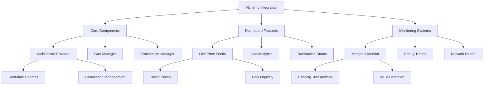

# Alchemy SDK Integration Plan

## Overview
Integrate Alchemy SDK as the primary Web3 interface for the arbitrage bot dashboard, focusing on Base network support and optimizing for real-time monitoring and transaction management.

## Architecture



## Implementation Phases

### Phase 1: Core Integration
1. WebSocket Provider
   - Replace current Web3 provider with Alchemy SDK
   - Implement enhanced WebSocket connections
   - Set up connection management and recovery
   - Configure Base network settings

2. Gas Manager
   - Implement gas price monitoring
   - Set up gas optimization strategies
   - Configure gas price alerts
   - Implement gas estimation improvements

3. Transaction Manager
   - Set up transaction tracking
   - Implement transaction status monitoring
   - Configure transaction retry logic
   - Set up transaction receipt validation

### Phase 2: Dashboard Features
1. Live Price Feeds
   - Implement real-time price monitoring
   - Set up pool liquidity tracking
   - Configure price update intervals
   - Implement price change alerts

2. Gas Analytics
   - Set up gas price trending
   - Implement gas price predictions
   - Configure gas usage analytics
   - Set up gas optimization recommendations

3. Transaction Status
   - Implement transaction status tracking
   - Set up confirmation monitoring
   - Configure status notifications
   - Implement transaction history

### Phase 3: Monitoring Systems
1. Mempool Monitor
   - Set up pending transaction monitoring
   - Implement MEV detection
   - Configure opportunity detection
   - Set up alert system

2. Debug Traces
   - Implement transaction tracing
   - Set up error analysis
   - Configure debug logging
   - Implement trace visualization

3. Network Health
   - Set up network status monitoring
   - Implement performance metrics
   - Configure health checks
   - Set up alert thresholds

## Technical Details

### API Configuration
```javascript
const config = {
    apiKey: "kRXhWVt8YU_8LnGS20145F5uBDFbL_k0",
    network: Network.BASE,
    maxRetries: 5
};
```

### WebSocket Settings
```javascript
const wsConfig = {
    reconnectAttempts: 5,
    reconnectInterval: 1000,
    timeout: 30000
};
```

### Monitoring Parameters
```javascript
const monitoringConfig = {
    gasUpdateInterval: 15000,
    priceUpdateInterval: 5000,
    healthCheckInterval: 60000,
    maxPendingTx: 100
};
```

## Success Metrics

1. Performance Metrics
   - WebSocket connection stability
   - Transaction confirmation times
   - Gas optimization effectiveness
   - System response times

2. Reliability Metrics
   - Connection uptime
   - Transaction success rate
   - Error recovery rate
   - Data accuracy

3. Business Metrics
   - Arbitrage opportunity detection rate
   - Successful trade execution rate
   - Gas cost savings
   - Profit optimization

## Next Steps

1. Begin Core Integration
   - Set up Alchemy SDK
   - Configure WebSocket provider
   - Implement basic monitoring

2. Test Basic Functionality
   - Verify connections
   - Test data streaming
   - Validate monitoring

3. Proceed with Dashboard Features
   - Implement UI components
   - Set up data visualization
   - Configure real-time updates