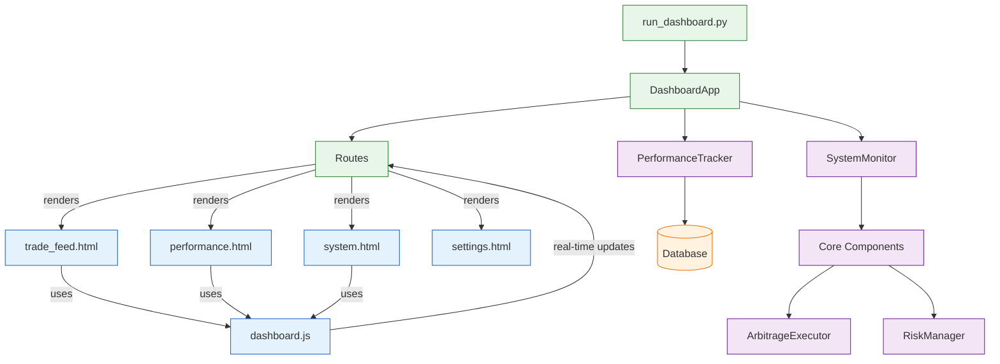

# Dashboard Components Flow

Key Features:
1. Real-time updates via WebSocket
2. Performance tracking and historical data
3. System monitoring integration
4. Configuration management

Dashboard Pages:
- trade_feed.html: Live trading activity
- performance.html: Historical performance metrics
- system.html: System health and status
- settings.html: Configuration management

Data Flow:
1. Core components generate events
2. Events stored in database
3. Dashboard queries and displays data
4. WebSocket provides real-time updates
5. User can modify settings through interface
