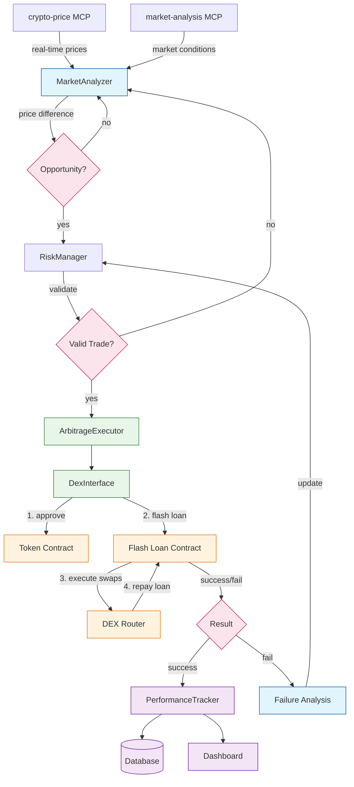

# Trade Execution Flow

## Trade Execution Steps

1. **Opportunity Detection**
   - MarketAnalyzer monitors prices via MCP servers
   - Identifies potential arbitrage opportunities
   - Initial profitability check

2. **Risk Validation**
   - RiskManager validates trade parameters
   - Checks market conditions
   - Verifies risk limits

3. **Trade Execution**
   - ArbitrageExecutor coordinates the trade
   - DexInterface handles blockchain interaction
   - Uses flash loans for atomic execution

4. **Contract Interaction**
   - Token approval
   - Flash loan borrowing
   - DEX swaps execution
   - Loan repayment

5. **Result Processing**
   - Success: Record profit and update metrics
   - Failure: Analyze cause and update risk parameters
   - Update dashboard with results

## Key Components

- **MarketAnalyzer**: Price monitoring and opportunity detection
- **RiskManager**: Trade validation and risk control
- **ArbitrageExecutor**: Trade coordination
- **DexInterface**: Blockchain interaction
- **PerformanceTracker**: Result recording and analysis

## Failure Handling

1. **Common Failures**
   - Insufficient liquidity
   - Price movement
   - High slippage
   - Failed transactions

2. **Response Actions**
   - Update risk parameters
   - Adjust gas settings
   - Modify trade size
   - Update price thresholds
