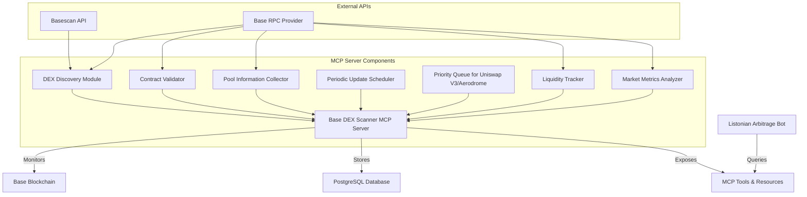
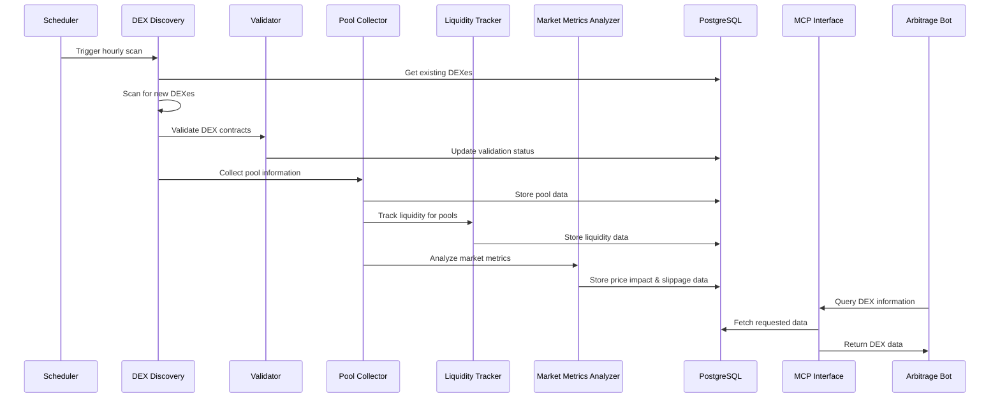
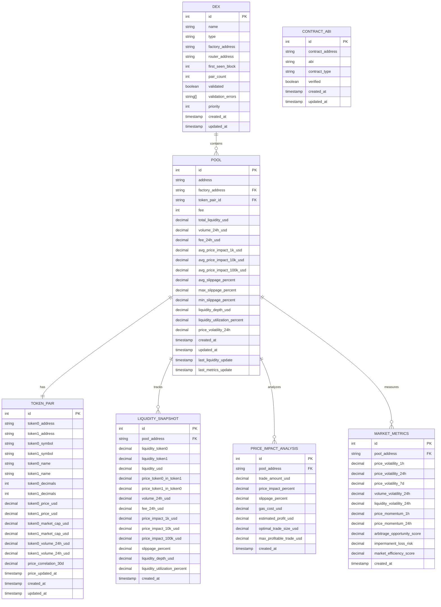

# Base DEX Scanner MCP Server Implementation Plan (Enhanced)

## Overview

This document outlines the detailed implementation plan for creating a Python-based MCP server that will continuously monitor the Base blockchain for new DEXes, with a focus on Uniswap V3 and Aerodrome. The server will store comprehensive DEX information in a PostgreSQL database, including detailed token pair data, liquidity metrics, price impact, and slippage estimates. This information will be exposed through the Model Context Protocol for the Listonian Arbitrage Bot to query.

## Architecture



### Component Interaction Flow



## Enhanced Database Schema

The database schema has been significantly enhanced to include comprehensive information about token pairs, liquidity, price impact, slippage estimates, and other quantitative metrics. This will provide the arbitrage bot with rich data for identifying profitable opportunities.

### Database Entity Relationship Diagram



### Data Models

```python
# src/db/models.py
from dataclasses import dataclass
from datetime import datetime
from typing import List, Optional, Dict, Any, Union
from decimal import Decimal

@dataclass
class DEX:
    """DEX information model."""
    id: Optional[int] = None
    name: str = ""
    type: str = ""  # 'v2' or 'v3'
    factory_address: str = ""
    router_address: Optional[str] = None
    first_seen_block: Optional[int] = None
    pair_count: int = 0
    validated: bool = False
    validation_errors: List[str] = None
    priority: int = 0  # Higher number = higher priority
    created_at: datetime = None
    updated_at: datetime = None
    
    def to_dict(self) -> Dict[str, Any]:
        """Convert to dictionary."""
        return {
            "id": self.id,
            "name": self.name,
            "type": self.type,
            "factory_address": self.factory_address,
            "router_address": self.router_address,
            "first_seen_block": self.first_seen_block,
            "pair_count": self.pair_count,
            "validated": self.validated,
            "validation_errors": self.validation_errors,
            "priority": self.priority,
            "created_at": self.created_at.isoformat() if self.created_at else None,
            "updated_at": self.updated_at.isoformat() if self.updated_at else None
        }

@dataclass
class TokenPair:
    """Token pair information model with enhanced market data."""
    id: Optional[int] = None
    token0_address: str = ""
    token1_address: str = ""
    token0_symbol: Optional[str] = None
    token1_symbol: Optional[str] = None
    token0_name: Optional[str] = None
    token1_name: Optional[str] = None
    token0_decimals: Optional[int] = None
    token1_decimals: Optional[int] = None
    token0_price_usd: Optional[Decimal] = None
    token1_price_usd: Optional[Decimal] = None
    token0_market_cap_usd: Optional[Decimal] = None
    token1_market_cap_usd: Optional[Decimal] = None
    token0_volume_24h_usd: Optional[Decimal] = None
    token1_volume_24h_usd: Optional[Decimal] = None
    price_correlation_30d: Optional[Decimal] = None
    price_updated_at: Optional[datetime] = None
    created_at: Optional[datetime] = None
    updated_at: Optional[datetime] = None
    
    def to_dict(self) -> Dict[str, Any]:
        """Convert to dictionary."""
        return {
            "id": self.id,
            "token0_address": self.token0_address,
            "token1_address": self.token1_address,
            "token0_symbol": self.token0_symbol,
            "token1_symbol": self.token1_symbol,
            "token0_name": self.token0_name,
            "token1_name": self.token1_name,
            "token0_decimals": self.token0_decimals,
            "token1_decimals": self.token1_decimals,
            "token0_price_usd": float(self.token0_price_usd) if self.token0_price_usd else None,
            "token1_price_usd": float(self.token1_price_usd) if self.token1_price_usd else None,
            "token0_market_cap_usd": float(self.token0_market_cap_usd) if self.token0_market_cap_usd else None,
            "token1_market_cap_usd": float(self.token1_market_cap_usd) if self.token1_market_cap_usd else None,
            "token0_volume_24h_usd": float(self.token0_volume_24h_usd) if self.token0_volume_24h_usd else None,
            "token1_volume_24h_usd": float(self.token1_volume_24h_usd) if self.token1_volume_24h_usd else None,
            "price_correlation_30d": float(self.price_correlation_30d) if self.price_correlation_30d else None,
            "price_updated_at": self.price_updated_at.isoformat() if self.price_updated_at else None,
            "created_at": self.created_at.isoformat() if self.created_at else None,
            "updated_at": self.updated_at.isoformat() if self.updated_at else None
        }

@dataclass
class Pool:
    """Pool information model with comprehensive metrics."""
    id: Optional[int] = None
    address: str = ""
    factory_address: str = ""
    token_pair_id: Optional[int] = None
    fee: Optional[int] = None  # For v3 pools
    total_liquidity_usd: Optional[Decimal] = None
    volume_24h_usd: Optional[Decimal] = None
    fee_24h_usd: Optional[Decimal] = None
    avg_price_impact_1k_usd: Optional[Decimal] = None
    avg_price_impact_10k_usd: Optional[Decimal] = None
    avg_price_impact_100k_usd: Optional[Decimal] = None
    avg_slippage_percent: Optional[Decimal] = None
    max_slippage_percent: Optional[Decimal] = None
    min_slippage_percent: Optional[Decimal] = None
    liquidity_depth_usd: Optional[Decimal] = None
    liquidity_utilization_percent: Optional[Decimal] = None
    price_volatility_24h: Optional[Decimal] = None
    created_at: Optional[datetime] = None
    updated_at: Optional[datetime] = None
    last_liquidity_update: Optional[datetime] = None
    last_metrics_update: Optional[datetime] = None
    
    # Non-database fields for convenience
    token_pair: Optional[TokenPair] = None
    
    def to_dict(self) -> Dict[str, Any]:
        """Convert to dictionary."""
        result = {
            "id": self.id,
            "address": self.address,
            "factory_address": self.factory_address,
            "token_pair_id": self.token_pair_id,
            "fee": self.fee,
            "total_liquidity_usd": float(self.total_liquidity_usd) if self.total_liquidity_usd else None,
            "volume_24h_usd": float(self.volume_24h_usd) if self.volume_24h_usd else None,
            "fee_24h_usd": float(self.fee_24h_usd) if self.fee_24h_usd else None,
            "avg_price_impact_1k_usd": float(self.avg_price_impact_1k_usd) if self.avg_price_impact_1k_usd else None,
            "avg_price_impact_10k_usd": float(self.avg_price_impact_10k_usd) if self.avg_price_impact_10k_usd else None,
            "avg_price_impact_100k_usd": float(self.avg_price_impact_100k_usd) if self.avg_price_impact_100k_usd else None,
            "avg_slippage_percent": float(self.avg_slippage_percent) if self.avg_slippage_percent else None,
            "max_slippage_percent": float(self.max_slippage_percent) if self.max_slippage_percent else None,
            "min_slippage_percent": float(self.min_slippage_percent) if self.min_slippage_percent else None,
            "liquidity_depth_usd": float(self.liquidity_depth_usd) if self.liquidity_depth_usd else None,
            "liquidity_utilization_percent": float(self.liquidity_utilization_percent) if self.liquidity_utilization_percent else None,
            "price_volatility_24h": float(self.price_volatility_24h) if self.price_volatility_24h else None,
            "created_at": self.created_at.isoformat() if self.created_at else None,
            "updated_at": self.updated_at.isoformat() if self.updated_at else None,
            "last_liquidity_update": self.last_liquidity_update.isoformat() if self.last_liquidity_update else None,
            "last_metrics_update": self.last_metrics_update.isoformat() if self.last_metrics_update else None
        }
        
        if self.token_pair:
            result["token_pair"] = self.token_pair.to_dict()
            
        return result

@dataclass
class LiquiditySnapshot:
    """Liquidity snapshot model with enhanced metrics."""
    id: Optional[int] = None
    pool_address: str = ""
    liquidity_token0: Decimal = Decimal(0)
    liquidity_token1: Decimal = Decimal(0)
    liquidity_usd: Decimal = Decimal(0)
    price_token0_in_token1: Decimal = Decimal(0)
    price_token1_in_token0: Decimal = Decimal(0)
    volume_24h_usd: Optional[Decimal] = None
    fee_24h_usd: Optional[Decimal] = None
    price_impact_1k_usd: Optional[Decimal] = None
    price_impact_10k_usd: Optional[Decimal] = None
    price_impact_100k_usd: Optional[Decimal] = None
    slippage_percent: Optional[Decimal] = None
    liquidity_depth_usd: Optional[Decimal] = None
    liquidity_utilization_percent: Optional[Decimal] = None
    created_at: Optional[datetime] = None
    
    def to_dict(self) -> Dict[str, Any]:
        """Convert to dictionary."""
        return {
            "id": self.id,
            "pool_address": self.pool_address,
            "liquidity_token0": float(self.liquidity_token0),
            "liquidity_token1": float(self.liquidity_token1),
            "liquidity_usd": float(self.liquidity_usd),
            "price_token0_in_token1": float(self.price_token0_in_token1),
            "price_token1_in_token0": float(self.price_token1_in_token0),
            "volume_24h_usd": float(self.volume_24h_usd) if self.volume_24h_usd else None,
            "fee_24h_usd": float(self.fee_24h_usd) if self.fee_24h_usd else None,
            "price_impact_1k_usd": float(self.price_impact_1k_usd) if self.price_impact_1k_usd else None,
            "price_impact_10k_usd": float(self.price_impact_10k_usd) if self.price_impact_10k_usd else None,
            "price_impact_100k_usd": float(self.price_impact_100k_usd) if self.price_impact_100k_usd else None,
            "slippage_percent": float(self.slippage_percent) if self.slippage_percent else None,
            "liquidity_depth_usd": float(self.liquidity_depth_usd) if self.liquidity_depth_usd else None,
            "liquidity_utilization_percent": float(self.liquidity_utilization_percent) if self.liquidity_utilization_percent else None,
            "created_at": self.created_at.isoformat() if self.created_at else None
        }

@dataclass
class PriceImpactAnalysis:
    """Price impact analysis model for detailed trade simulation."""
    id: Optional[int] = None
    pool_address: str = ""
    trade_amount_usd: Decimal = Decimal(0)
    price_impact_percent: Decimal = Decimal(0)
    slippage_percent: Decimal = Decimal(0)
    gas_cost_usd: Optional[Decimal] = None
    estimated_profit_usd: Optional[Decimal] = None
    optimal_trade_size_usd: Optional[Decimal] = None
    max_profitable_trade_usd: Optional[Decimal] = None
    created_at: Optional[datetime] = None
    
    def to_dict(self) -> Dict[str, Any]:
        """Convert to dictionary."""
        return {
            "id": self.id,
            "pool_address": self.pool_address,
            "trade_amount_usd": float(self.trade_amount_usd),
            "price_impact_percent": float(self.price_impact_percent),
            "slippage_percent": float(self.slippage_percent),
            "gas_cost_usd": float(self.gas_cost_usd) if self.gas_cost_usd else None,
            "estimated_profit_usd": float(self.estimated_profit_usd) if self.estimated_profit_usd else None,
            "optimal_trade_size_usd": float(self.optimal_trade_size_usd) if self.optimal_trade_size_usd else None,
            "max_profitable_trade_usd": float(self.max_profitable_trade_usd) if self.max_profitable_trade_usd else None,
            "created_at": self.created_at.isoformat() if self.created_at else None
        }

@dataclass
class MarketMetrics:
    """Market metrics model for advanced market analysis."""
    id: Optional[int] = None
    pool_address: str = ""
    price_volatility_1h: Optional[Decimal] = None
    price_volatility_24h: Optional[Decimal] = None
    price_volatility_7d: Optional[Decimal] = None
    volume_volatility_24h: Optional[Decimal] = None
    liquidity_volatility_24h: Optional[Decimal] = None
    price_momentum_1h: Optional[Decimal] = None
    price_momentum_24h: Optional[Decimal] = None
    arbitrage_opportunity_score: Optional[Decimal] = None
    impermanent_loss_risk: Optional[Decimal] = None
    market_efficiency_score: Optional[Decimal] = None
    created_at: Optional[datetime] = None
    
    def to_dict(self) -> Dict[str, Any]:
        """Convert to dictionary."""
        return {
            "id": self.id,
            "pool_address": self.pool_address,
            "price_volatility_1h": float(self.price_volatility_1h) if self.price_volatility_1h else None,
            "price_volatility_24h": float(self.price_volatility_24h) if self.price_volatility_24h else None,
            "price_volatility_7d": float(self.price_volatility_7d) if self.price_volatility_7d else None,
            "volume_volatility_24h": float(self.volume_volatility_24h) if self.volume_volatility_24h else None,
            "liquidity_volatility_24h": float(self.liquidity_volatility_24h) if self.liquidity_volatility_24h else None,
            "price_momentum_1h": float(self.price_momentum_1h) if self.price_momentum_1h else None,
            "price_momentum_24h": float(self.price_momentum_24h) if self.price_momentum_24h else None,
            "arbitrage_opportunity_score": float(self.arbitrage_opportunity_score) if self.arbitrage_opportunity_score else None,
            "impermanent_loss_risk": float(self.impermanent_loss_risk) if self.impermanent_loss_risk else None,
            "market_efficiency_score": float(self.market_efficiency_score) if self.market_efficiency_score else None,
            "created_at": self.created_at.isoformat() if self.created_at else None
        }

@dataclass
class ContractABI:
    """Contract ABI information model."""
    id: Optional[int] = None
    contract_address: str = ""
    abi: Optional[str] = None
    contract_type: str = ""  # 'factory', 'router', 'pool', 'other'
    verified: bool = False
    created_at: Optional[datetime] = None
    updated_at: Optional[datetime] = None
```

### Database Implementation

```python
# src/db/database.py
import asyncio
import logging
import psycopg2
import psycopg2.extras
from datetime import datetime, timedelta
from typing import List, Optional, Dict, Any, Tuple
from decimal import Decimal

from .models import DEX, Pool, TokenPair, LiquiditySnapshot, PriceImpactAnalysis, MarketMetrics, ContractABI

logger = logging.getLogger(__name__)

class Database:
    """PostgreSQL database connection and operations."""
    
    def __init__(self, connection_string: str):
        """Initialize database connection."""
        self.connection_string = connection_string
        self.conn = None
        self._lock = asyncio.Lock()
        
    async def connect(self):
        """Connect to the database."""
        if self.conn is None or self.conn.closed:
            try:
                self.conn = psycopg2.connect(self.connection_string)
                await self._create_tables()
                logger.info("Connected to PostgreSQL database")
            except Exception as e:
                logger.error(f"Error connecting to database: {str(e)}")
                raise
    
    async def close(self):
        """Close the database connection."""
        if self.conn and not self.conn.closed:
            self.conn.close()
            logger.info("Closed PostgreSQL database connection")
    
    async def _create_tables(self):
        """Create database tables if they don't exist."""
        async with self._lock:
            with self.conn.cursor() as cur:
                # Create dexes table
                cur.execute("""
                CREATE TABLE IF NOT EXISTS dexes (
                    id SERIAL PRIMARY KEY,
                    name VARCHAR(255) NOT NULL,
                    type VARCHAR(50) NOT NULL,
                    factory_address VARCHAR(42) NOT NULL UNIQUE,
                    router_address VARCHAR(42),
                    first_seen_block INTEGER,
                    pair_count INTEGER DEFAULT 0,
                    validated BOOLEAN DEFAULT FALSE,
                    validation_errors TEXT[],
                    priority INTEGER DEFAULT 0,
                    created_at TIMESTAMP DEFAULT NOW(),
                    updated_at TIMESTAMP DEFAULT NOW()
                );
                """)
                
                # Create token_pairs table with enhanced market data
                cur.execute("""
                CREATE TABLE IF NOT EXISTS token_pairs (
                    id SERIAL PRIMARY KEY,
                    token0_address VARCHAR(42) NOT NULL,
                    token1_address VARCHAR(42) NOT NULL,
                    token0_symbol VARCHAR(50),
                    token1_symbol VARCHAR(50),
                    token0_name VARCHAR(255),
                    token1_name VARCHAR(255),
                    token0_decimals INTEGER,
                    token1_decimals INTEGER,
                    token0_price_usd DECIMAL(24, 12),
                    token1_price_usd DECIMAL(24, 12),
                    token0_market_cap_usd DECIMAL(24, 12),
                    token1_market_cap_usd DECIMAL(24, 12),
                    token0_volume_24h_usd DECIMAL(24, 12),
                    token1_volume_24h_usd DECIMAL(24, 12),
                    price_correlation_30d DECIMAL(8, 4),
                    price_updated_at TIMESTAMP,
                    created_at TIMESTAMP DEFAULT NOW(),
                    updated_at TIMESTAMP DEFAULT NOW(),
                    UNIQUE(token0_address, token1_address)
                );
                """)
                
                # Create pools table with comprehensive metrics
                cur.execute("""
                CREATE TABLE IF NOT EXISTS pools (
                    id SERIAL PRIMARY KEY,
                    address VARCHAR(42) NOT NULL UNIQUE,
                    factory_address VARCHAR(42) NOT NULL,
                    token_pair_id INTEGER NOT NULL,
                    fee INTEGER,
                    total_liquidity_usd DECIMAL(24, 12),
                    volume_24h_usd DECIMAL(24, 12),
                    fee_24h_usd DECIMAL(24, 12),
                    avg_price_impact_1k_usd DECIMAL(12, 6),
                    avg_price_impact_10k_usd DECIMAL(12, 6),
                    avg_price_impact_100k_usd DECIMAL(12, 6),
                    avg_slippage_percent DECIMAL(12, 6),
                    max_slippage_percent DECIMAL(12, 6),
                    min_slippage_percent DECIMAL(12, 6),
                    liquidity_depth_usd DECIMAL(24, 12),
                    liquidity_utilization_percent DECIMAL(12, 6),
                    price_volatility_24h DECIMAL(12, 6),
                    created_at TIMESTAMP DEFAULT NOW(),
                    updated_at TIMESTAMP DEFAULT NOW(),
                    last_liquidity_update TIMESTAMP,
                    last_metrics_update TIMESTAMP,
                    FOREIGN KEY (factory_address) REFERENCES dexes(factory_address) ON DELETE CASCADE,
                    FOREIGN KEY (token_pair_id) REFERENCES token_pairs(id) ON DELETE CASCADE
                );
                """)
                
                # Create liquidity_snapshots table with enhanced metrics
                cur.execute("""
                CREATE TABLE IF NOT EXISTS liquidity_snapshots (
                    id SERIAL PRIMARY KEY,
                    pool_address VARCHAR(42) NOT NULL,
                    liquidity_token0 DECIMAL(36, 18) NOT NULL,
                    liquidity_token1 DECIMAL(36, 18) NOT NULL,
                    liquidity_usd DECIMAL(24, 12) NOT NULL,
                    price_token0_in_token1 DECIMAL(36, 18) NOT NULL,
                    price_token1_in_token0 DECIMAL(36, 18) NOT NULL,
                    volume_24h_usd DECIMAL(24, 12),
                    fee_24h_usd DECIMAL(24, 12),
                    price_impact_1k_usd DECIMAL(12, 6),
                    price_impact_10k_usd DECIMAL(12, 6),
                    price_impact_100k_usd DECIMAL(12, 6),
                    slippage_percent DECIMAL(12, 6),
                    liquidity_depth_usd DECIMAL(24, 12),
                    liquidity_utilization_percent DECIMAL(12, 6),
                    created_at TIMESTAMP DEFAULT NOW(),
                    FOREIGN KEY (pool_address) REFERENCES pools(address) ON DELETE CASCADE
                );
                """)
                
                # Create price_impact_analysis table for detailed trade simulation
                cur.execute("""
                CREATE TABLE IF NOT EXISTS price_impact_analysis (
                    id SERIAL PRIMARY KEY,
                    pool_address VARCHAR(42) NOT NULL,
                    trade_amount_usd DECIMAL(24, 12) NOT NULL,
                    price_impact_percent DECIMAL(12, 6) NOT NULL,
                    slippage_percent DECIMAL(12, 6) NOT NULL,
                    gas_cost_usd DECIMAL(12, 6),
                    estimated_profit_usd DECIMAL(24, 12),
                    optimal_trade_size_usd DECIMAL(24, 12),
                    max_profitable_trade_usd DECIMAL(24, 12),
                    created_at TIMESTAMP DEFAULT NOW(),
                    FOREIGN KEY (pool_address) REFERENCES pools(address) ON DELETE CASCADE
                );
                """)
                
                # Create market_metrics table for advanced market analysis
                cur.execute("""
                CREATE TABLE IF NOT EXISTS market_metrics (
                    id SERIAL PRIMARY KEY,
                    pool_address VARCHAR(42) NOT NULL,
                    price_volatility_1h DECIMAL(12, 6),
                    price_volatility_24h DECIMAL(12, 6),
                    price_volatility_7d DECIMAL(12, 6),
                    volume_volatility_24h DECIMAL(12, 6),
                    liquidity_volatility_24h DECIMAL(12, 6),
                    price_momentum_1h DECIMAL(12, 6),
                    price_momentum_24h DECIMAL(12, 6),
                    arbitrage_opportunity_score DECIMAL(12, 6),
                    impermanent_loss_risk DECIMAL(12, 6),
                    market_efficiency_score DECIMAL(12, 6),
                    created_at TIMESTAMP DEFAULT NOW(),
                    FOREIGN KEY (pool_address) REFERENCES pools(address) ON DELETE CASCADE
                );
