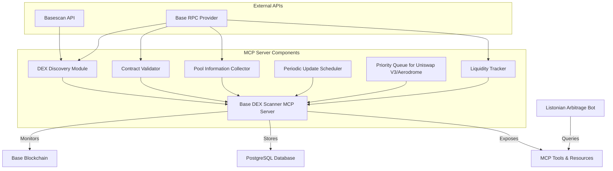
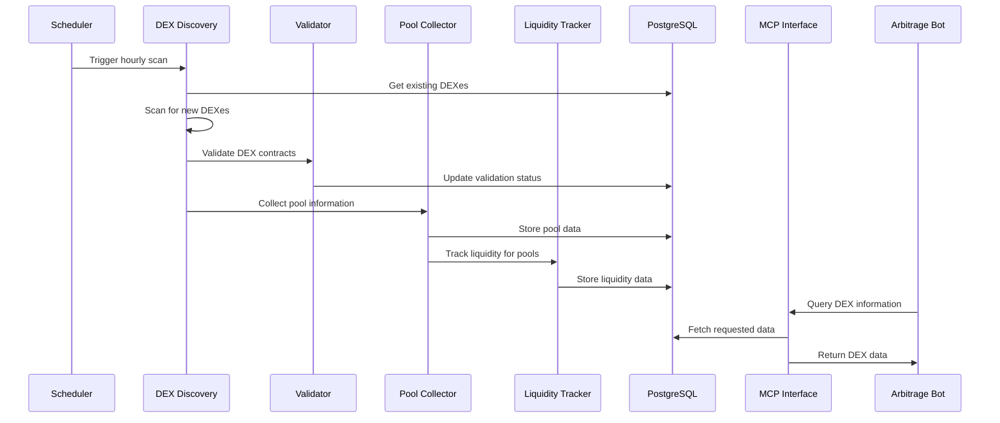
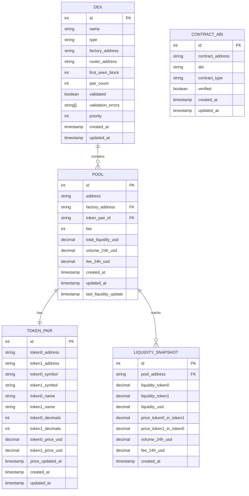

# Base DEX Scanner MCP Server Implementation Plan (Updated)

## Overview

This document outlines the detailed implementation plan for creating a Python-based MCP server that will continuously monitor the Base blockchain for new DEXes, with a focus on Uniswap V3 and Aerodrome. The server will store DEX information in a PostgreSQL database and expose tools and resources through the Model Context Protocol for the Listonian Arbitrage Bot to query.

## Architecture



### Component Interaction Flow



## Enhanced Database Schema

The database schema has been enhanced to include more detailed information about token pairs and liquidity. This will provide the arbitrage bot with richer data for identifying profitable opportunities.

### Database Entity Relationship Diagram



### Data Models

```python
# src/db/models.py
from dataclasses import dataclass
from datetime import datetime
from typing import List, Optional, Dict, Any, Union
from decimal import Decimal

@dataclass
class DEX:
    """DEX information model."""
    id: Optional[int] = None
    name: str = ""
    type: str = ""  # 'v2' or 'v3'
    factory_address: str = ""
    router_address: Optional[str] = None
    first_seen_block: Optional[int] = None
    pair_count: int = 0
    validated: bool = False
    validation_errors: List[str] = None
    priority: int = 0  # Higher number = higher priority
    created_at: datetime = None
    updated_at: datetime = None
    
    def to_dict(self) -> Dict[str, Any]:
        """Convert to dictionary."""
        return {
            "id": self.id,
            "name": self.name,
            "type": self.type,
            "factory_address": self.factory_address,
            "router_address": self.router_address,
            "first_seen_block": self.first_seen_block,
            "pair_count": self.pair_count,
            "validated": self.validated,
            "validation_errors": self.validation_errors,
            "priority": self.priority,
            "created_at": self.created_at.isoformat() if self.created_at else None,
            "updated_at": self.updated_at.isoformat() if self.updated_at else None
        }

@dataclass
class TokenPair:
    """Token pair information model."""
    id: Optional[int] = None
    token0_address: str = ""
    token1_address: str = ""
    token0_symbol: Optional[str] = None
    token1_symbol: Optional[str] = None
    token0_name: Optional[str] = None
    token1_name: Optional[str] = None
    token0_decimals: Optional[int] = None
    token1_decimals: Optional[int] = None
    token0_price_usd: Optional[Decimal] = None
    token1_price_usd: Optional[Decimal] = None
    price_updated_at: Optional[datetime] = None
    created_at: Optional[datetime] = None
    updated_at: Optional[datetime] = None
    
    def to_dict(self) -> Dict[str, Any]:
        """Convert to dictionary."""
        return {
            "id": self.id,
            "token0_address": self.token0_address,
            "token1_address": self.token1_address,
            "token0_symbol": self.token0_symbol,
            "token1_symbol": self.token1_symbol,
            "token0_name": self.token0_name,
            "token1_name": self.token1_name,
            "token0_decimals": self.token0_decimals,
            "token1_decimals": self.token1_decimals,
            "token0_price_usd": float(self.token0_price_usd) if self.token0_price_usd else None,
            "token1_price_usd": float(self.token1_price_usd) if self.token1_price_usd else None,
            "price_updated_at": self.price_updated_at.isoformat() if self.price_updated_at else None,
            "created_at": self.created_at.isoformat() if self.created_at else None,
            "updated_at": self.updated_at.isoformat() if self.updated_at else None
        }

@dataclass
class Pool:
    """Pool information model with enhanced liquidity data."""
    id: Optional[int] = None
    address: str = ""
    factory_address: str = ""
    token_pair_id: Optional[int] = None
    fee: Optional[int] = None  # For v3 pools
    total_liquidity_usd: Optional[Decimal] = None
    volume_24h_usd: Optional[Decimal] = None
    fee_24h_usd: Optional[Decimal] = None
    created_at: Optional[datetime] = None
    updated_at: Optional[datetime] = None
    last_liquidity_update: Optional[datetime] = None
    
    # Non-database fields for convenience
    token_pair: Optional[TokenPair] = None
    
    def to_dict(self) -> Dict[str, Any]:
        """Convert to dictionary."""
        result = {
            "id": self.id,
            "address": self.address,
            "factory_address": self.factory_address,
            "token_pair_id": self.token_pair_id,
            "fee": self.fee,
            "total_liquidity_usd": float(self.total_liquidity_usd) if self.total_liquidity_usd else None,
            "volume_24h_usd": float(self.volume_24h_usd) if self.volume_24h_usd else None,
            "fee_24h_usd": float(self.fee_24h_usd) if self.fee_24h_usd else None,
            "created_at": self.created_at.isoformat() if self.created_at else None,
            "updated_at": self.updated_at.isoformat() if self.updated_at else None,
            "last_liquidity_update": self.last_liquidity_update.isoformat() if self.last_liquidity_update else None
        }
        
        if self.token_pair:
            result["token_pair"] = self.token_pair.to_dict()
            
        return result

@dataclass
class LiquiditySnapshot:
    """Liquidity snapshot model for tracking historical liquidity data."""
    id: Optional[int] = None
    pool_address: str = ""
    liquidity_token0: Decimal = Decimal(0)
    liquidity_token1: Decimal = Decimal(0)
    liquidity_usd: Decimal = Decimal(0)
    price_token0_in_token1: Decimal = Decimal(0)
    price_token1_in_token0: Decimal = Decimal(0)
    volume_24h_usd: Optional[Decimal] = None
    fee_24h_usd: Optional[Decimal] = None
    created_at: Optional[datetime] = None
    
    def to_dict(self) -> Dict[str, Any]:
        """Convert to dictionary."""
        return {
            "id": self.id,
            "pool_address": self.pool_address,
            "liquidity_token0": float(self.liquidity_token0),
            "liquidity_token1": float(self.liquidity_token1),
            "liquidity_usd": float(self.liquidity_usd),
            "price_token0_in_token1": float(self.price_token0_in_token1),
            "price_token1_in_token0": float(self.price_token1_in_token0),
            "volume_24h_usd": float(self.volume_24h_usd) if self.volume_24h_usd else None,
            "fee_24h_usd": float(self.fee_24h_usd) if self.fee_24h_usd else None,
            "created_at": self.created_at.isoformat() if self.created_at else None
        }

@dataclass
class ContractABI:
    """Contract ABI information model."""
    id: Optional[int] = None
    contract_address: str = ""
    abi: Optional[str] = None
    contract_type: str = ""  # 'factory', 'router', 'pool', 'other'
    verified: bool = False
    created_at: Optional[datetime] = None
    updated_at: Optional[datetime] = None
```

### Database Implementation

```python
# src/db/database.py
import asyncio
import logging
import psycopg2
import psycopg2.extras
from datetime import datetime, timedelta
from typing import List, Optional, Dict, Any, Tuple
from decimal import Decimal

from .models import DEX, Pool, TokenPair, LiquiditySnapshot, ContractABI

logger = logging.getLogger(__name__)

class Database:
    """PostgreSQL database connection and operations."""
    
    def __init__(self, connection_string: str):
        """Initialize database connection."""
        self.connection_string = connection_string
        self.conn = None
        self._lock = asyncio.Lock()
        
    async def connect(self):
        """Connect to the database."""
        if self.conn is None or self.conn.closed:
            try:
                self.conn = psycopg2.connect(self.connection_string)
                await self._create_tables()
                logger.info("Connected to PostgreSQL database")
            except Exception as e:
                logger.error(f"Error connecting to database: {str(e)}")
                raise
    
    async def close(self):
        """Close the database connection."""
        if self.conn and not self.conn.closed:
            self.conn.close()
            logger.info("Closed PostgreSQL database connection")
    
    async def _create_tables(self):
        """Create database tables if they don't exist."""
        async with self._lock:
            with self.conn.cursor() as cur:
                # Create dexes table
                cur.execute("""
                CREATE TABLE IF NOT EXISTS dexes (
                    id SERIAL PRIMARY KEY,
                    name VARCHAR(255) NOT NULL,
                    type VARCHAR(50) NOT NULL,
                    factory_address VARCHAR(42) NOT NULL UNIQUE,
                    router_address VARCHAR(42),
                    first_seen_block INTEGER,
                    pair_count INTEGER DEFAULT 0,
                    validated BOOLEAN DEFAULT FALSE,
                    validation_errors TEXT[],
                    priority INTEGER DEFAULT 0,
                    created_at TIMESTAMP DEFAULT NOW(),
                    updated_at TIMESTAMP DEFAULT NOW()
                );
                """)
                
                # Create token_pairs table
                cur.execute("""
                CREATE TABLE IF NOT EXISTS token_pairs (
                    id SERIAL PRIMARY KEY,
                    token0_address VARCHAR(42) NOT NULL,
                    token1_address VARCHAR(42) NOT NULL,
                    token0_symbol VARCHAR(50),
                    token1_symbol VARCHAR(50),
                    token0_name VARCHAR(255),
                    token1_name VARCHAR(255),
                    token0_decimals INTEGER,
                    token1_decimals INTEGER,
                    token0_price_usd DECIMAL(24, 12),
                    token1_price_usd DECIMAL(24, 12),
                    price_updated_at TIMESTAMP,
                    created_at TIMESTAMP DEFAULT NOW(),
                    updated_at TIMESTAMP DEFAULT NOW(),
                    UNIQUE(token0_address, token1_address)
                );
                """)
                
                # Create pools table with enhanced liquidity information
                cur.execute("""
                CREATE TABLE IF NOT EXISTS pools (
                    id SERIAL PRIMARY KEY,
                    address VARCHAR(42) NOT NULL UNIQUE,
                    factory_address VARCHAR(42) NOT NULL,
                    token_pair_id INTEGER NOT NULL,
                    fee INTEGER,
                    total_liquidity_usd DECIMAL(24, 12),
                    volume_24h_usd DECIMAL(24, 12),
                    fee_24h_usd DECIMAL(24, 12),
                    created_at TIMESTAMP DEFAULT NOW(),
                    updated_at TIMESTAMP DEFAULT NOW(),
                    last_liquidity_update TIMESTAMP,
                    FOREIGN KEY (factory_address) REFERENCES dexes(factory_address) ON DELETE CASCADE,
                    FOREIGN KEY (token_pair_id) REFERENCES token_pairs(id) ON DELETE CASCADE
                );
                """)
                
                # Create liquidity_snapshots table for historical data
                cur.execute("""
                CREATE TABLE IF NOT EXISTS liquidity_snapshots (
                    id SERIAL PRIMARY KEY,
                    pool_address VARCHAR(42) NOT NULL,
                    liquidity_token0 DECIMAL(36, 18) NOT NULL,
                    liquidity_token1 DECIMAL(36, 18) NOT NULL,
                    liquidity_usd DECIMAL(24, 12) NOT NULL,
                    price_token0_in_token1 DECIMAL(36, 18) NOT NULL,
                    price_token1_in_token0 DECIMAL(36, 18) NOT NULL,
                    volume_24h_usd DECIMAL(24, 12),
                    fee_24h_usd DECIMAL(24, 12),
                    created_at TIMESTAMP DEFAULT NOW(),
                    FOREIGN KEY (pool_address) REFERENCES pools(address) ON DELETE CASCADE
                );
                """)
                
                # Create contract_abis table
                cur.execute("""
                CREATE TABLE IF NOT EXISTS contract_abis (
                    id SERIAL PRIMARY KEY,
                    contract_address VARCHAR(42) NOT NULL UNIQUE,
                    abi TEXT,
                    contract_type VARCHAR(50) NOT NULL,
                    verified BOOLEAN DEFAULT FALSE,
                    created_at TIMESTAMP DEFAULT NOW(),
                    updated_at TIMESTAMP DEFAULT NOW()
                );
                """)
                
                # Create indexes
                cur.execute("CREATE INDEX IF NOT EXISTS idx_dexes_factory ON dexes(factory_address);")
                cur.execute("CREATE INDEX IF NOT EXISTS idx_pools_factory ON pools(factory_address);")
                cur.execute("CREATE INDEX IF NOT EXISTS idx_pools_token_pair ON pools(token_pair_id);")
                cur.execute("CREATE INDEX IF NOT EXISTS idx_token_pairs_tokens ON token_pairs(token0_address, token1_address);")
                cur.execute("CREATE INDEX IF NOT EXISTS idx_liquidity_snapshots_pool ON liquidity_snapshots(pool_address);")
                cur.execute("CREATE INDEX IF NOT EXISTS idx_liquidity_snapshots_created_at ON liquidity_snapshots(created_at);")
                
                self.conn.commit()
                logger.info("Database tables created or already exist")
    
    # DEX operations
    
    async def save_dex(self, dex: DEX) -> DEX:
        """Save DEX information to database."""
        async with self._lock:
            with self.conn.cursor() as cur:
                # Check if DEX already exists
                cur.execute(
                    "SELECT id FROM dexes WHERE factory_address = %s",
                    (dex.factory_address,)
                )
                result = cur.fetchone()
                
                if result:
                    # Update existing DEX
                    dex.id = result[0]
                    dex.updated_at = datetime.now()
                    
                    # Set priority for Uniswap V3 and Aerodrome
                    if "uniswap" in dex.name.lower() and "v3" in dex.name.lower():
                        dex.priority = 100
                    elif "aerodrome" in dex.name.lower():
                        dex.priority = 90
                    
                    cur.execute(
                        """
                        UPDATE dexes SET 
                            name = %s, 
                            type = %s, 
                            router_address = %s, 
                            first_seen_block = %s,
                            pair_count = %s,
                            validated = %s,
                            validation_errors = %s,
                            priority = %s,
                            updated_at = NOW()
                        WHERE id = %s
                        """,
                        (
                            dex.name, 
                            dex.type, 
                            dex.router_address, 
                            dex.first_seen_block,
                            dex.pair_count,
                            dex.validated,
                            dex.validation_errors,
                            dex.priority,
                            dex.id
                        )
                    )
                else:
                    # Insert new DEX
                    dex.created_at = datetime.now()
                    dex.updated_at = datetime.now()
                    
                    # Set priority for Uniswap V3 and Aerodrome
                    if "uniswap" in dex.name.lower() and "v3" in dex.name.lower():
                        dex.priority = 100
                    elif "aerodrome" in dex.name.lower():
                        dex.priority = 90
                    
                    cur.execute(
                        """
                        INSERT INTO dexes (
                            name, 
                            type, 
                            factory_address, 
                            router_address, 
                            first_seen_block,
                            pair_count,
                            validated,
                            validation_errors,
                            priority,
                            created_at,
                            updated_at
                        ) VALUES (%s, %s, %s, %s, %s, %s, %s, %s, %s, NOW(), NOW())
                        RETURNING id
                        """,
                        (
                            dex.name, 
                            dex.type, 
                            dex.factory_address, 
                            dex.router_address, 
                            dex.first_seen_block,
                            dex.pair_count,
                            dex.validated,
                            dex.validation_errors,
                            dex.priority
                        )
                    )
                    dex.id = cur.fetchone()[0]
                
                self.conn.commit()
                return dex
    
    # Token pair operations
    
    async def save_token_pair(self, token_pair: TokenPair) -> TokenPair:
        """Save token pair information to database."""
        async with self._lock:
            with self.conn.cursor() as cur:
                # Check if token pair already exists
                cur.execute(
                    "SELECT id FROM token_pairs WHERE token0_address = %s AND token1_address = %s",
                    (token_pair.token0_address, token_pair.token1_address)
                )
                result = cur.fetchone()
                
                if result:
                    # Update existing token pair
                    token_pair.id = result[0]
                    token_pair.updated_at = datetime.now()
                    
                    cur.execute(
                        """
                        UPDATE token_pairs SET 
                            token0_symbol = %s,
                            token1_symbol = %s,
                            token0_name = %s,
                            token1_name = %s,
                            token0_decimals = %s,
                            token1_decimals = %s,
                            token0_price_usd = %s,
                            token1_price_usd = %s,
                            price_updated_at = %s,
                            updated_at = NOW()
                        WHERE id = %s
                        """,
                        (
                            token_pair.token0_symbol,
                            token_pair.token1_symbol,
                            token_pair.token0_name,
                            token_pair.token1_name,
                            token_pair.token0_decimals,
                            token_pair.token1_decimals,
                            token_pair.token0_price_usd,
                            token_pair.token1_price_usd,
                            token_pair.price_updated_at,
                            token_pair.id
                        )
                    )
                else:
                    # Insert new token pair
                    token_pair.created_at = datetime.now()
                    token_pair.updated_at = datetime.now()
                    
                    cur.execute(
                        """
                        INSERT INTO token_pairs (
                            token0_address,
                            token1_address,
                            token0_symbol,
                            token1_symbol,
                            token0_name,
                            token1_name,
                            token0_decimals,
                            token1_decimals,
                            token0_price_usd,
                            token1_price_usd,
                            price_updated_at,
                            created_at,
                            updated_at
                        ) VALUES (%s, %s, %s, %s, %s, %s, %s, %s, %s, %s, %s, NOW(), NOW())
                        RETURNING id
                        """,
                        (
                            token_pair.token0_address,
                            token_pair.token1_address,
                            token_pair.token0_symbol,
                            token_pair.token1_symbol,
                            token_pair.token0_name,
                            token_pair.token1_name,
                            token_pair.token0_decimals,
                            token_pair.token1_decimals,
                            token_pair.token0_price_usd,
                            token_pair.token1_price_usd,
                            token_pair.price_updated_at
                        )
                    )
                    token_pair.id = cur.fetchone()[0]
                
                self.conn.commit()
                return token_pair
    
    # Pool operations
    
    async def save_pool(self, pool: Pool) -> Pool:
        """Save pool information to database."""
        async with self._lock:
            with self.conn.cursor() as cur:
                # Ensure token pair is saved first if provided
                if pool.token_pair and not pool.token_pair_id:
                    token_pair = await self.save_token_pair(pool.token_pair)
                    pool.token_pair_id = token_pair.id
                
                # Check if pool already exists
                cur.execute(
                    "SELECT id FROM pools WHERE address = %s",
                    (pool.address,)
                )
                result = cur.fetchone()
                
                if result:
                    # Update existing pool
                    pool.id = result[0]
                    pool.updated_at = datetime.now()
                    
                    cur.execute(
                        """
                        UPDATE pools SET 
                            factory_address = %s,
                            token_pair_id = %s,
                            fee = %s,
                            total_liquidity_usd = %s,
                            volume_24h_usd = %s,
                            fee_24h_usd = %s,
                            updated_at = NOW(),
                            last_liquidity_update = %s
                        WHERE id = %s
                        """,
                        (
                            pool.factory_address,
                            pool.token_pair_id,
                            pool.fee,
                            pool.total_liquidity_usd,
                            pool.volume_24h_usd,
                            pool.fee_24h_usd,
                            pool.last_liquidity_update or datetime.now(),
                            pool.id
                        )
                    )
                else:
                    # Insert new pool
                    pool.created_at = datetime.now()
                    pool.updated_at = datetime.now()
                    pool.last_liquidity_update = pool.last_liquidity_update or datetime.now()
                    
                    cur.execute(
                        """
                        INSERT INTO pools (
                            address,
                            factory_address,
                            token_pair_id,
                            fee,
                            total_liquidity_usd,
                            volume_24h_usd,
                            fee_24h_usd,
                            created_at,
                            updated_at,
                            last_liquidity_update
                        ) VALUES (%s, %s, %s, %s, %s, %s, %s, NOW(), NOW(), %s)
                        RETURNING id
                        """,
                        (
                            pool.address,
                            pool.factory_address,
                            pool.token_pair_id,
                            pool.fee,
                            pool.total_liquidity_usd,
                            pool.volume_24h_usd,
                            pool.fee_24h_usd,
                            pool.last_liquidity_update
                        )
                    )
                    pool.id = cur.fetchone()[0]
                
                self.conn.commit()
                return pool
    
    # Liquidity snapshot operations
    
    async def save_liquidity_snapshot(self, snapshot: LiquiditySnapshot) -> LiquiditySnapshot:
        """Save liquidity snapshot to database."""
        async with self._lock:
            with self.conn.cursor() as cur:
                # Insert new snapshot (snapshots are immutable)
                snapshot.created_at = datetime.now()
                
                cur.execute(
                    """
                    INSERT INTO liquidity_snapshots (
                        pool_address,
                        liquidity_token0,
                        liquidity_token1,
                        liquidity_usd,
                        price_token0_in_token1,
                        price_token1_in_token0,
                        volume_24h_usd,
                        fee_24h_usd,
                        created_at
                    ) VALUES (%s, %s, %s, %s, %s, %s, %s, %s, NOW())
                    RETURNING id
                    """,
                    (
                        snapshot.pool_address,
                        snapshot.liquidity_token0,
                        snapshot.liquidity_token1,
                        snapshot.liquidity_usd,
                        snapshot.price_token0_in_token1,
                        snapshot.price_token1_in_token0,
                        snapshot.volume_24h_usd,
                        snapshot.fee_24h_usd
                    )
                )
                snapshot.id = cur.fetchone()[0]
                
                # Update pool with latest liquidity information
                cur.execute(
                    """
                    UPDATE pools SET
                        total_liquidity_usd = %s,
                        volume_24h_usd = %s,
                        fee_24h_usd = %s,
                        last_liquidity_update = NOW()
                    WHERE address = %s
                    """,
                    (
                        snapshot.liquidity_usd,
                        snapshot.volume_24h_usd,
                        snapshot.fee_24h_usd,
                        snapshot.pool_address
                    )
                )
                
                self.conn.commit()
                return snapshot
    
    # Query operations
    
    async def get_pools_needing_liquidity_update(self, hours_threshold: int = 1) -> List[Pool]:
        """Get pools that need liquidity updates."""
        async with self._lock:
            with self.conn.cursor(cursor_factory=psycopg2.extras.DictCursor) as cur:
                cur.execute(
                    """
                    SELECT p.*, tp.* FROM pools p
                    JOIN token_pairs tp ON p.token_pair_id = tp.id
                    WHERE p.last_liquidity_update IS NULL
                    OR p.last_liquidity_update < %s
                    ORDER BY p.last_liquidity_update ASC NULLS FIRST
                    LIMIT 100
                    """,
                    (datetime.now() - timedelta(hours=hours_threshold),)
                )
                
                results = []
                for row in cur.fetchall():
                    pool = Pool(
                        id=row['id'],
                        address=row['address'],
                        factory_address=row['factory_address'],
                        token_pair_id=row['token_pair_id'],
                        fee=row['fee'],
                        total_liquidity_usd=row['total_liquidity_usd'],
                        volume_24h_usd=row['volume_24h_usd'],
