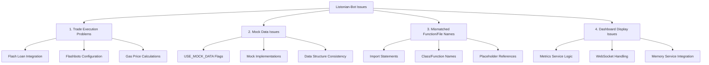

# Listonian-Bot Fix Plan: Critical Issues Analysis

Based on our sequential thinking analysis, I've identified and prioritized the critical issues in the Listonian-bot project. Here's a comprehensive plan to address these issues in order of importance:

## Issue Prioritization

## Detailed Fix Plan

### 1. Trade Execution Problems (Highest Priority)

These issues directly prevent the bot from generating profit, which is its primary purpose.

#### 1.1 Flash Loan Integration
- Verify the `EnhancedFlashLoanManager` implementation
- Check Balancer integration for flash loans
- Test flash loan borrowing and repayment
- Ensure proper error handling for flash loan failures

#### 1.2 Flashbots Integration
- Review Flashbots configuration in `SwapBasedDEX`
- Verify authentication key handling
- Test bundle simulation and submission
- Implement fallback mechanisms for when Flashbots fails

#### 1.3 Gas Price Calculations
- Review gas price calculation logic
- Optimize for profitability while ensuring execution
- Implement adaptive gas pricing based on network conditions
- Test with different market conditions

#### 1.4 Execute Opportunity Method
- Test the `execute_opportunity` method in `BaseArbitrageSystem`
- Verify proper handling of the execution flow
- Implement better error handling and recovery
- Add detailed logging for debugging

### 2. Mock Data Issues (Second Priority)

These affect the discovery of arbitrage opportunities, potentially causing the bot to find non-existent opportunities or miss real ones.

#### 2.1 USE_MOCK_DATA Flags
- Identify all `USE_MOCK_DATA` flags in the codebase
- Ensure they're set to false in production environments
- Add clear warnings when mock data is being used
- Consider removing mock data options from production code

#### 2.2 Mock Implementations
- Replace mock implementations with real ones, especially in the MCP server
- Ensure real implementations handle all edge cases
- Add proper error handling for real data sources
- Implement graceful degradation when data sources are unavailable

#### 2.3 Data Structure Consistency
- Verify data structures match between mock and real implementations
- Standardize data formats across the codebase
- Implement data validation to catch inconsistencies
- Add type hints and documentation for data structures

### 3. Mismatched Function/File Names (Third Priority)

These cause integration problems that could prevent components from working together properly.

#### 3.1 Import Statements
- Audit all import statements for correctness
- Fix relative imports that might be causing issues
- Ensure consistent import patterns throughout the codebase
- Remove unused imports

#### 3.2 Class and Function Names
- Check class and function names for consistency
- Standardize naming conventions
- Update references to renamed components
- Document public APIs

#### 3.3 Placeholder References
- Fix any references to placeholder components
- Replace TODOs with actual implementations
- Remove commented-out code that might be confusing
- Ensure proper service registration in the dashboard

### 4. Dashboard Display Issues (Fourth Priority)

While important for monitoring and configuration, these are less critical for the core arbitrage functionality.

#### 4.1 Metrics Service Logic
- Fix the metrics service data transformation logic
- Ensure proper handling of different data types
- Optimize performance for real-time updates
- Add better error handling for data processing

#### 4.2 WebSocket Connection Handling
- Ensure proper WebSocket connection handling
- Implement reconnection logic
- Add heartbeat mechanism to detect disconnections
- Optimize message size for performance

#### 4.3 Memory Service Integration
- Validate memory service integration
- Ensure proper state management
- Fix subscription handling
- Test with various data loads

## Implementation Approach

I recommend using a systematic approach to implement these fixes:

1. **Isolate and Test**: Test each component in isolation to identify specific issues
2. **Fix Core Components First**: Start with the trade execution and mock data issues
3. **Integration Testing**: Test components together after individual fixes
4. **End-to-End Testing**: Test the full arbitrage flow with real data
5. **Dashboard Fixes**: Address dashboard issues after core functionality is working
6. **Documentation**: Update documentation to reflect changes

## Next Steps

1. Switch to code mode to begin implementing the fixes
2. Start with the highest priority issues (Trade Execution Problems)
3. Use the sequentialthinking MCP server to methodically work through each issue
4. Test each fix thoroughly before moving to the next issue
5. Document all changes and improvements