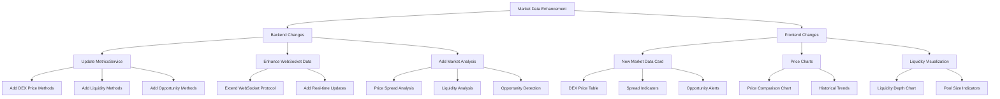

# Dashboard Market Data Enhancement Plan

## Overview
This document outlines the plan for enhancing the arbitrage bot dashboard with comprehensive market data visualization and analysis features.

## Implementation Details

### 1. Backend Changes

#### MetricsService Enhancement
- Add new methods for DEX price comparison
  * Real-time price fetching from BaseSwap V3 and Aerodrome V3
  * Price spread calculations
  * Historical price tracking
- Implement liquidity depth tracking
  * Pool size monitoring
  * Liquidity change detection
- Add opportunity detection logic
  * Price differential analysis
  * Profitability calculations
  * Risk assessment

#### WebSocket Protocol Updates
- Extend data structure for new metrics
- Implement real-time update channels
- Add error handling and recovery
- Optimize data transmission

#### Market Analysis Components
- Price spread analysis engine
- Liquidity depth analyzer
- Opportunity detection system
- Historical trend analysis

### 2. Frontend Changes

#### New Market Overview Section
- Real-time price comparison table
  * DEX prices side by side
  * Price spread visualization
  * Trend indicators
- Liquidity depth visualization
  * Pool size charts
  * Historical liquidity trends
- Opportunity alerts
  * Visual indicators for profitable trades
  * Risk level indicators

#### Interactive Charts
- Price comparison charts
  * Real-time price updates
  * Historical price trends
  * Multiple DEX overlay
- Liquidity visualization
  * Depth charts
  * Pool size indicators
  * Change markers

#### UI/UX Enhancements
- Color coding for price differences
- Visual indicators for opportunities
- Interactive tooltips
- Filtering and sorting options
- Responsive design updates

### 3. Data Integration

#### Price Feed Integration
- Connect to BaseSwap V3 API
- Connect to Aerodrome V3 API
- Implement price normalization
- Set up update intervals

#### Liquidity Monitoring
- Pool size tracking
- Liquidity change detection
- Historical data storage
- Alert thresholds

#### Real-time Updates
- WebSocket channel configuration
- Update frequency optimization
- Data validation
- Error handling

### 4. Testing and Deployment

#### Testing Strategy
- Unit tests for new components
- Integration testing
- Performance testing
- UI/UX testing

#### Deployment Plan
- Backend service updates
- Frontend deployment
- Monitoring setup
- Rollback procedures

## Success Metrics
- Real-time data accuracy
- Update latency < 1s
- UI responsiveness
- System stability
- User feedback

## Next Steps
1. Implement backend changes
2. Update frontend components
3. Integrate data sources
4. Test and deploy
5. Monitor and optimize