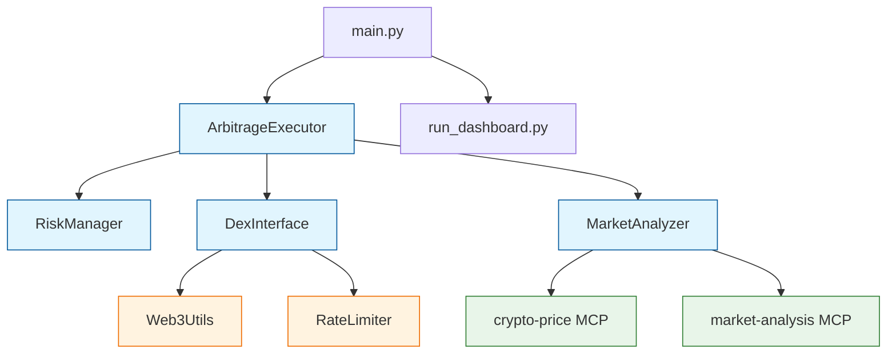

# Core Components Flow

This diagram shows:
- Entry points (main.py and dashboard)
- Core business logic components
- External data sources (MCP servers)
- Utility classes

Key relationships:
1. ArbitrageExecutor coordinates all operations
2. MarketAnalyzer gets data from MCP servers
3. DexInterface handles all blockchain interactions
4. RiskManager validates operations

If this renders well, we can create more detailed diagrams for other components.
