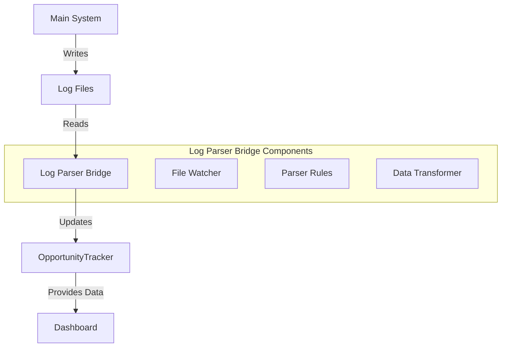
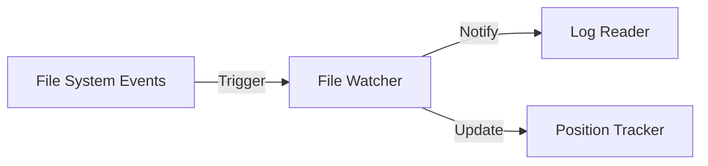
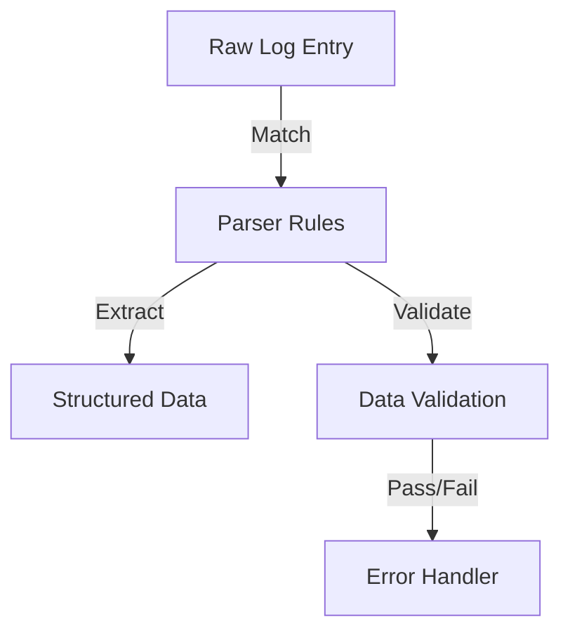
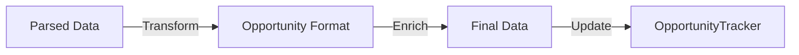

# Log Parser Bridge Implementation Plan

## Overview

The Log Parser Bridge is a new component designed to bridge the gap between the arbitrage system's log files and the dashboard's data stores. It provides a flexible, maintainable solution for ensuring data consistency across the system.

## Architecture



## Components

### 1. File Watcher
- Monitors log directory for changes
- Uses efficient file system events
- Tracks file positions to avoid re-reading
- Configurable watch patterns



### 2. Parser Rules
- Configurable regex patterns for different log types
- Support for opportunity and execution logs
- Extensible for new log formats
- Validation rules for data integrity



### 3. Data Transformer
- Converts parsed log data to OpportunityTracker format
- Handles data type conversions
- Maintains data consistency
- Supports data enrichment



## Implementation Steps

### Phase 1: Core Infrastructure
1. Create base LogParserBridge class
2. Implement FileWatcher with inotify/watchdog
3. Set up position tracking system
4. Add basic error handling

### Phase 2: Parsing Logic
1. Define parser rule configuration format
2. Implement regex-based log parsing
3. Add validation rules
4. Create error recovery mechanisms

### Phase 3: Data Transformation
1. Implement data transformer
2. Add OpportunityTracker integration
3. Set up data enrichment pipeline
4. Add data consistency checks

### Phase 4: Integration
1. Connect to existing log files
2. Integrate with dashboard
3. Add monitoring and metrics
4. Implement health checks

## Configuration

```yaml
parser_bridge:
  watch_directory: "./logs"
  update_frequency: 1.0  # seconds
  max_batch_size: 1000
  
  file_patterns:
    - "opportunities_*.log"
    - "execution_*.log"
    
  parser_rules:
    opportunity:
      pattern: "Found opportunity.*DEX: (.*) -> (.*), Token: (.*), Profit: \\$(\\d+\\.\\d+)"
      groups:
        - source_dex
        - target_dex
        - token
        - profit_usd
    
    execution:
      pattern: "Trade execution.*Hash: (.*), Status: (.*), Profit: \\$(\\d+\\.\\d+)"
      groups:
        - tx_hash
        - status
        - profit_usd

  error_handling:
    max_retries: 3
    retry_delay: 1.0
    log_errors: true
```

## Error Handling

1. File System Errors
   - Missing files
   - Permission issues
   - Disk space problems

2. Parsing Errors
   - Invalid log format
   - Corrupted entries
   - Incomplete data

3. Transformation Errors
   - Data type mismatches
   - Missing required fields
   - Validation failures

4. Integration Errors
   - Connection issues
   - Data synchronization
   - Race conditions

## Monitoring

1. Performance Metrics
   - Parse rate (entries/second)
   - Processing latency
   - Error rate
   - Memory usage

2. Health Checks
   - File system access
   - Parser status
   - OpportunityTracker connection
   - Data consistency

3. Alerts
   - Error rate thresholds
   - Processing delays
   - Data inconsistencies
   - System resource usage

## Future Enhancements

1. Advanced Features
   - Real-time data streaming
   - Custom parser plugins
   - Advanced data enrichment
   - Historical data replay

2. Performance Optimizations
   - Batch processing
   - Parallel parsing
   - Memory optimization
   - Caching strategies

3. Integration Options
   - Additional data sources
   - Export capabilities
   - API endpoints
   - Custom transformers

## Development Timeline

1. Week 1: Core Infrastructure
   - Basic file watching
   - Simple parsing
   - Initial integration

2. Week 2: Enhanced Features
   - Full parsing rules
   - Data transformation
   - Error handling

3. Week 3: Integration & Testing
   - Dashboard integration
   - System testing
   - Performance tuning

4. Week 4: Deployment & Monitoring
   - Production deployment
   - Monitoring setup
   - Documentation

## Success Criteria

1. Functional Requirements
   - Real-time data flow
   - Accurate parsing
   - Reliable updates
   - Error recovery

2. Performance Requirements
   - Sub-second latency
   - Low resource usage
   - High reliability
   - Scalable design

3. Operational Requirements
   - Easy configuration
   - Clear monitoring
   - Simple maintenance
   - Good documentation