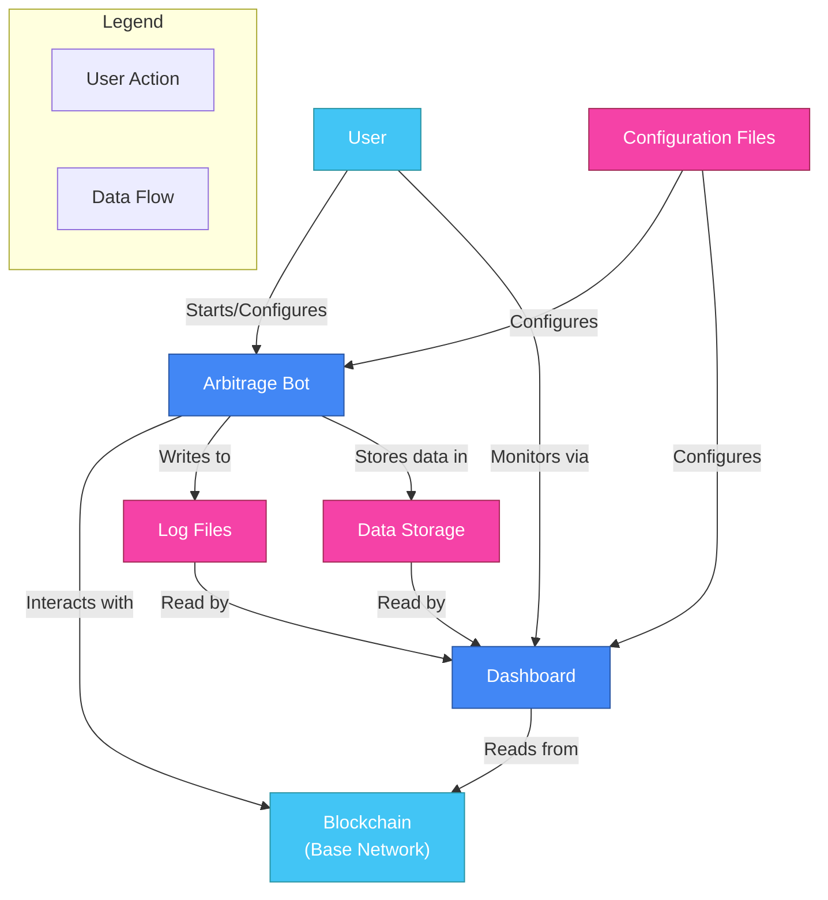
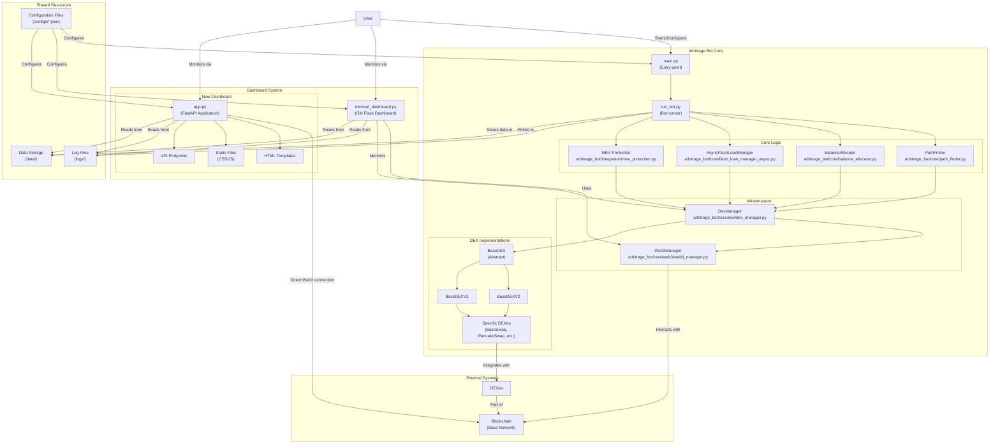
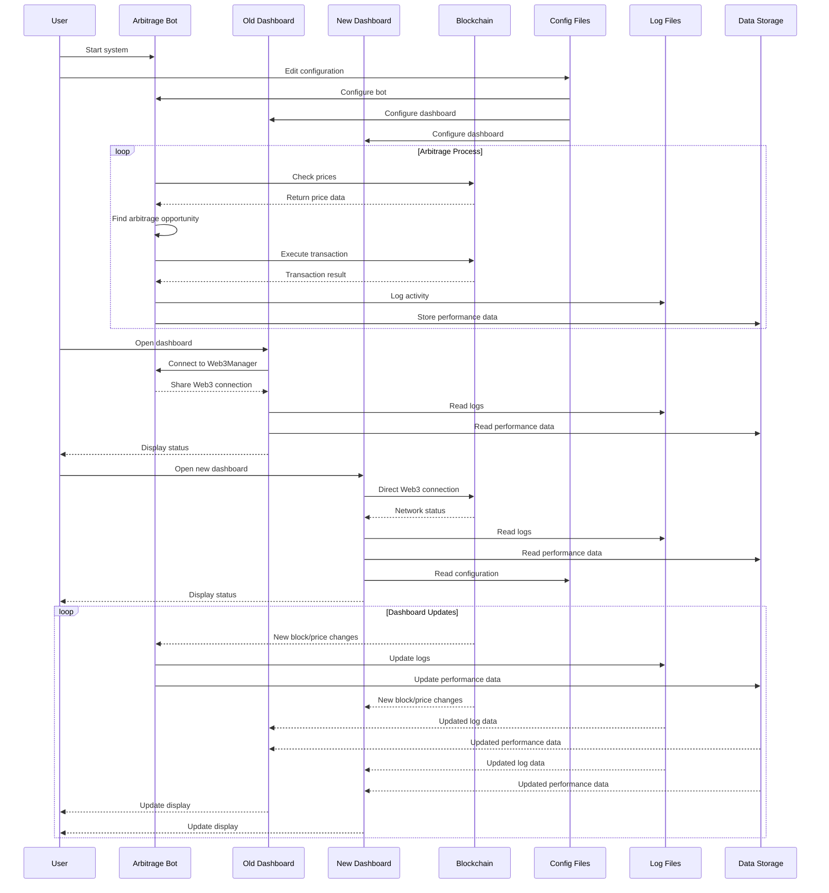

# Arbitrage Bot System Architecture

This document provides a comprehensive overview of the entire arbitrage bot system architecture, with special focus on how the dashboard and the core bot components interact with each other.

## System Overview



## Detailed Component Architecture



## Communication Diagram



## Directory Structure

```
d:/Listonian-bot/
│
├── main.py                        # Main entry point for the bot
├── run_bot.py                     # Bot runner script
├── minimal_dashboard.py           # Old dashboard implementation
├── start_dashboard.bat/.ps1       # Old dashboard starters
├── start_new_dashboard.bat/.ps1   # New dashboard starters
│
├── arbitrage_bot/                 # Core package
│   ├── __init__.py
│   ├── integration.py
│   │
│   ├── core/                      # Core bot functionality
│   │   ├── path_finder.py         # Finds arbitrage paths
│   │   ├── balance_allocator.py   # Manages balance allocation
│   │   ├── flash_loan_manager_async.py  # Flash loan handling
│   │   │
│   │   ├── dex/                   # DEX implementations
│   │   │   ├── __init__.py
│   │   │   ├── dex_manager.py     # Manages DEX connections
│   │   │   ├── base_dex.py        # Abstract base class
│   │   │   ├── base_dex_v2.py     # V2 DEX base class
│   │   │   ├── base_dex_v3.py     # V3 DEX base class
│   │   │   └── [specific DEXes]   # Individual DEX implementations
│   │   │
│   │   └── web3/                  # Web3 connectivity
│   │       ├── __init__.py
│   │       └── web3_manager.py    # Manages blockchain connections
│   │
│   ├── integration/               # Integration components
│   │   └── mev_protection.py      # MEV protection implementation
│   │
│   └── utils/                     # Utility modules
│       └── [utility modules]
│
├── configs/                       # Configuration
│   ├── config.json                # Main configuration
│   └── production.json            # Production configuration
│
├── new_dashboard/                 # New dashboard
│   ├── app.py                     # FastAPI application
│   ├── dashboard_requirements.txt # Dashboard dependencies
│   ├── start_dashboard.bat        # Dashboard starter (batch)
│   ├── start_dashboard.ps1        # Dashboard starter (PowerShell)
│   ├── README.md                  # Dashboard documentation
│   │
│   ├── templates/                 # HTML templates
│   │   └── index.html             # Main dashboard view
│   │
│   └── static/                    # Static files
│       ├── css/                   # CSS styles
│       │   └── styles.css         # Main stylesheet
│       └── js/                    # JavaScript files
│
├── logs/                          # Log files
│   ├── arbitrage.log              # Main bot logs
│   ├── new_dashboard.log          # New dashboard logs
│   └── minimal_dashboard.log      # Old dashboard logs
│
└── data/                          # Data storage
    ├── performance/               # Performance metrics
    ├── transactions/              # Transaction records
    └── market/                    # Market data
```

## Communication Mechanisms

### 1. Dashboard-Bot Communication

The most important relationships between the dashboard and the bot:

#### Old Dashboard
- **Direct Component Access**: The old dashboard directly uses the `Web3Manager` from the arbitrage bot package, creating a tight coupling.
- **Shared In-Memory State**: Because of this direct access, the old dashboard can access in-memory state of the bot components.
- **Disadvantage**: This tight coupling means errors in one component can affect the other, as seen in your troubleshooting.

#### New Dashboard
- **Loose Coupling**: The new dashboard doesn't directly access bot components.
- **Independent Web3 Connection**: Creates its own Web3 connection to the blockchain.
- **Shared Configuration**: Both systems read from the same configuration files.
- **Data Exchange via Files**: Both systems interact through shared log files and data storage.
- **Advantage**: Independence means failures in the bot won't affect dashboard functionality.

### 2. Shared Resources

Both the dashboard and bot share these resources:

- **Configuration Files**: Located in `configs/`, these JSON files configure both systems.
- **Log Files**: Bot writes to logs in `logs/`, both dashboards read from these.
- **Data Storage**: Bot stores performance and transaction data in `data/`, dashboards read from this.
- **Blockchain**: Both connect to the same blockchain network (Base).

### 3. Data Flow

The primary data flows in the system:

1. **Configuration Flow**:
   - User edits configuration files
   - Both bot and dashboards read configuration
   - Configuration dictates behavior of all components

2. **Operation Flow**:
   - Bot executes transactions and strategies
   - Bot writes logs and stores performance data
   - Dashboards read logs and data for display

3. **Monitoring Flow**:
   - Dashboards connect to blockchain
   - Dashboards read bot-generated data
   - Dashboards visualize state to user

## Key Architectural Decisions

1. **Old vs New Dashboard**:
   - Old dashboard: Tightly coupled with bot components
   - New dashboard: Independent implementation with loose coupling

2. **Communication Strategy**:
   - File-based communication (config, logs, data)
   - Independent blockchain access
   - No direct in-memory communication

3. **Resource Sharing**:
   - Configuration files for settings
   - Log files for activity records
   - Data storage for performance metrics
   - Blockchain for network state

4. **Separation of Concerns**:
   - Bot focuses on executing arbitrage strategies
   - Dashboard focuses on monitoring and visualization
   - Clear boundaries between components

This architecture allows for greater reliability and maintainability, reducing the chance of cascading failures that were observed with the previous dashboard implementation.