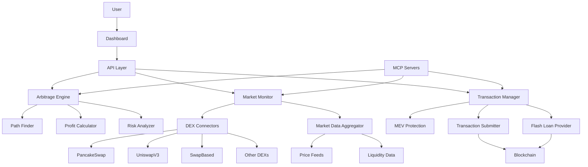
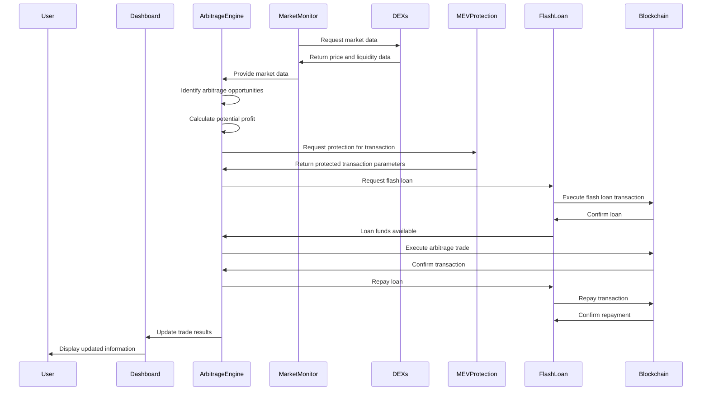
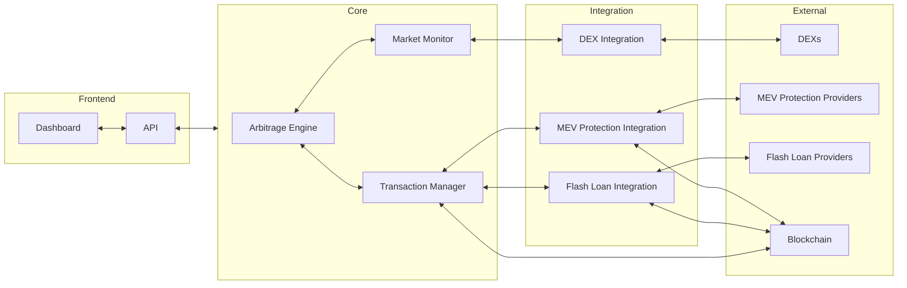
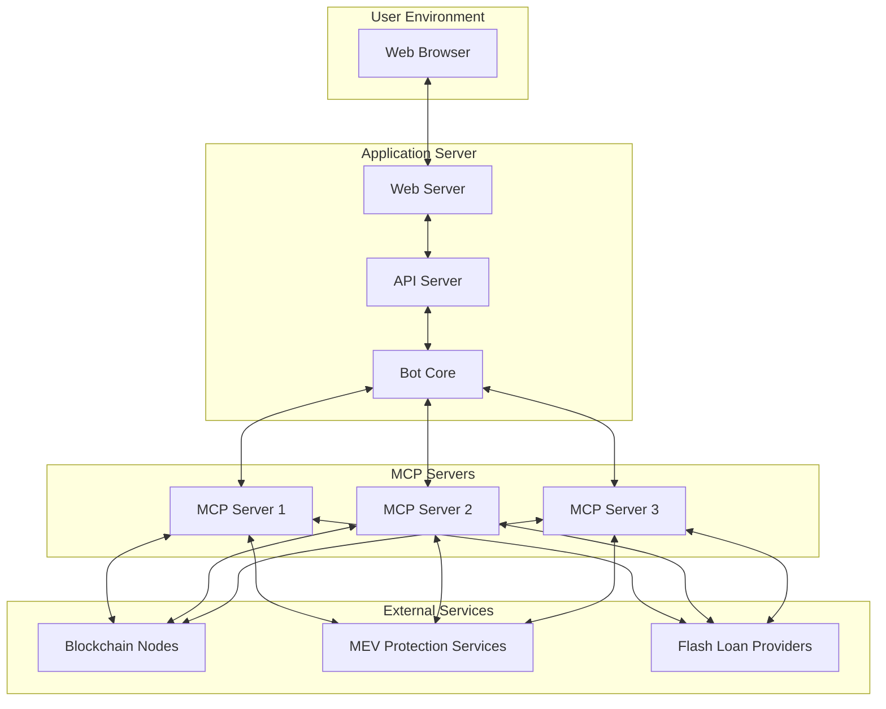
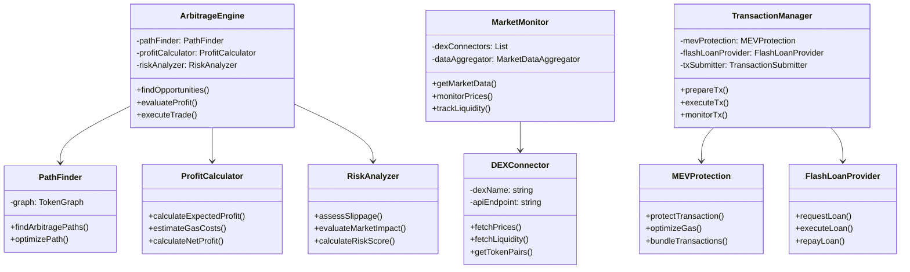

# Listonian Bot Component Diagrams

## System Architecture Diagram

```mermaid
graph TD
    User[User] --> Dashboard
    Dashboard --> API[API Layer]
    API --> AE[Arbitrage Engine]
    API --> MM[Market Monitor]
    API --> TM[Transaction Manager]
    
    AE --> PathFinder[Path Finder]
    AE --> ProfitCalculator[Profit Calculator]
    AE --> RiskAnalyzer[Risk Analyzer]
    
    MM --> DEXConnectors[DEX Connectors]
    MM --> MarketDataAggregator[Market Data Aggregator]
    
    TM --> MEVProtection[MEV Protection]
    TM --> FlashLoanProvider[Flash Loan Provider]
    TM --> TransactionSubmitter[Transaction Submitter]
    
    DEXConnectors --> DEX1[PancakeSwap]
    DEXConnectors --> DEX2[UniswapV3]
    DEXConnectors --> DEX3[SwapBased]
    DEXConnectors --> DEX4[Other DEXs]
    
    TransactionSubmitter --> Blockchain[Blockchain]
    FlashLoanProvider --> Blockchain
    
    MarketDataAggregator --> PriceFeeds[Price Feeds]
    MarketDataAggregator --> LiquidityData[Liquidity Data]
    
    MCP[MCP Servers] --> AE
    MCP --> MM
    MCP --> TM
```

## Data Flow Diagram

```mermaid
sequenceDiagram
    participant User
    participant Dashboard
    participant ArbitrageEngine
    participant MarketMonitor
    participant DEXs
    participant MEVProtection
    participant FlashLoan
    participant Blockchain
    
    MarketMonitor->>DEXs: Request market data
    DEXs->>MarketMonitor: Return price and liquidity data
    MarketMonitor->>ArbitrageEngine: Provide market data
    ArbitrageEngine->>ArbitrageEngine: Identify arbitrage opportunities
    ArbitrageEngine->>ArbitrageEngine: Calculate potential profit
    ArbitrageEngine->>MEVProtection: Request protection for transaction
    MEVProtection->>ArbitrageEngine: Return protected transaction parameters
    ArbitrageEngine->>FlashLoan: Request flash loan
    FlashLoan->>Blockchain: Execute flash loan transaction
    Blockchain->>FlashLoan: Confirm loan
    FlashLoan->>ArbitrageEngine: Loan funds available
    ArbitrageEngine->>Blockchain: Execute arbitrage trade
    Blockchain->>ArbitrageEngine: Confirm transaction
    ArbitrageEngine->>FlashLoan: Repay loan
    FlashLoan->>Blockchain: Repay transaction
    Blockchain->>FlashLoan: Confirm repayment
    ArbitrageEngine->>Dashboard: Update trade results
    Dashboard->>User: Display updated information
```

## Component Interaction Diagram

```mermaid
graph LR
    subgraph Core
        AE[Arbitrage Engine]
        MM[Market Monitor]
        TM[Transaction Manager]
    end
    
    subgraph Integration
        DEXInt[DEX Integration]
        MEVInt[MEV Protection Integration]
        FLInt[Flash Loan Integration]
    end
    
    subgraph External
        DEXs[DEXs]
        MEVProv[MEV Protection Providers]
        FLProv[Flash Loan Providers]
        Blockchain[Blockchain]
    end
    
    subgraph Frontend
        Dashboard[Dashboard]
        API[API]
    end
    
    AE <--> MM
    AE <--> TM
    MM <--> DEXInt
    TM <--> MEVInt
    TM <--> FLInt
    DEXInt <--> DEXs
    MEVInt <--> MEVProv
    FLInt <--> FLProv
    MEVInt <--> Blockchain
    FLInt <--> Blockchain
    TM <--> Blockchain
    API <--> Core
    Dashboard <--> API
```

## Deployment Architecture

```mermaid
graph TD
    subgraph User Environment
        Browser[Web Browser]
    end
    
    subgraph Application Server
        WebServer[Web Server]
        API[API Server]
        BotCore[Bot Core]
    end
    
    subgraph MCP Servers
        MCP1[MCP Server 1]
        MCP2[MCP Server 2]
        MCP3[MCP Server 3]
    end
    
    subgraph External Services
        BlockchainNodes[Blockchain Nodes]
        MEVServices[MEV Protection Services]
        FlashLoanProviders[Flash Loan Providers]
    end
    
    Browser <--> WebServer
    WebServer <--> API
    API <--> BotCore
    BotCore <--> MCP1
    BotCore <--> MCP2
    BotCore <--> MCP3
    MCP1 <--> BlockchainNodes
    MCP2 <--> BlockchainNodes
    MCP3 <--> BlockchainNodes
    MCP1 <--> MEVServices
    MCP2 <--> MEVServices
    MCP3 <--> MEVServices
    MCP1 <--> FlashLoanProviders
    MCP2 <--> FlashLoanProviders
    MCP3 <--> FlashLoanProviders
```

## Class Diagram

```mermaid
classDiagram
    class ArbitrageEngine {
        -pathFinder: PathFinder
        -profitCalculator: ProfitCalculator
        -riskAnalyzer: RiskAnalyzer
        +findOpportunities()
        +evaluateProfit()
        +executeTrade()
    }
    
    class PathFinder {
        -graph: TokenGraph
        +findArbitragePaths()
        +optimizePath()
    }
    
    class ProfitCalculator {
        +calculateExpectedProfit()
        +estimateGasCosts()
        +calculateNetProfit()
    }
    
    class RiskAnalyzer {
        +assessSlippage()
        +evaluateMarketImpact()
        +calculateRiskScore()
    }
    
    class MarketMonitor {
        -dexConnectors: List<DEXConnector>
        -dataAggregator: MarketDataAggregator
        +getMarketData()
        +monitorPrices()
        +trackLiquidity()
    }
    
    class DEXConnector {
        -dexName: string
        -apiEndpoint: string
        +fetchPrices()
        +fetchLiquidity()
        +getTokenPairs()
    }
    
    class TransactionManager {
        -mevProtection: MEVProtection
        -flashLoanProvider: FlashLoanProvider
        -txSubmitter: TransactionSubmitter
        +prepareTx()
        +executeTx()
        +monitorTx()
    }
    
    class MEVProtection {
        +protectTransaction()
        +optimizeGas()
        +bundleTransactions()
    }
    
    class FlashLoanProvider {
        +requestLoan()
        +executeLoan()
        +repayLoan()
    }
    
    ArbitrageEngine --> PathFinder
    ArbitrageEngine --> ProfitCalculator
    ArbitrageEngine --> RiskAnalyzer
    MarketMonitor --> DEXConnector
    TransactionManager --> MEVProtection
    TransactionManager --> FlashLoanProvider
```
