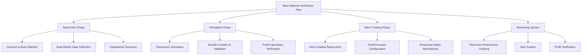

# Bot Verification Plan: Minimal Capital, Real Profits

**Date:** April 10, 2025

## Overview

The goal is to verify that the Listonian Arbitrage Bot operates correctly after refactoring by testing it on Base mainnet with minimal capital, aiming to achieve small but real profits of at least $0.10 USD per trade.

## Detailed Steps

### 1. Read-Only Phase

1. **Connect to Base Mainnet**
   - Set up secure RPC connections to Base mainnet
   - Configure the bot for Base mainnet addresses and parameters
   - Ensure proper API keys and rate limits for production use

2. **Real Market Data Collection**
   - Collect real-time price data from all supported DEXes on Base
   - Focus on the most liquid pairs (WETH-USDC, WETH-USDT, etc.)
   - Track gas prices and network conditions

3. **Opportunity Discovery**
   - Run the discovery pipeline with real market data
   - Identify potential arbitrage opportunities
   - Filter for opportunities with expected profit > $0.10 USD after gas

### 2. Simulation Phase

1. **Transaction Simulation**
   - Create real transaction bundles for opportunities meeting profit criteria
   - Use Flashbots simulation API to simulate execution
   - Verify gas estimates and transaction validity

2. **Bundle Creation & Validation**
   - Test the flash loan transaction creation with minimal amounts
   - Validate multi-step arbitrage bundles
   - Ensure proper transaction ordering and dependencies

3. **Profit Calculation Verification**
   - Verify profit calculations with real market data
   - Account for gas costs, slippage, and fees
   - Ensure expected profit meets the $0.10 USD minimum threshold

### 3. Micro-Trading Phase

1. **Micro-Capital Deployment**
   - Start with minimal capital (0.01-0.05 ETH)
   - Focus only on the most liquid and reliable DEX pairs
   - Set profit threshold to minimum $0.10 USD after all costs

2. **Profit-Focused Configuration**
   - Configure for conservative slippage settings
   - Optimize gas settings for reliable execution
   - Prioritize completion rate over maximum profit

3. **Enhanced Safety Mechanisms**
   - Implement strict capital exposure limits
   - Create automatic shutdown triggers if capital decreases
   - Develop emergency fund recovery procedures
   - Set maximum transaction count per day

### 4. Monitoring System

1. **Real-time Performance Tracking**
   - Monitor all bot activities on mainnet
   - Track execution times, success rates, and profits
   - Log all interactions with DEXes and flash loan providers

2. **Alert System**
   - Set up immediate alerts for any transaction
   - Create notifications for successful/failed arbitrages
   - Implement early warning for potential issues

3. **Profit Verification**
   - Implement precise profit tracking per transaction
   - Verify actual vs. expected profits
   - Track cumulative profit over time

## Implementation Approach

1. **Start with Passive Observation**
   - Begin by only observing the market and logging opportunities
   - Identify opportunities that would yield at least $0.10 USD profit
   - Ensure stable connections to all required services

2. **Progress to Simulation**
   - Simulate transactions without submitting them
   - Validate expected outcomes and profit calculations
   - Ensure simulated profits meet the minimum threshold

3. **Implement Micro-Trading**
   - Start with minimal capital (0.01-0.05 ETH)
   - Execute only on opportunities with high confidence
   - Verify actual profits match expected profits

4. **Establish Comprehensive Monitoring**
   - Set up detailed logging of all operations
   - Create dashboards for real-time monitoring
   - Implement profit tracking and visualization

## Success Criteria

1. **Stable Operation**
   - Bot maintains stable connections to Base mainnet
   - WebSocket connections remain stable over extended periods
   - No unexpected crashes or resource leaks

2. **Accurate Opportunity Identification**
   - Bot correctly identifies real arbitrage opportunities
   - Price and liquidity data matches on-chain reality
   - Profit calculations are accurate and conservative

3. **Successful Transactions**
   - Flash loan transactions execute as expected
   - Arbitrage routes complete successfully
   - Slippage protection prevents losses

4. **Verified Profits**
   - Bot achieves at least $0.10 USD profit per successful trade
   - Consistent positive ROI over multiple transactions
   - Accurate profit tracking and reporting

## Implementation Checklist

- [ ] Configure secure RPC connections to Base mainnet
- [ ] Set up real-time price monitoring for supported DEXes
- [ ] Implement opportunity discovery with profit filtering
- [ ] Create transaction simulation pipeline
- [ ] Develop bundle creation and validation process
- [ ] Implement profit calculation verification
- [ ] Set up micro-capital deployment system
- [ ] Configure profit-focused parameters
- [ ] Implement enhanced safety mechanisms
- [ ] Develop real-time performance tracking
- [ ] Create alert system for transactions
- [ ] Implement profit verification system
- [ ] Test passive observation mode
- [ ] Validate simulation accuracy
- [ ] Execute micro-trades with minimal capital
- [ ] Establish comprehensive monitoring system