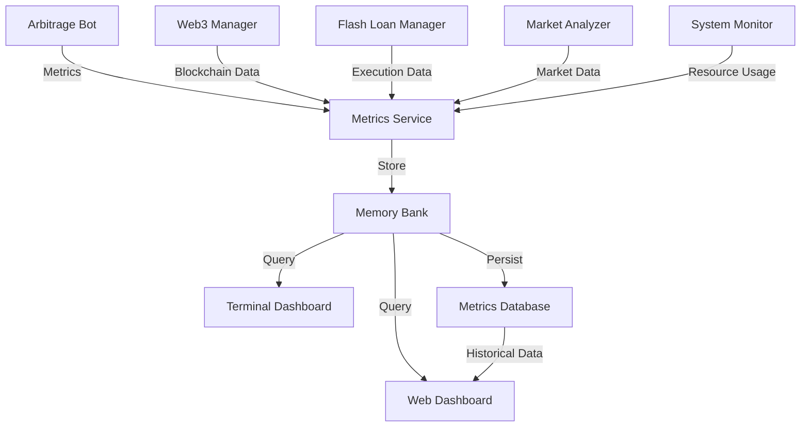
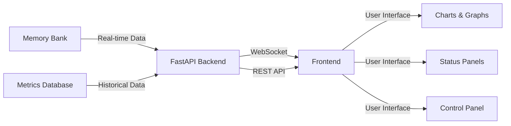
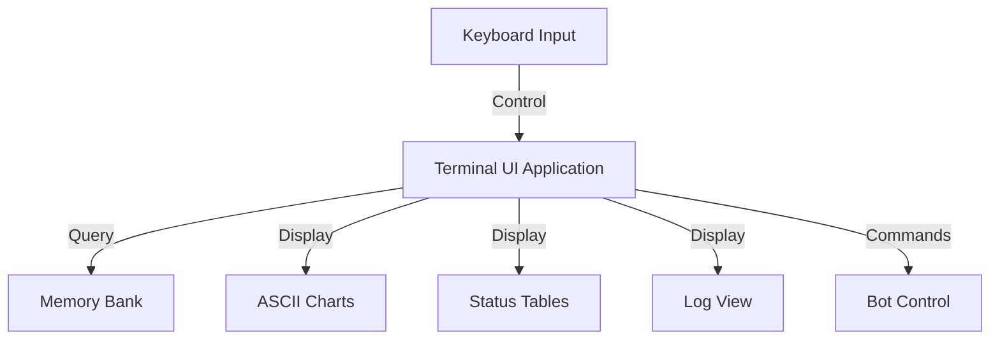
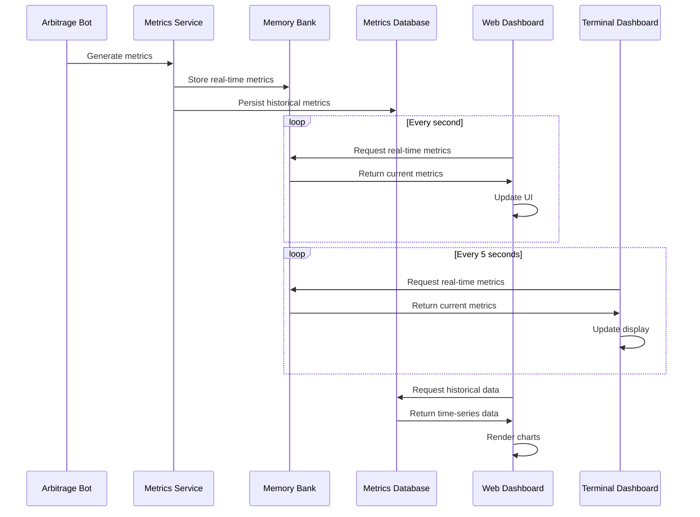

# Metrics Dashboard Plan for Listonian Arbitrage Bot

## Executive Summary

This document outlines a comprehensive plan for implementing real-time metrics dashboards for the Listonian Arbitrage Bot. The solution includes:

- **Dual Interface Approach**: Both web-based and terminal-based dashboards for different use cases
- **Comprehensive Metrics**: Coverage of financial metrics (profit/loss, ROI), operational metrics (scan rates, opportunities), and system health metrics (resource usage, blockchain connection)
- **Real-time Updates**: WebSocket-based updates for the web dashboard and periodic refreshes for the terminal dashboard
- **Historical Data**: Time-series storage for trend analysis and performance tracking
- **Implementation Phases**: A structured 5-phase approach from core metrics collection to deployment

The plan leverages existing components like the MetricsService and MemoryBank while adding new functionality for comprehensive monitoring. Implementation is estimated to require 9-13 days of development effort.

---

# Comprehensive Metrics Dashboard Plan

## 1. Metrics Categories and Data Points

### Financial Metrics
- **Profit/Loss Tracking**
  - Total profit (all-time)
  - Daily/weekly/monthly profit
  - Profit per trade
  - ROI percentage
  - Profit distribution by DEX pair
- **Gas Costs**
  - Average gas cost per transaction
  - Total gas spent
  - Gas efficiency (profit vs. gas cost ratio)
- **Trading Volume**
  - Total trading volume
  - Volume by token pair
  - Volume by DEX
- **Position Metrics**
  - Current wallet balance
  - Position size distribution
  - Maximum position size used

### Operational Metrics
- **Scanning Performance**
  - DEXes scanned per minute
  - Pools monitored (total and by DEX)
  - API response times
  - Cache hit/miss ratio
- **Arbitrage Opportunities**
  - Opportunities detected vs. executed
  - Average opportunity size
  - Opportunity distribution by token pair
  - Time to execution
- **Flash Loan Metrics**
  - Flash loan success rate
  - Average flash loan size
  - Flash loan provider distribution
- **Transaction Metrics**
  - Transaction success rate
  - Failed transaction reasons
  - Average confirmation time
  - Pending transactions

### System Health Metrics
- **Resource Usage**
  - CPU utilization
  - Memory usage
  - Disk I/O
  - Network bandwidth
- **Blockchain Connection**
  - RPC connection status
  - Block sync status
  - Block height
  - Gas price trends
- **System Status**
  - Process uptime
  - Service status
  - API health
  - Log freshness
- **Error Rates**
  - Error count by type
  - Error frequency
  - Recent error messages

## 2. Data Collection Architecture

### Implementation Details:
1. **Metrics Service Enhancement**
   - Extend the existing `MetricsService` to collect all required metrics
   - Implement collectors for each metric category
   - Add aggregation functions for time-based metrics

2. **Memory Bank Integration**
   - Use the existing `MemoryBank` for in-memory storage of real-time metrics
   - Add methods for querying specific metric categories
   - Implement time-series storage for historical data

3. **System Monitor Component**
   - Create a new component to collect system resource metrics
   - Integrate with OS-level monitoring tools
   - Implement periodic collection of resource usage data

4. **Metrics Database**
   - Add a lightweight database (SQLite or similar) for persistent storage
   - Implement data retention policies
   - Create schema for efficient querying of historical data

## 3. Web Dashboard Implementation

### Implementation Details:
1. **Backend Enhancement**
   - Extend the existing FastAPI application in `new_dashboard/dashboard.py`
   - Add new API endpoints for each metric category
   - Enhance WebSocket support for real-time updates

2. **Frontend Development**
   - Create responsive dashboard layout with Bootstrap or similar
   - Implement charts and graphs using Chart.js or D3.js
   - Add filtering and time range selection

3. **Visualization Components**
   - Financial metrics: Line charts, pie charts for distribution
   - Operational metrics: Gauges, counters, and status indicators
   - System health: Resource usage graphs, status indicators

4. **User Interface Features**
   - Dark/light mode toggle
   - Customizable dashboard layouts
   - Alert thresholds configuration
   - Data export functionality

## 4. Terminal Dashboard Implementation

### Implementation Details:
1. **Terminal UI Framework**
   - Use a library like `blessed`, `urwid`, or `textual` for TUI
   - Create a layout with multiple panels for different metric categories
   - Implement keyboard navigation and commands

2. **ASCII Visualization**
   - Implement simple ASCII charts for key metrics
   - Use color coding for status indicators
   - Create compact tabular displays for detailed metrics

3. **Real-time Updates**
   - Implement periodic refresh of displayed metrics
   - Add event-based updates for critical changes
   - Include a log view for recent events

4. **Interactive Features**
   - Add commands for controlling the bot
   - Implement filtering and sorting of displayed metrics
   - Include help system and keyboard shortcuts

## 5. Integration and Data Flow

### Implementation Details:
1. **Data Collection Frequency**
   - High-frequency metrics: 1-second intervals (prices, gas)
   - Medium-frequency metrics: 10-second intervals (operational)
   - Low-frequency metrics: 1-minute intervals (system health)

2. **Data Retention Policy**
   - Real-time data: In-memory storage with 1-hour retention
   - Short-term data: Database storage with 7-day retention
   - Long-term data: Aggregated storage with 1-year retention

3. **Update Mechanisms**
   - Web Dashboard: WebSocket for real-time, REST API for historical
   - Terminal Dashboard: Periodic polling with configurable interval

4. **Synchronization**
   - Use locks to prevent race conditions during updates
   - Implement atomic operations for critical metrics
   - Add data validation to ensure consistency

## 6. Implementation Phases

### Phase 1: Core Metrics Collection
1. Enhance the `MetricsService` to collect all required metrics
2. Implement the `SystemMonitor` component
3. Extend the `MemoryBank` for storing the new metrics
4. Add basic persistence to a metrics database

### Phase 2: Web Dashboard Enhancement
1. Extend the existing FastAPI backend with new endpoints
2. Implement the frontend dashboard with charts and graphs
3. Add WebSocket support for real-time updates
4. Implement user interface features and controls

### Phase 3: Terminal Dashboard Development
1. Create the terminal UI application
2. Implement ASCII visualization components
3. Add keyboard navigation and commands
4. Integrate with the `MemoryBank` for data access

### Phase 4: Testing and Optimization
1. Test both dashboards with simulated data
2. Optimize data collection and storage
3. Fine-tune update frequencies and retention policies
4. Conduct user testing and gather feedback

### Phase 5: Documentation and Deployment
1. Create user documentation for both dashboards
2. Add configuration options for customization
3. Implement deployment scripts
4. Conduct final testing in production environment

## 7. Technical Considerations

### Performance Optimization
- Use efficient data structures for in-memory storage
- Implement caching for frequently accessed metrics
- Optimize database queries for historical data
- Use compression for long-term storage

### Security Considerations
- Implement authentication for the web dashboard
- Add rate limiting for API endpoints
- Sanitize all user inputs
- Use secure WebSocket connections

### Scalability
- Design for potential future metrics
- Allow for plugin-based metric collectors
- Implement configurable retention policies
- Support distributed deployment

### Error Handling
- Implement graceful degradation on metric collection failures
- Add retry mechanisms for transient errors
- Provide clear error messages in the UI
- Log all errors for troubleshooting

## 8. Required Resources

### Libraries and Dependencies
- **Web Dashboard**: FastAPI, WebSockets, Chart.js/D3.js, Bootstrap
- **Terminal Dashboard**: blessed/textual, asciichartpy
- **Data Storage**: SQLite/SQLAlchemy, pandas for data manipulation
- **System Monitoring**: psutil, py-spy

### Development Effort
- **Phase 1**: 2-3 days
- **Phase 2**: 3-4 days
- **Phase 3**: 2-3 days
- **Phase 4**: 1-2 days
- **Phase 5**: 1 day
- **Total**: 9-13 days of development effort