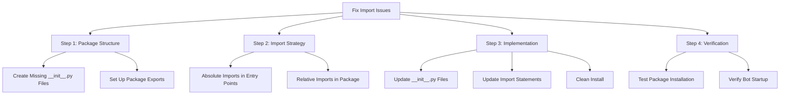

# Import Structure Fix Implementation Plan

## Overview
This document outlines the plan to fix Python package import issues in the arbitrage bot, specifically addressing the `ModuleNotFoundError: No module named 'arbitrage_bot.core.ml.model_interface'` error.

## Current Issue
The bot is failing to import modules correctly due to incomplete package structure and inconsistent import strategies. While the package is installed successfully with `pip install -e .`, the internal package structure needs proper initialization files and a consistent import strategy.

## Implementation Plan



## Detailed Steps

### 1. Package Structure Setup

Required directory structure with proper initialization:
```
arbitrage_bot/
├── __init__.py  (export core components with absolute imports)
├── core/
│   ├── __init__.py  (export submodules)
│   ├── ml/
│   │   ├── __init__.py  (export MLSystem)
│   │   └── model_interface.py  (use relative imports)
│   ├── market/
│   │   ├── __init__.py  (export EnhancedMarketAnalyzer)
│   │   └── enhanced_market_analyzer.py  (use relative imports)
│   └── memory/
│       ├── __init__.py  (export MemoryBank)
│       └── memory_bank.py  (use relative imports)
```

### 2. Import Strategy

#### Entry Points (main.py, run_bot.py)
Use absolute imports for clarity and explicit dependencies:
```python
from arbitrage_bot.core.ml.model_interface import MLSystem
from arbitrage_bot.core.market.enhanced_market_analyzer import EnhancedMarketAnalyzer
```

#### Internal Modules
Use relative imports for better maintainability:
```python
from ..ml.model_interface import MLSystem
from ..memory.memory_bank import MemoryBank
```

### 3. Implementation Steps

1. Create/Update __init__.py Files
   - Create missing __init__.py files in each package directory
   - Set up proper exports in each __init__.py
   - Ensure consistent import patterns

2. Update Import Statements
   - Convert entry point imports to absolute
   - Verify relative imports in package internals
   - Update any circular dependencies

3. Clean Installation
   - Uninstall current package
   - Clean build artifacts
   - Reinstall with pip in editable mode

### 4. Verification Process

1. Package Installation
   - Verify package installs cleanly
   - Check package structure in site-packages
   - Confirm all modules are discoverable

2. Import Testing
   - Test imports in Python shell
   - Verify package namespace
   - Check for import errors

3. Bot Verification
   - Run bot with debug logging
   - Monitor startup process
   - Verify all components initialize

## Success Criteria
- All imports resolve correctly
- Bot starts without import errors
- Package structure is clean and maintainable
- Import strategy is consistent across the codebase

## Next Steps
1. Switch to code mode for implementation
2. Follow the steps outlined above
3. Test and verify each change
4. Document any additional findings or required changes