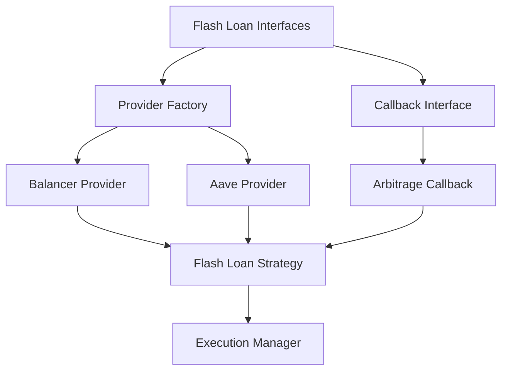

# Flash Loan Integration

This document provides a comprehensive overview of the Flash Loan integration in the Listonian Arbitrage Bot. It covers the architecture, implementation details, provider selection, and usage patterns.

## Overview

Flash Loans allow for borrowing assets without collateral, as long as the borrowed assets are returned within the same transaction. This enables capital-efficient arbitrage, as the bot can execute large trades without requiring significant capital reserves.

## Architecture

The Flash Loan integration follows a clean, modular architecture:



### Components

1. **Interfaces** (`interfaces.py`)
   - Define protocols for providers and callbacks
   - Standardize data models for parameters and results
   - Ensure consistent error handling

2. **Provider Factory** (`factory.py`)
   - Creates and initializes provider instances
   - Implements intelligent provider selection
   - Handles fallback mechanisms and cost estimation

3. **Providers**
   - **Balancer Provider** (`providers/balancer.py`)
     - Zero-fee flash loans
     - Primary provider for maximum profit
   - **Aave Provider** (`providers/aave.py`)
     - 0.09% fee with wider token support
     - Fallback provider for reliability

4. **Flash Loan Strategy** (`execution/strategies/flash_loan_strategy.py`)
   - Integrates with execution manager
   - Implements opportunity validation and execution
   - Handles provider selection and fallback logic

5. **Callback Implementation** (`ArbitrageFlashLoanCallback`)
   - Executes arbitrage steps during flash loan
   - Ensures loan repayment with fees
   - Tracks profit and execution metrics

## Provider Selection Logic

The system implements intelligent provider selection to maximize profit:

1. **Primary Selection** - `get_best_provider()`
   - Prioritize Balancer (zero fees) when token is supported and has liquidity
   - Fall back to Aave (0.09% fee) when Balancer lacks support or liquidity

2. **Multi-Token Selection** - `get_optimal_multi_token_provider()`
   - Find a single provider that can handle all tokens for a multi-token flash loan
   - Prioritize Balancer first, then Aave

3. **Runtime Fallback** - In `FlashLoanExecutionStrategy.execute()`
   - Try primary provider first
   - If primary fails, try alternative provider
   - Comprehensive error handling and logging

4. **Cost Estimation** - `estimate_flash_loan_cost()`
   - Compare costs across providers
   - Calculate fee and gas costs for profit assessment
   - Support profitability verification

## Implementation Details

### Provider Interfaces

All flash loan providers implement the `FlashLoanProvider` protocol:

```python
class FlashLoanProvider(Protocol):
    @property
    def name(self) -> str: ...
    
    @property
    def supported_tokens(self) -> List[str]: ...
    
    async def initialize(self) -> None: ...
    
    async def execute_flash_loan(
        self,
        params: FlashLoanParams,
        callback: FlashLoanCallback
    ) -> FlashLoanResult: ...
    
    async def get_flash_loan_fee(
        self,
        token_address: str,
        amount: Decimal
    ) -> Decimal: ...
    
    async def check_liquidity(
        self,
        token_address: str,
        amount: Decimal
    ) -> bool: ...
    
    async def max_flash_loan(
        self,
        token_address: str
    ) -> Decimal: ...
    
    async def close(self) -> None: ...
```

### Callback System

Flash loan callbacks implement the `FlashLoanCallback` protocol:

```python
class FlashLoanCallback(Protocol):
    async def on_flash_loan(
        self,
        sender: str,
        tokens: List[str],
        amounts: List[int],
        fees: List[int],
        user_data: bytes
    ) -> bool: ...
    
    async def on_flash_loan_completed(
        self,
        result: FlashLoanResult
    ) -> None: ...
    
    async def on_flash_loan_failed(
        self,
        result: FlashLoanResult
    ) -> None: ...
```

### Provider Implementation

Providers implement contract interactions with their respective flash loan protocols:

#### Balancer Provider
- Uses Balancer's vault contract for flash loans
- No fees (maximum profit)
- Works with token batches
- Supports multi-token flash loans

#### Aave Provider
- Uses Aave's lending pool contract
- 0.09% fee
- Wider token support
- More extensive network support

### Execution Strategy

The Flash Loan execution strategy integrates with the arbitrage system:

1. **Validation**
   - Checks if the opportunity can be executed with flash loans
   - Verifies liquidity across providers
   - Calculates fee costs and profit potential

2. **Profitability Assessment**
   - Compares expected profit against estimated costs
   - Applies a profit threshold multiplier for safety
   - Considers gas costs in profitability calculation

3. **Execution**
   - Creates and initializes optimal provider
   - Sets up arbitrage callback with opportunity details
   - Executes flash loan and handles result
   - Implements fallback to alternative provider on failure

4. **Result Handling**
   - Tracks execution time, gas used, and profit
   - Provides detailed success/failure information
   - Implements proper resource cleanup

## Safety Mechanisms

The flash loan integration implements several safety mechanisms:

1. **Slippage Protection**
   - Default 0.5% slippage tolerance, configurable
   - Prevents excessive price impact

2. **Profit Threshold**
   - 1.5x cost multiplier by default, configurable
   - Ensures sufficient profit margin for safety

3. **Liquidity Verification**
   - Checks available liquidity before execution
   - Prevents execution when liquidity is insufficient

4. **Balance Verification**
   - Verifies token balances before repayment
   - Ensures sufficient funds to repay flash loan + fees

5. **Provider Fallback**
   - Attempts alternative provider on failure
   - Improves reliability and success rate

6. **Resource Management**
   - Proper initialization and cleanup
   - Thread safety with locks

## Usage Examples

### Basic Usage

```python
# Create flash loan provider
provider_config = {
    "network": "mainnet",
    "pool_address": "0xBA12222222228d8Ba445958a75a0704d566BF2C8"  # Balancer
}
provider = await create_flash_loan_provider("balancer", web3_client, provider_config)

# Create callback
callback = ArbitrageFlashLoanCallback(web3_client, opportunity, execution_params)

# Define token to borrow
token_amount = TokenAmount(
    token_address="0xC02aaA39b223FE8D0A0e5C4F27eAD9083C756Cc2",  # WETH
    amount=Decimal("10")  # 10 WETH
)

# Create flash loan parameters
params = FlashLoanParams(
    token_amounts=[token_amount],
    receiver_address="0xYourContractAddress",
    slippage_tolerance=Decimal("0.005"),  # 0.5%
    transaction_params={}
)

# Execute flash loan
result = await provider.execute_flash_loan(params, callback)
```

### Using Factory Selection

```python
# Combined provider configuration
provider_config = {
    "balancer": {
        "network": "mainnet",
        "pool_address": "0xBA12222222228d8Ba445958a75a0704d566BF2C8"
    },
    "aave": {
        "network": "mainnet",
        "lending_pool_address": "0x87870Bca3F3fD6335C3F4ce8392D69350B4fA4E2"
    }
}

# Get best provider for specific token
token_address = "0xC02aaA39b223FE8D0A0e5C4F27eAD9083C756Cc2"  # WETH
amount = Decimal("10")  # 10 WETH

provider = await get_best_provider(
    web3_client,
    token_address,
    amount,
    provider_config
)

# Provider is now the best option for this token/amount
```

### Using Execution Strategy

```python
# Create strategy
strategy = FlashLoanExecutionStrategy(web3_client, config)
await strategy.initialize()

# Check if opportunity can be executed
can_execute = await strategy.can_execute(opportunity)

# Check profitability
is_profitable = await strategy.is_profitable(opportunity)

# Execute opportunity
if can_execute and is_profitable:
    result = await strategy.execute(opportunity)
    
    if result.status == ExecutionStatus.EXECUTED:
        print(f"Success! Profit: {result.profit_amount}")
    else:
        print(f"Failed: {result.error_message}")
```

## Performance Considerations

1. **Provider Caching**
   - Pre-initialize providers for common tokens
   - Cache providers for reuse to reduce initialization overhead

2. **Gas Optimization**
   - Balancer typically uses less gas than Aave
   - Include gas buffer in estimations (20% default)
   - Consider gas costs in profitability calculations

3. **Network Selection**
   - Different networks have different optimal providers
   - Ethereum mainnet has highest liquidity but highest gas costs
   - Layer 2 solutions might offer better economics for smaller arbitrages

4. **Error Handling**
   - Flash loans must be atomic
   - Comprehensive error handling at all levels
   - Proper resource cleanup on errors

## Integration with Flashbots

Flash loans can be combined with Flashbots protection:

1. Bundle flash loan transactions with Flashbots submissions
2. Protect against MEV attacks during flash loan execution
3. Improve transaction privacy and execution reliability

This integration is planned but not yet implemented.

## Next Steps

1. Further optimize gas usage for flash loan transactions
2. Implement more comprehensive testing and simulation
3. Add support for more flash loan providers (dYdX, Uniswap, etc.)
4. Create specialized flash loan contracts for complex arbitrage
5. Integrate with Flashbots for MEV protection

## Troubleshooting

Common issues and solutions:

1. **Insufficient Liquidity**
   - Error: "Insufficient liquidity for token"
   - Solution: Try smaller amounts or different tokens

2. **Transaction Reverted**
   - Error: "Transaction reverted"
   - Cause: Often due to slippage or price movement
   - Solution: Increase slippage tolerance or check contract errors

3. **Gas Estimation Failures**
   - Error: "Failed to estimate gas"
   - Solution: Set manual gas limit or check input parameters

4. **Provider Initialization Failures**
   - Error: "Failed to initialize provider"
   - Solution: Check network settings and contract addresses