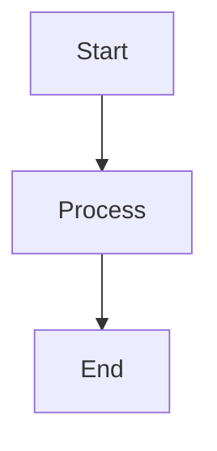
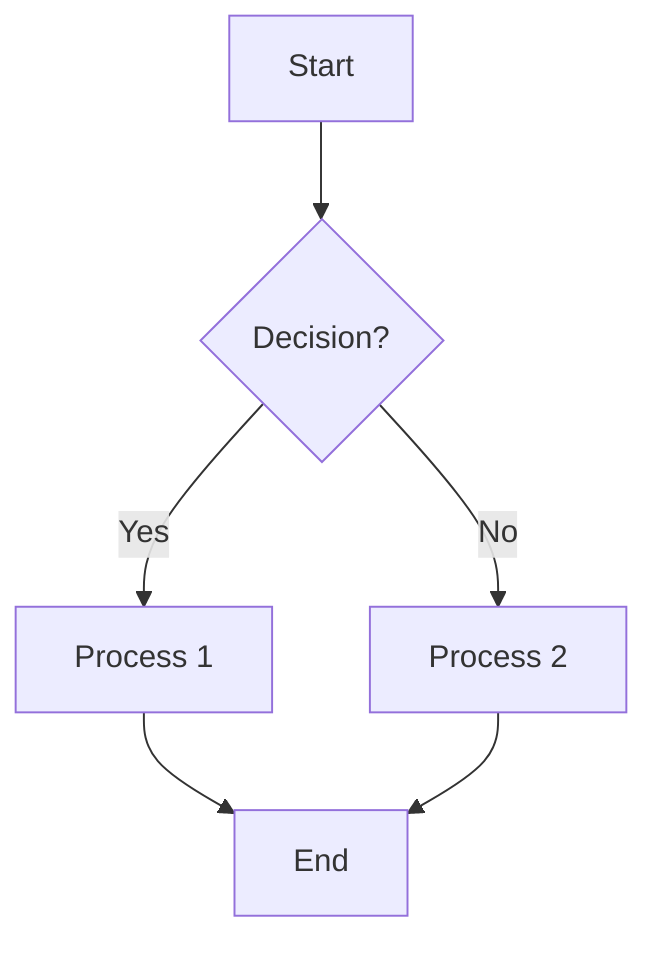
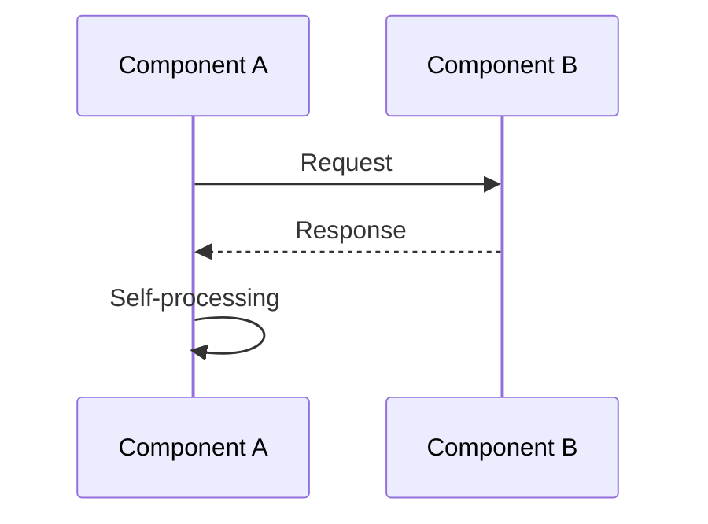
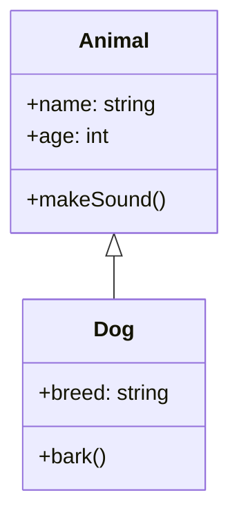
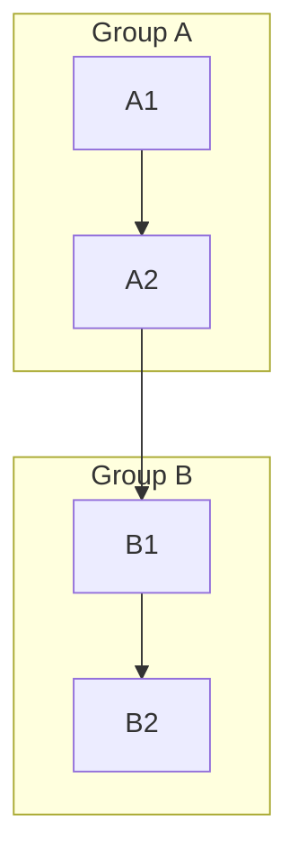
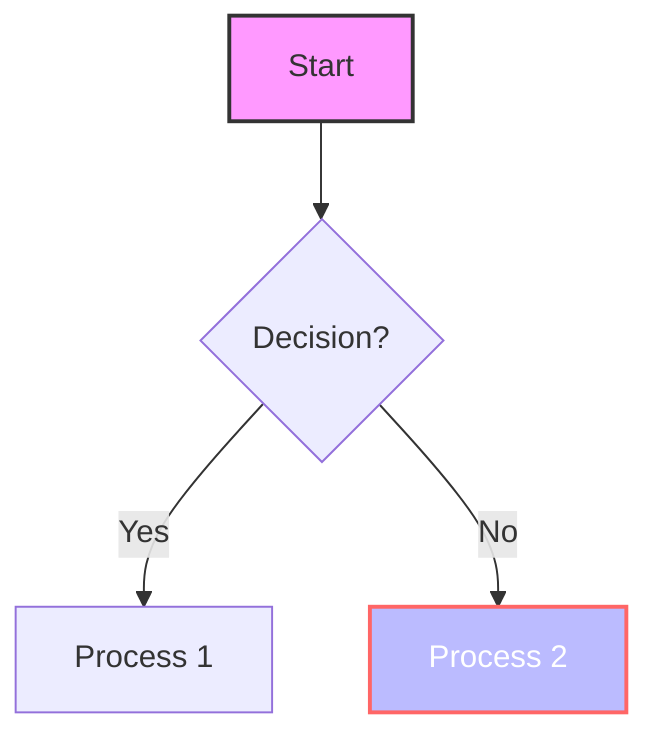
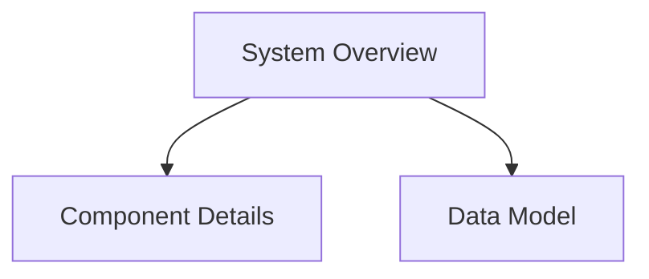
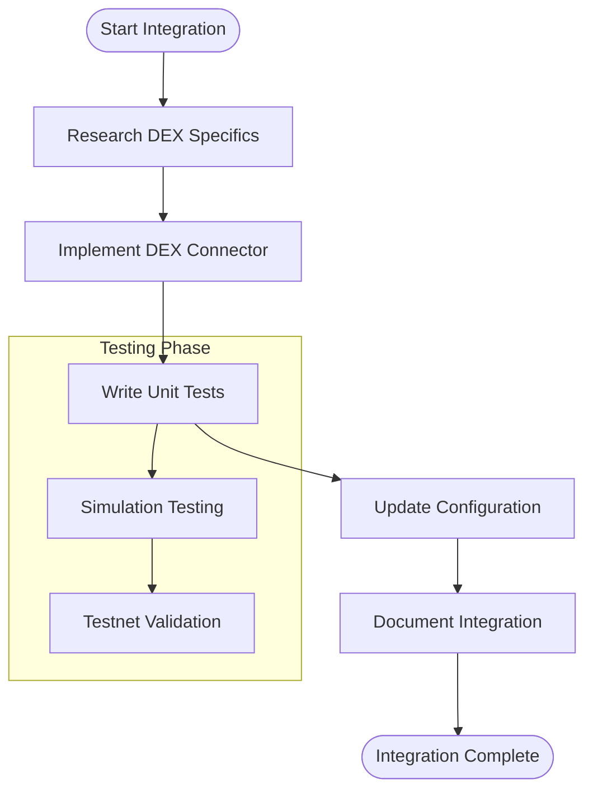
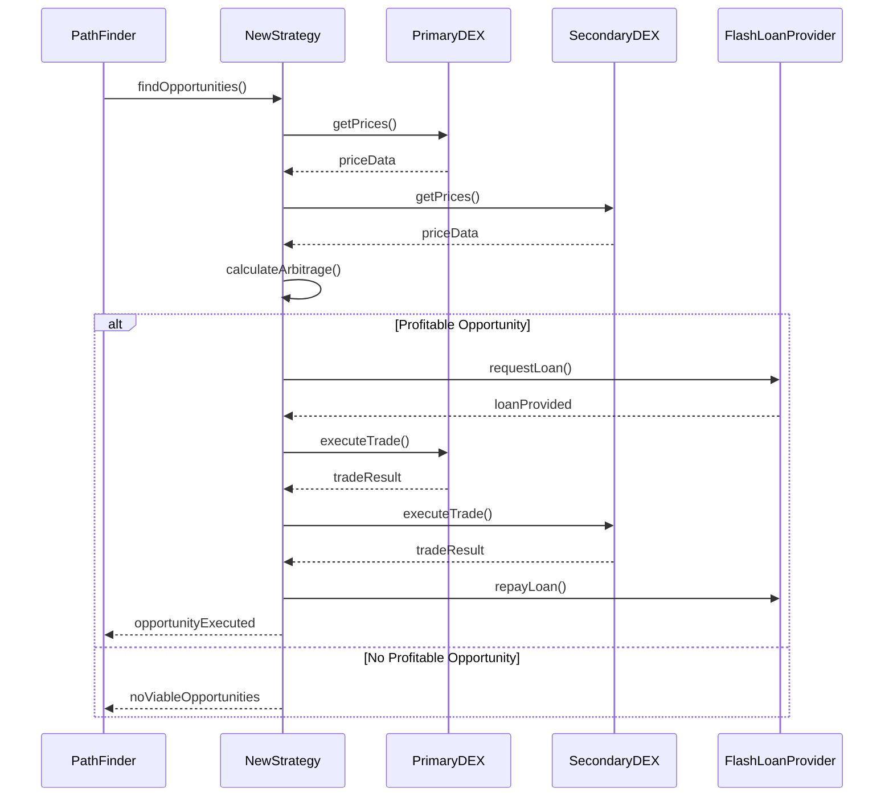

# Using Mermaid Diagrams in Documentation

This guide explains how to use, modify, and create Mermaid diagrams to enhance your arbitrage system documentation.

## What is Mermaid?

Mermaid is a JavaScript-based diagramming and charting tool that renders Markdown-inspired text definitions to create and modify diagrams dynamically. It's supported in many Markdown environments, including GitHub, GitLab, and various documentation tools.

## How to Use Mermaid Diagrams

### Including Diagrams in Markdown

To include a Mermaid diagram in your Markdown documentation:

1. Add a code block with the `mermaid` language identifier
2. Insert your diagram code within the block

```

```

When rendered, this will display as a flowchart.

### Viewing Diagrams

To view Mermaid diagrams:

1. Use a Markdown viewer that supports Mermaid (like GitHub, VSCode with extensions, etc.)
2. For development/editing, use the [Mermaid Live Editor](https://mermaid.live/) to preview and modify diagrams
3. In environments that don't support Mermaid, consider exporting diagrams as SVG or PNG files

## Modifying Existing Diagrams

The diagrams in `mermaid_visualizations.md` are designed to be starting points that you can customize:

1. Copy the diagram code from the document
2. Paste it into the [Mermaid Live Editor](https://mermaid.live/)
3. Make your modifications
4. Test the rendering
5. Copy the updated code back to your documentation

### Common Modifications

- **Adding new elements**: Add nodes, connections, or states to reflect system changes
- **Updating text**: Modify descriptions, labels, and titles
- **Changing relationships**: Update connections between components
- **Styling**: Adjust colors, shapes, and styles to emphasize important elements

## Creating New Diagrams

### Basic Process

1. Identify what you want to visualize
2. Choose the appropriate diagram type (see below)
3. Start with a simple structure
4. Add details incrementally
5. Test rendering after each significant addition
6. Review for clarity and accuracy

### Choosing the Right Diagram Type

| Diagram Type | Best For |
|-------------|---------|
| Flowchart | Process flows, algorithms, decision trees |
| Sequence Diagram | Interactions between components over time |
| Class Diagram | Code structure, inheritance, relationships |
| State Diagram | System states and transitions |
| Entity Relationship | Data models and relationships |
| Gantt Chart | Project planning, scheduling |
| Pie Chart | Distribution of values |
| User Journey | User experience flows |
| Git Graph | Repository history visualization |
| C4 Diagram | Architecture at different abstraction levels |
| Mindmap | Hierarchical information organization |
| Timeline | Events over time |
| Requirement Diagram | System requirements and verification |

## Diagram-Specific Guidance

### Flowcharts

Flowcharts use shapes and arrows to represent processes:



Key components:
- Nodes with various shapes: `[]` for process, `()` for start/end, `{}` for decision
- Directional arrows with optional labels: `-->`, `-->|Label|`
- Direction: TD (top-down), LR (left-right), RL, BT

### Sequence Diagrams

Sequence diagrams show interaction between components:



Key components:
- Participants: `participant X as Label`
- Messages: `->>` for solid arrows, `-->>` for dashed
- Activations: `activate A` and `deactivate A`
- Notes: `Note over A,B: Note text`

### Class Diagrams

Class diagrams show code structure and relationships:



Key components:
- Classes with attributes and methods
- Relationships: inheritance `<|--`, composition `*--`, aggregation `o--`
- Visibility modifiers: `+` public, `-` private, `#` protected

### Advanced Techniques

#### Subgraphs for Grouping



#### Styling Elements



#### Links Between Diagrams

You can create a "diagram of diagrams" by linking to separate diagrams:



## Best Practices

1. **Keep it simple**: Focus on what's important, avoid excessive detail
2. **Use consistent styling**: Maintain visual coherence across diagrams
3. **Add descriptions**: Include text explaining key points about the diagram
4. **Version control**: Update diagrams when the system changes
5. **Decompose complex diagrams**: Break large diagrams into smaller, focused ones
6. **Use meaningful labels**: Clear, concise text that conveys meaning
7. **Consider your audience**: Technical depth should match reader expertise
8. **Test rendering**: Verify diagrams render correctly in your documentation platform

## Diagram Maintenance

As your arbitrage system evolves:

1. Review diagrams for accuracy after significant changes
2. Update diagrams to reflect new components or relationships
3. Create new diagrams for new features or subsystems
4. Remove or archive outdated diagrams
5. Consider adding a "last updated" date to track diagram currency

## Resources

- [Official Mermaid Documentation](https://mermaid-js.github.io/mermaid/)
- [Mermaid Live Editor](https://mermaid.live/)
- [Mermaid Cheat Sheet](https://jojozhuang.github.io/tutorial/mermaid-cheat-sheet/)

## Examples for Common Arbitrage System Documentation

### Documenting a New DEX Integration



### Visualizing a New Profit Strategy



By using these examples and resources, you'll be able to create clear, effective Mermaid diagrams to enhance your arbitrage system documentation.