# Mermaid Chart Examples for Memory Bank Documentation

The Memory Bank documentation can be enhanced with various types of charts and diagrams using the Mermaid syntax. This document provides examples of different chart types that can be used to visualize concepts, architecture, flows, and relationships within the Listonian Arbitrage Bot project.

## 1. Flowcharts

Flowcharts are ideal for displaying process flows, decision paths, and system architecture.

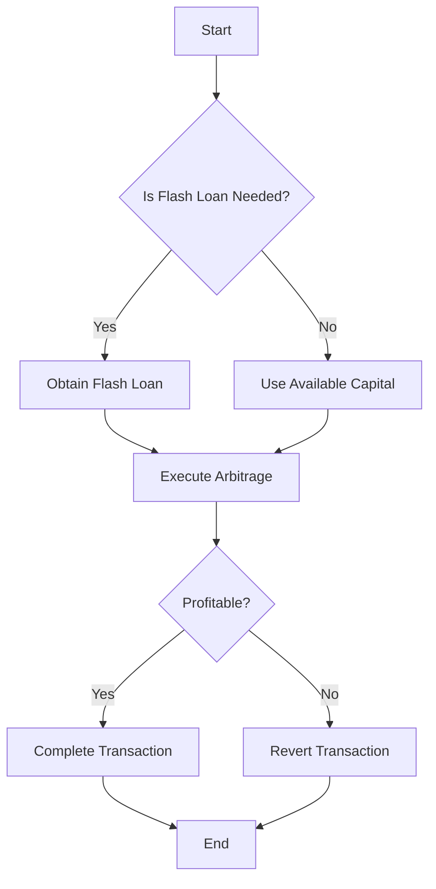

## 2. Sequence Diagrams

Sequence diagrams show the interaction between different components over time.

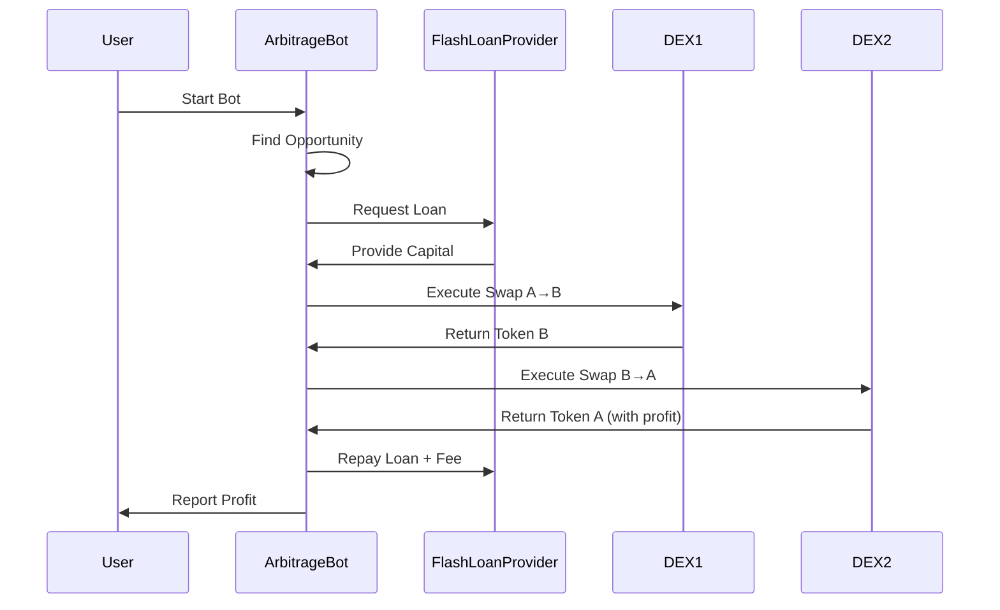

## 3. Class Diagrams

Class diagrams display the structure of classes, interfaces, and their relationships.

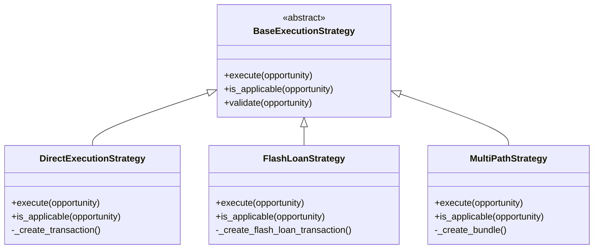

## 4. State Diagrams

State diagrams show different states of a system and transitions between them.

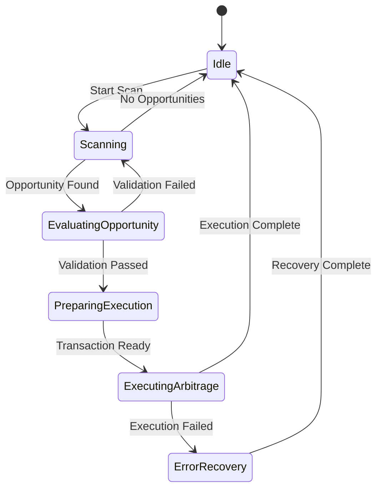

## 5. Entity Relationship Diagrams

ERD diagrams show database structure and relationships between entities.

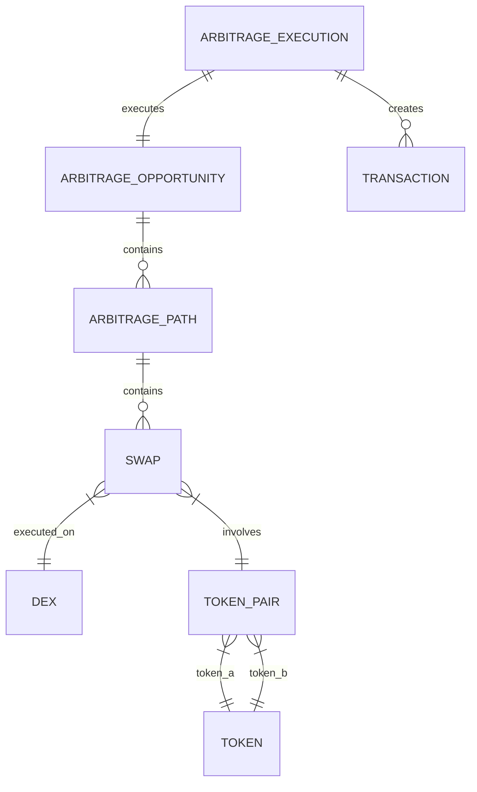

## 6. Gantt Charts

Gantt charts are useful for project planning and milestone tracking.

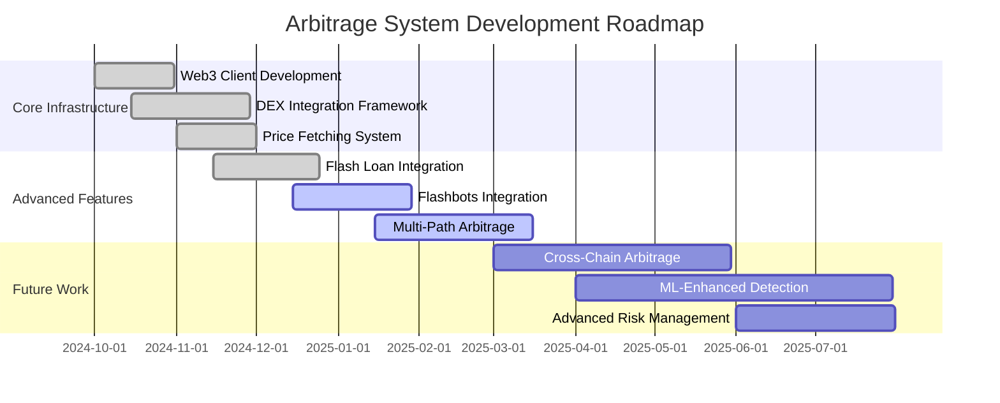

## 7. Pie Charts

Pie charts can visualize distribution data.

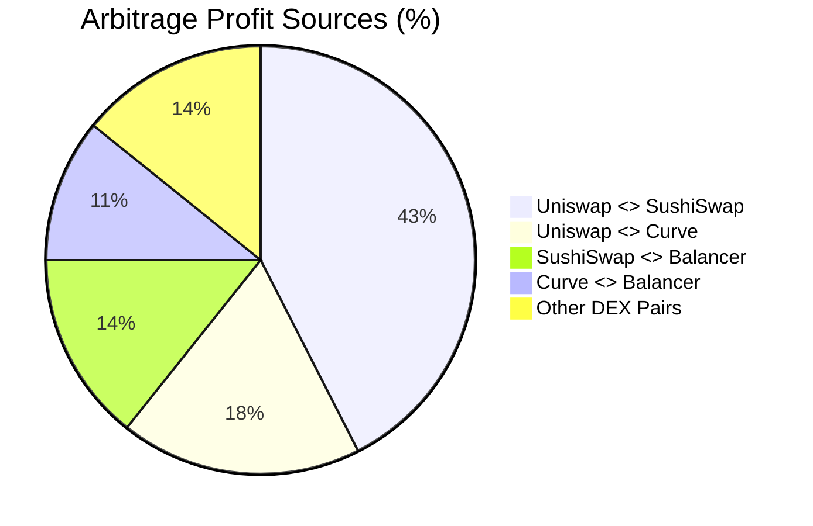

## 8. User Journey Diagrams

User journey diagrams show the user's path through a system.

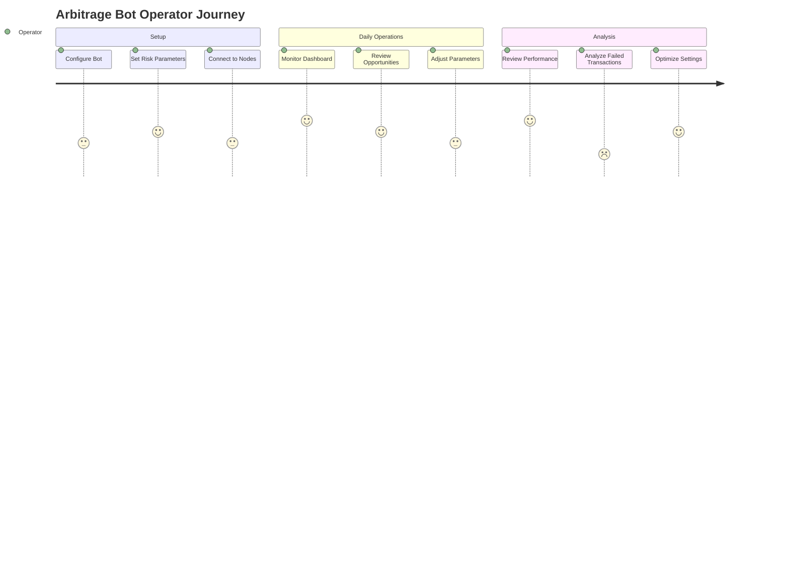

## 9. Git Graphs

Git graphs show repository history and branching.

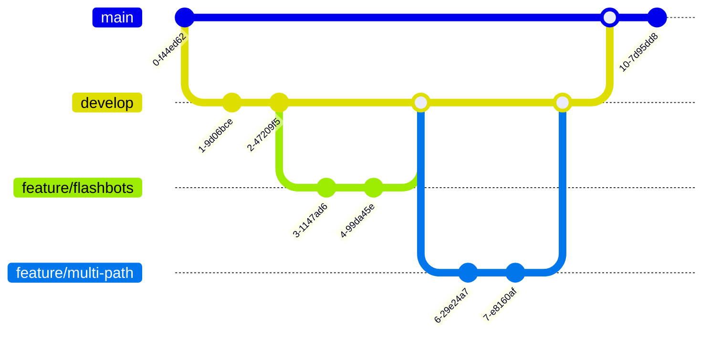

## 10. C4 Diagrams

C4 models document software architecture at different abstraction levels.

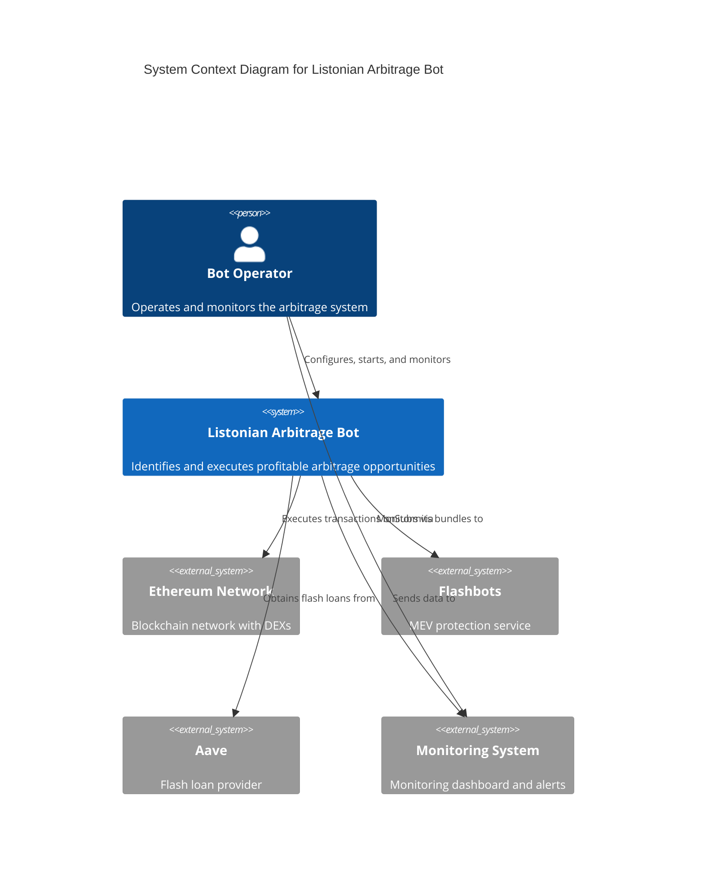

## 11. Mindmaps

Mindmaps organize hierarchical information.

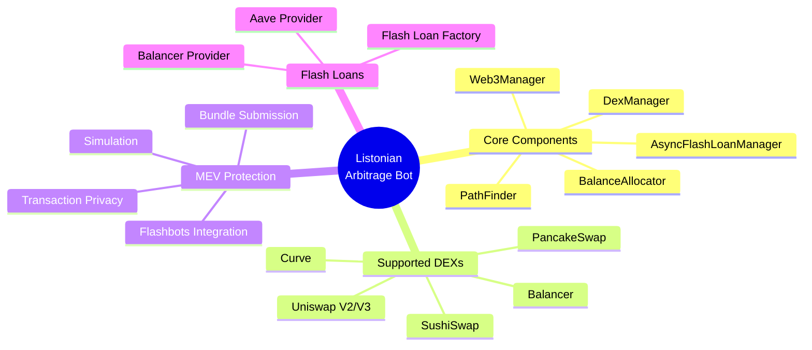

## 12. Timeline Charts

Timeline charts visualize events over time.

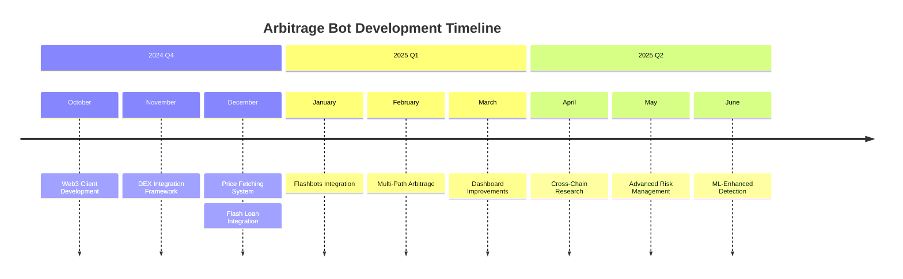

## 13. Requirement Diagrams

Requirement diagrams document and track requirements.

```mermaid
requirementDiagram
    requirement r1 {
        id: 1
        text: The system shall execute arbitrage opportunities
        risk: high
        verifymethod: test
    }
    
    requirement r2 {
        id: 2
        text: The system shall protect against front-running
        risk: high
        verifymethod: test
    }
    
    requirement r3 {
        id: 3
        text: The system shall optimize capital allocation
        risk: medium
        verifymethod: test
    }
    
    element flashbotsIntegration {
        type: module
        docref: flashbots_integration.md
    }
    
    element multiPathArbitrage {
        type: module
        docref: multi_path_arbitrage.md
    }
    
    r1 - satisfies -> multiPathArbitrage
    r2 - satisfies -> flashbotsIntegration
    r3 - satisfies -> multiPathArbitrage
```

## Example: Architecture Overview

Here's a comprehensive system architecture diagram that could be used in the Memory Bank:

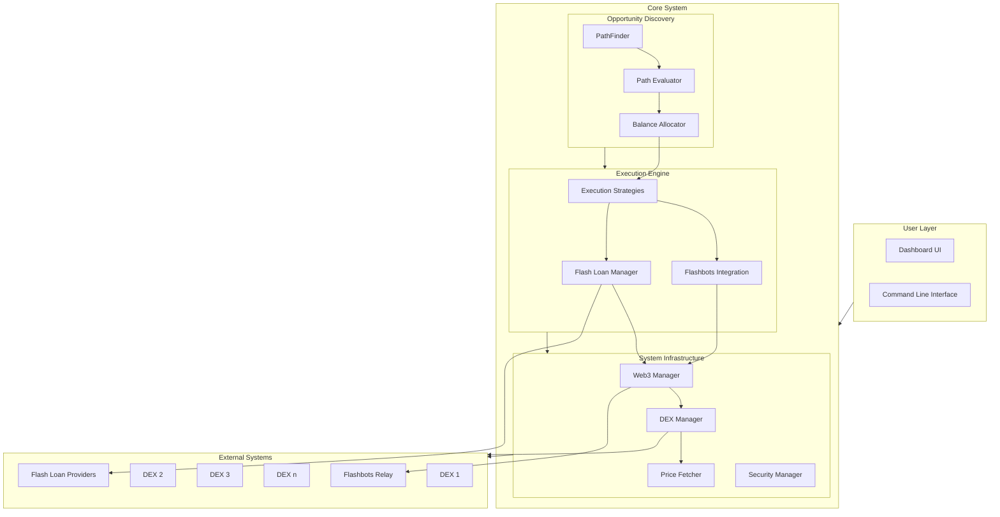

## Example: Multi-Path Arbitrage Flow

A detailed flowchart of the multi-path arbitrage process:

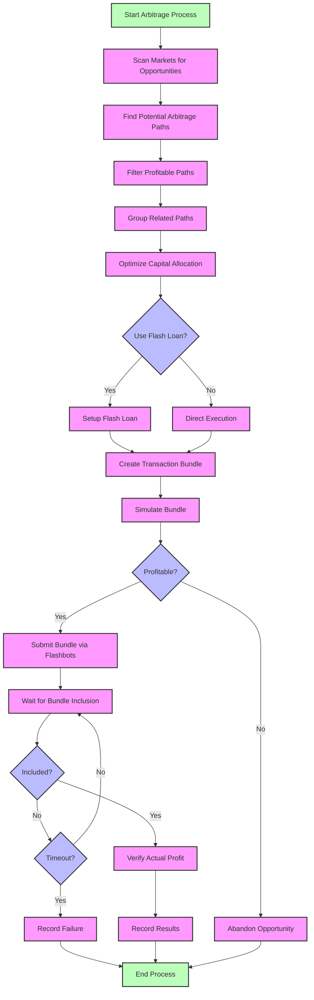

## Using Mermaid in Memory Bank Documentation

To include Mermaid diagrams in your Memory Bank documentation, simply embed the Mermaid syntax within a code block using the `mermaid` language identifier:

````markdown
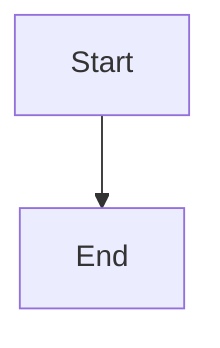
````

### Tips for Effective Diagram Use

1. **Choose the Right Diagram Type**
   - Flowcharts for processes and algorithms
   - Sequence diagrams for interactions between components
   - Class diagrams for code architecture
   - State diagrams for state transitions

2. **Keep Diagrams Focused**
   - Each diagram should convey a single main concept
   - Break complex diagrams into smaller, focused ones
   - Use consistent styling for similar diagram elements

3. **Use Descriptive Labels**
   - Add clear, concise labels to nodes and connections
   - Include descriptive titles for diagrams
   - Add comments where necessary for clarification

4. **Maintain Consistency**
   - Use consistent terminology across diagrams and text
   - Follow the same styling conventions in all diagrams
   - Align diagram notation with code structure

These diagrams can significantly enhance the Memory Bank documentation by providing visual representation of complex concepts, making the documentation more accessible and easier to understand during development.