# Arbitrage System Visualizations

This document provides various visual representations of the arbitrage system using Mermaid diagrams. These visualizations help clarify system architecture, processes, relationships, and more.

## Table of Contents

1. [Flowcharts](#flowcharts)
2. [Sequence Diagrams](#sequence-diagrams)
3. [Class Diagrams](#class-diagrams)
4. [State Diagrams](#state-diagrams)
5. [Entity Relationship Diagrams](#entity-relationship-diagrams)
6. [Gantt Charts](#gantt-charts)
7. [Pie Charts](#pie-charts)
8. [User Journey Diagrams](#user-journey-diagrams)
9. [Git Graphs](#git-graphs)
10. [C4 Diagrams](#c4-diagrams)
11. [Mindmaps](#mindmaps)
12. [Timeline Charts](#timeline-charts)
13. [Requirement Diagrams](#requirement-diagrams)

---

## Flowcharts

Flowcharts visualize the execution flow and decision paths within the system.

### Arbitrage Execution Flowchart

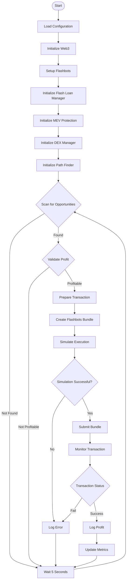

### Opportunity Discovery Process

```mermaid
flowchart LR
    Start([Start Discovery]) --> FetchPrices[Fetch Prices from All DEXes]
    FetchPrices --> BuildGraph[Build Token Graph]
    BuildGraph --> FindPaths[Find Potential Paths]
    FindPaths --> EvaluatePaths[Evaluate Path Profitability]
    
    EvaluatePaths --> FilterPaths{Filter Paths}
    FilterPaths -->|Profitable| CalculateROI[Calculate Expected ROI]
    FilterPaths -->|Not Profitable| Discard([Discard Path])
    
    CalculateROI --> RankOpportunities[Rank Opportunities]
    RankOpportunities --> SortByROI[Sort by ROI]
    SortByROI --> ReturnTop[Return Top Opportunities]
    ReturnTop --> End([End Discovery])
```

---

## Sequence Diagrams

Sequence diagrams show interactions between components over time.

### Flash Loan Arbitrage Sequence

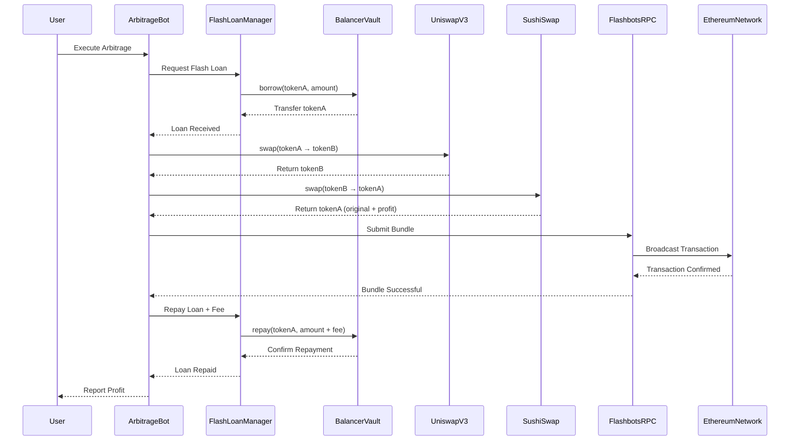

### Multi-DEX Price Fetching

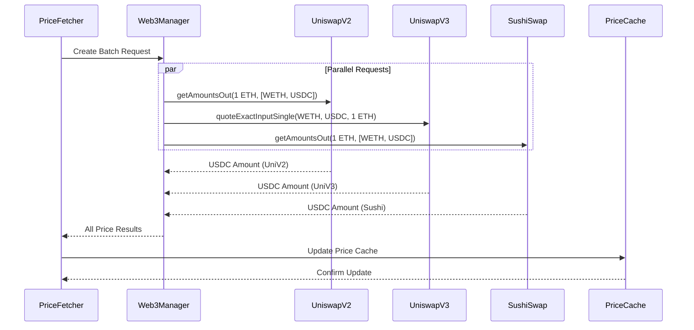

---

## Class Diagrams

Class diagrams display code structure and inheritance patterns.

### DEX Implementation Hierarchy

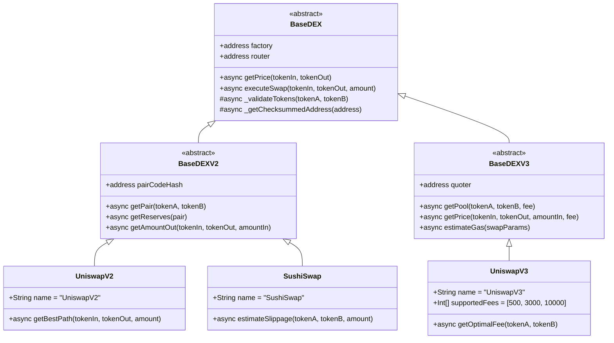

### Core System Components

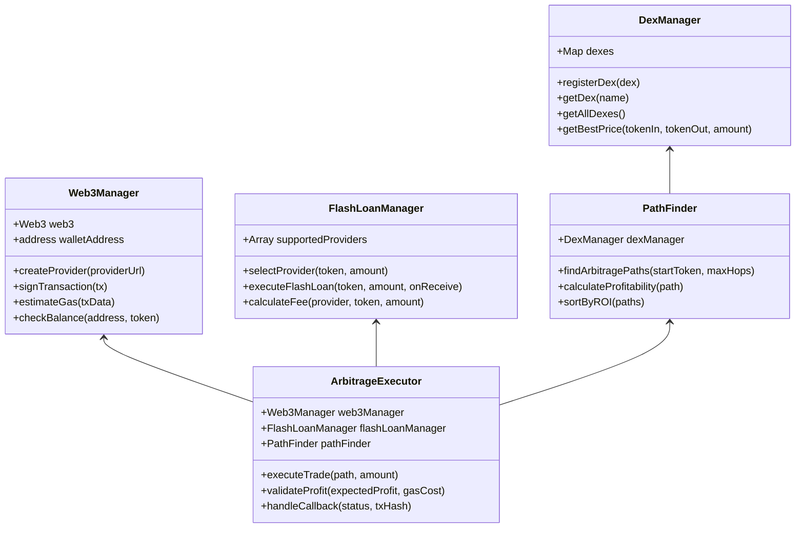

---

## State Diagrams

State diagrams show different states of the system.

### Arbitrage Bot Lifecycle

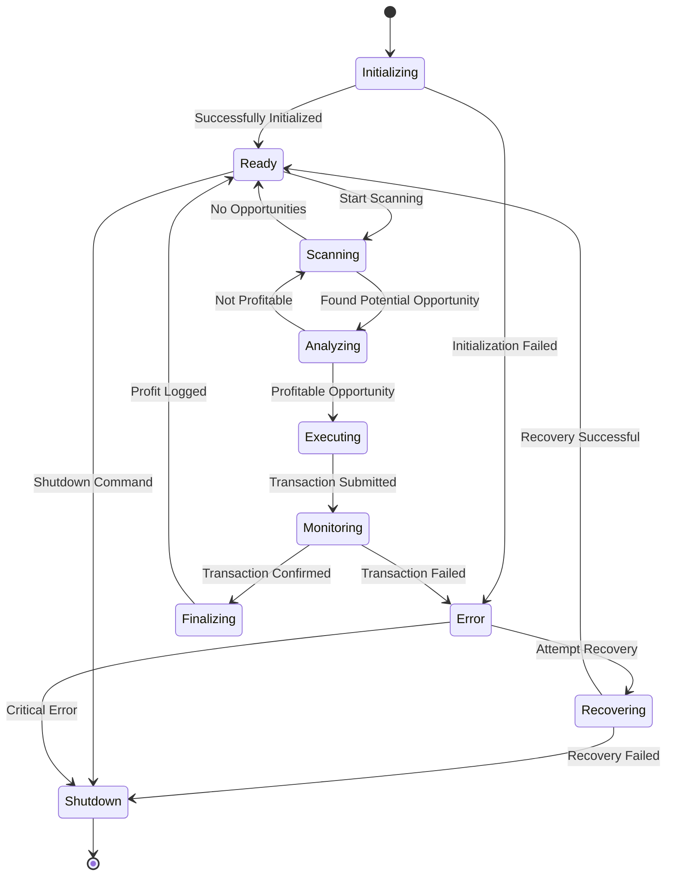

### Transaction State Lifecycle

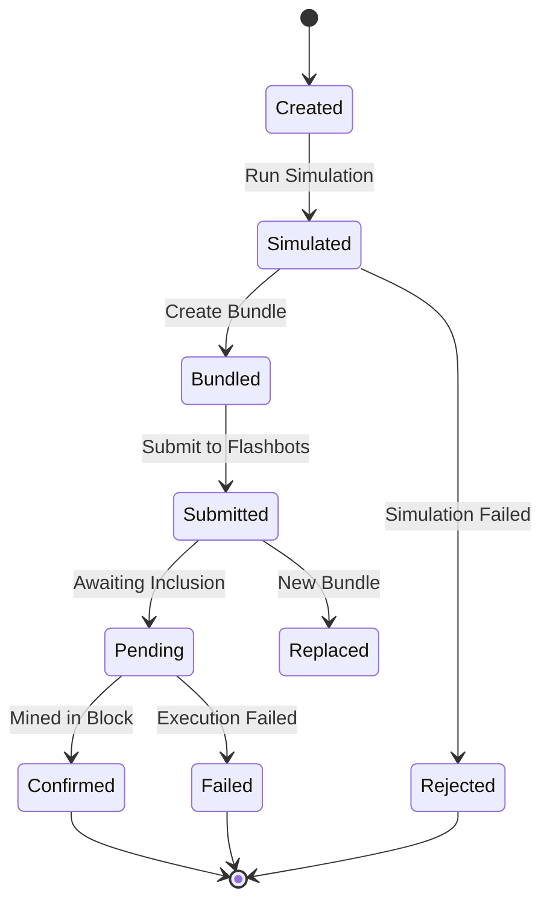

---

## Entity Relationship Diagrams

Entity Relationship Diagrams show data relationships.

### Arbitrage Data Model

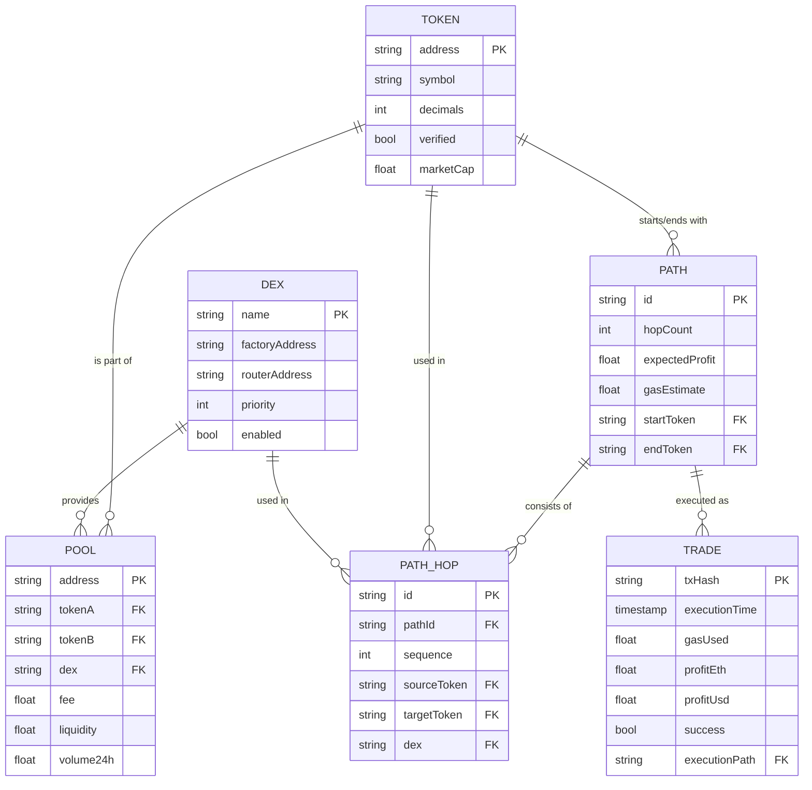

---

## Gantt Charts

Gantt charts display project planning and milestones.

### Arbitrage System Development Roadmap

```mermaid
gantt
    title Arbitrage System Development Roadmap
    dateFormat  YYYY-MM-DD
    
    section Foundation
    Core System Architecture       :done, arch, 2025-01-01, 14d
    Web3 Integration              :done, web3, after arch, 7d
    Basic DEX Integration         :done, dex, after web3, 10d
    
    section Core Features
    PathFinder Implementation     :done, path, after dex, 14d
    Basic Arbitrage Logic         :done, arb, after path, 7d
    Dashboard Prototype           :done, dash, after arb, 10d
    
    section Advanced Features
    Flash Loan Integration        :done, flash, after arb, 14d
    Multi-DEX Support             :done, multidex, after flash, 10d
    MEV Protection                :done, mev, after multidex, 14d
    
    section Enhancements
    Enhanced Dashboard            :done, endash, after dash, 14d
    Profit Optimization           :done, profit, after mev, 10d
    Gas Optimization              :done, gas, after profit, 7d
    
    section Testing & Deployment
    Integration Testing           :done, test, after gas, 14d
    Production Deployment         :active, deploy, after test, 7d
    Monitoring & Optimization     :future, monitor, after deploy, 21d
    
    section Future Development
    Machine Learning Integration  :future, ml, after monitor, 21d
    Cross-Chain Support           :future, crosschain, after ml, 28d
```

---

## Pie Charts

Pie charts visualize distribution data.

### Profit Sources Breakdown

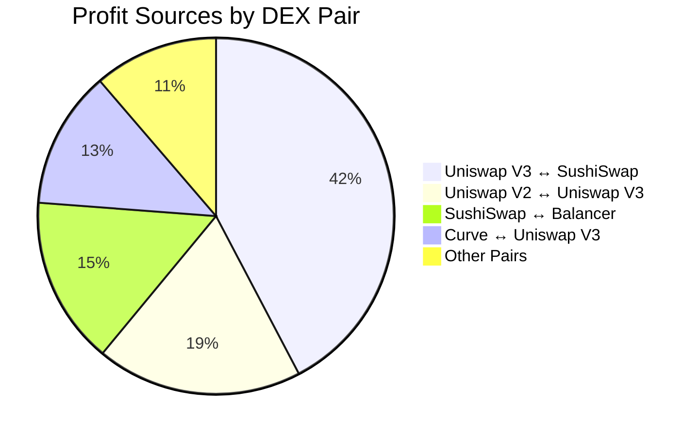

### Gas Cost Distribution

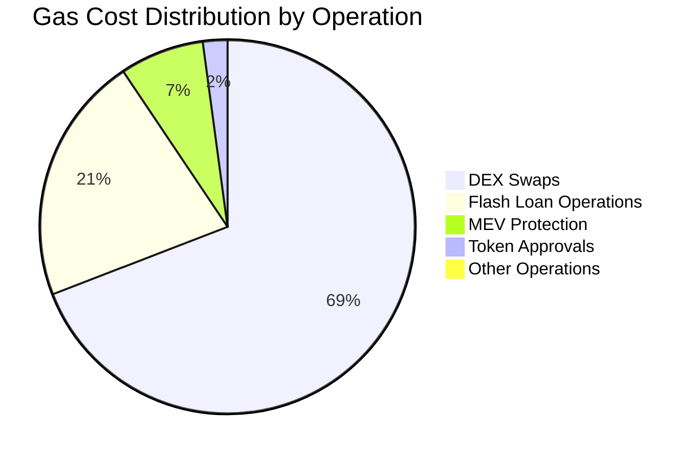

---

## User Journey Diagrams

User Journey Diagrams show operator experience flow.

### Arbitrage Operator Journey

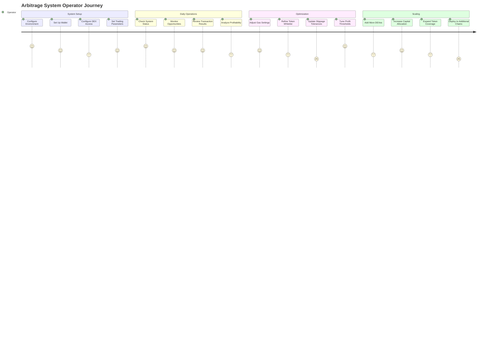

---

## Git Graphs

Git graphs show repository history and branching.

### Development Workflow

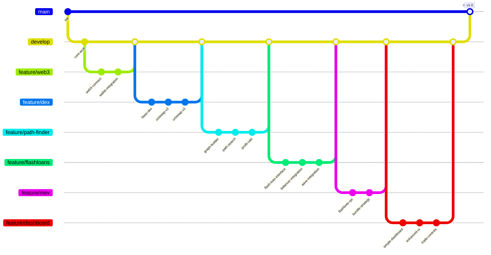

---

## C4 Diagrams

C4 diagrams document software architecture at different levels.

### System Context (C1)

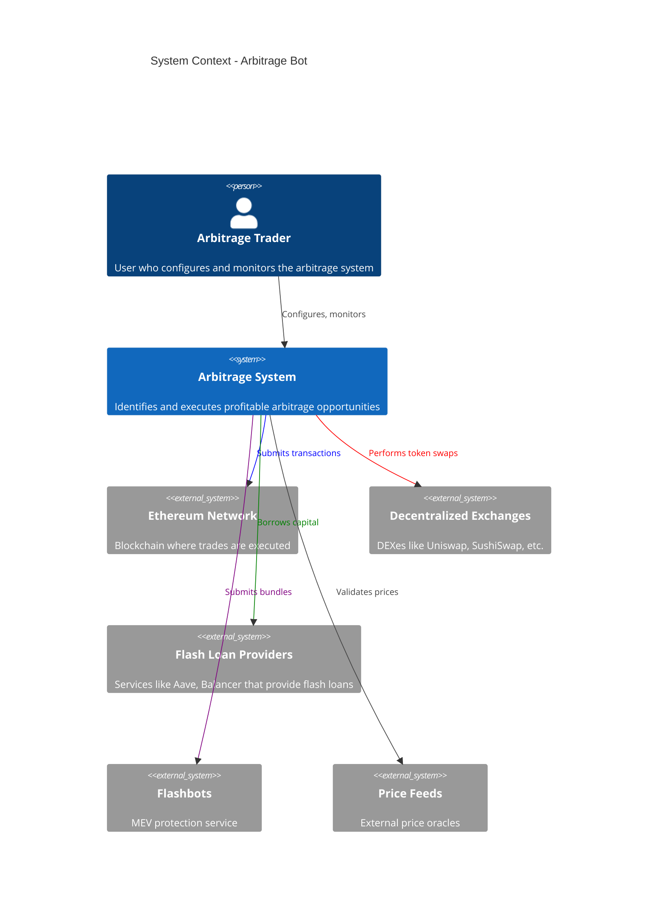

### Container Diagram (C2)

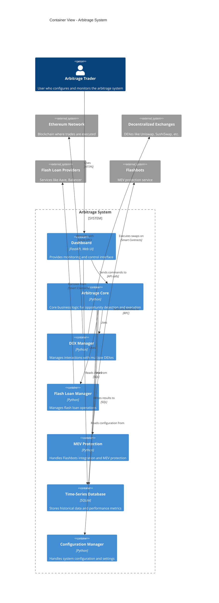

---

## Mindmaps

Mindmaps organize hierarchical information.

### Arbitrage System Components

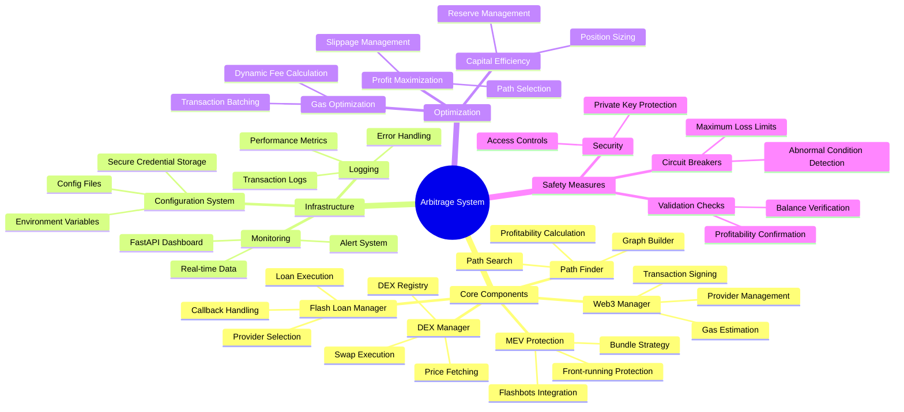

---

## Timeline Charts

Timeline charts visualize events over time.

### Development Roadmap Timeline

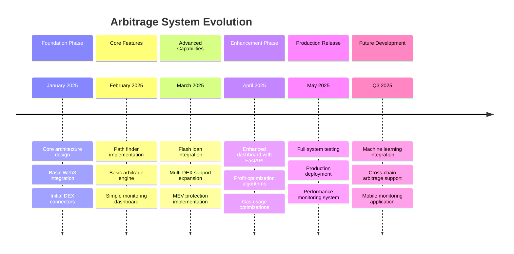

---

## Requirement Diagrams

Requirement diagrams document and track system requirements.

### System Requirements

```mermaid
requirementDiagram
    requirement system "Arbitrage System" {
        id: SYS-001
        text: The system shall identify and execute profitable arbitrage opportunities
        risk: low
        verifymethod: test
    }
    
    requirement profit "Profit Maximization" {
        id: REQ-001
        text: The system shall maximize net profit after gas costs and fees
        risk: medium
        verifymethod: analysis
    }
    
    requirement safety "Safety Measures" {
        id: REQ-002
        text: The system shall implement protections against financial loss
        risk: high
        verifymethod: inspection
    }
    
    requirement dex "DEX Integration" {
        id: REQ-003
        text: The system shall support multiple decentralized exchanges
        risk: low
        verifymethod: demonstration
    }
    
    requirement flash "Flash Loan Support" {
        id: REQ-004
        text: The system shall leverage flash loans for capital efficiency
        risk: medium
        verifymethod: test
    }
    
    requirement mev "MEV Protection" {
        id: REQ-005
        text: The system shall implement protection against MEV attacks
        risk: high
        verifymethod: test
    }
    
    requirement monitoring "Monitoring Capabilities" {
        id: REQ-006
        text: The system shall provide real-time monitoring of operations
        risk: medium
        verifymethod: demonstration
    }
    
    element test_flashloan "Flash Loan Test" {
        type: test
        docref: run_flash_loan_test.bat
    }
    
    element test_mev "MEV Protection Test" {
        type: test
        docref: run_flashbots_test.bat
    }
    
    system - profit
    system - safety
    system - dex
    system - flash
    system - mev
    system - monitoring
    
    flash - test_flashloan
    mev - test_mev
```

---

These Mermaid diagrams provide comprehensive visual documentation of your arbitrage system. Each diagram type highlights different aspects of the system, from execution flows to component relationships, development timelines, and more. You can include these diagrams in your Memory Bank documentation to make complex concepts more accessible and provide clear visual representations of your system's architecture and processes.

To use these diagrams in your Markdown files, simply copy the relevant diagram code including the triple backtick sections that contain the `mermaid` syntax.