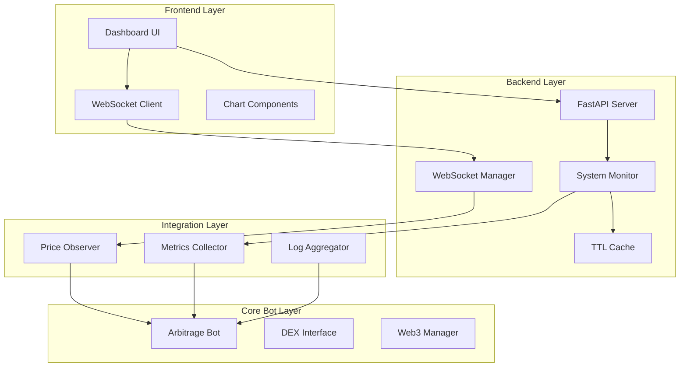
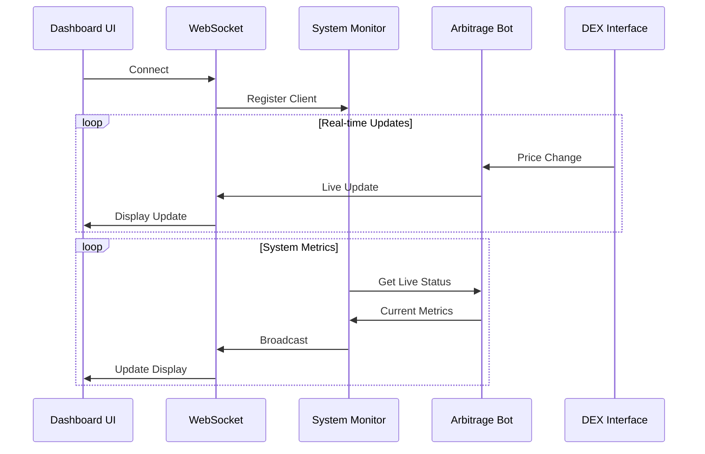

# Dashboard Implementation Plan

## Core Architecture



## Implementation Strategy

### 1. Core Components

#### WebSocket Manager
```python
class WebSocketManager:
    def __init__(self):
        self._lock = asyncio.Lock()
        self._connections = set()
        self._cache = TTLCache()

    async def broadcast(self, event: str, data: Dict):
        async with self._lock:
            for conn in self._connections:
                await conn.send_json({"event": event, "data": data})
```

#### System Monitor
```python
class SystemMonitor:
    def __init__(self):
        self._observers = set()
        self._metrics = {}

    async def collect_metrics(self):
        async with self._lock:
            return {
                'system': await self._get_system_metrics(),
                'bot': await self._get_bot_metrics(),
                'network': await self._get_network_metrics()
            }
```

#### Price Observer
```python
class PriceObserver:
    async def on_price_change(self, token: str, price: Decimal):
        await self.ws_manager.broadcast("price_update", {
            "token": token,
            "price": str(price),
            "timestamp": time.time()
        })
```

### 2. Data Flow



### 3. Implementation Phases

#### Phase 1: Foundation
1. WebSocket Manager
   - Live connection handling
   - Real-time broadcasting
   - Error recovery
   - Client tracking

2. System Monitor
   - Live metric collection
   - Direct status tracking
   - Active resource monitoring
   - Real-time error detection

3. Base UI
   - Live data display
   - Real-time updates
   - Error handling
   - Connection management

#### Phase 2: Data Integration
1. Price Observer
   - Direct DEX integration
   - Live price tracking
   - Immediate updates
   - Real-time notifications

2. Metrics Collector
   - Live performance tracking
   - Real-time gas monitoring
   - Direct success rate tracking
   - Actual volume monitoring

3. Log Aggregator
   - Live error collection
   - Real-time event tracking
   - Immediate status updates
   - Direct alert generation

#### Phase 3: Enhanced Features
1. Interactive Charts
   - Live price tracking
   - Real-time volume updates
   - Current gas usage
   - Actual success rates

2. Advanced Monitoring
   - Live network status
   - Real-time contract states
   - Current pool liquidity
   - Active gas trends

3. Alert System
   - Real-time error detection
   - Live threshold monitoring
   - Immediate status updates
   - Direct performance alerts

## Technical Requirements

### 1. Backend
- FastAPI for HTTP endpoints
- WebSocket for real-time data
- Direct async operations
- Live error handling

### 2. Frontend
- Real-time data display
- Live updates
- Direct error reporting
- Active connection management

### 3. Data Management
- Direct data access
- Active memory management
- Real-time thread safety
- Immediate resource cleanup

### 4. Monitoring
- Live system metrics
- Real-time bot performance
- Current network status
- Active error tracking

## Success Criteria

### 1. Performance
- < 2s response time
- < 100ms WebSocket latency
- < 50MB memory usage
- < 10% CPU usage

### 2. Reliability
- 99.9% uptime
- Immediate recovery
- No memory leaks
- Clean shutdowns

### 3. Usability
- Real-time metrics
- Live updates
- Immediate error visibility
- Direct navigation

## Next Steps

1. Review and approve plan
2. Set up direct connections to bot
3. Begin Phase 1 with live data
4. Continuous testing with real data

Remember:
- No mock data anywhere
- Direct integration with live systems
- Real-time data only
- Immediate updates
- Active monitoring
- Live testing