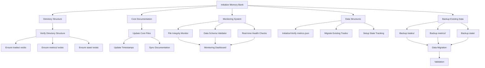
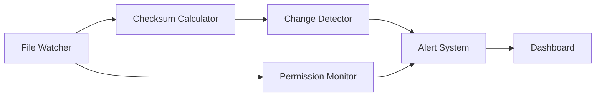
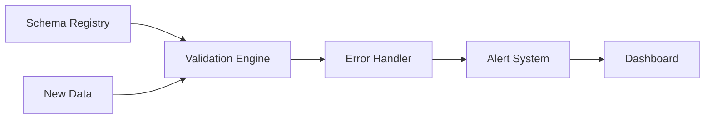
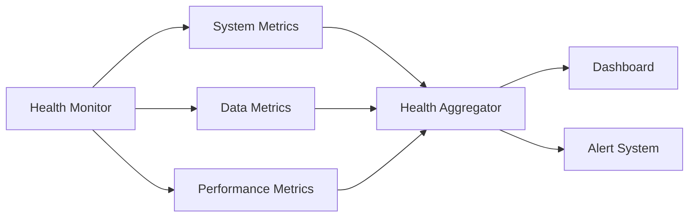

# Memory Bank Initialization Plan

## Overview

This document outlines the plan for initializing and maintaining the memory bank system with real-time monitoring capabilities.

## System Architecture



## Directory Structure

```
memory-bank/
├── trades/         # Trade history
├── metrics/        # Performance metrics
│   └── historical/ # Historical metric snapshots
└── state/         # System state data
```

## Monitoring System Architecture

### 1. File Integrity Monitor



Components:
- File Watcher: Real-time monitoring of file changes
- Checksum Calculator: Validates file integrity
- Change Detector: Identifies unauthorized modifications
- Permission Monitor: Tracks file permissions
- Alert System: Notifies of integrity violations

### 2. Data Schema Validator



Components:
- Schema Registry: Maintains data structure definitions
- Validation Engine: Validates data against schemas
- Error Handler: Processes validation failures
- Alert System: Notifies of schema violations

### 3. Real-time Health Checks



Components:
- Health Monitor: Continuous system monitoring
- System Metrics: Disk space, permissions, etc.
- Data Metrics: Data integrity and consistency
- Performance Metrics: Response times and throughput
- Health Aggregator: Combines metrics for overall health score

## Data Structures

### Memory Bank Status Schema
```json
{
  "memory_bank_status": {
    "last_check": "<ISO timestamp>",
    "health_status": "healthy|degraded|error",
    "integrity_checks": {
      "trades": {
        "status": "ok|error",
        "file_count": "<number>",
        "last_validated": "<ISO timestamp>"
      },
      "metrics": {
        "status": "ok|error",
        "schema_valid": true|false,
        "last_updated": "<ISO timestamp>"
      },
      "state": {
        "status": "ok|error",
        "last_snapshot": "<ISO timestamp>"
      }
    },
    "alerts": [
      {
        "timestamp": "<ISO timestamp>",
        "level": "info|warning|error",
        "message": "<string>",
        "component": "<string>"
      }
    ]
  }
}
```

### Monitoring Thresholds

- File Size Limits:
  - Trade files: < 1MB each
  - Metrics file: < 10MB
  - State files: < 5MB each

- Update Frequencies:
  - Trade data: Real-time
  - Metrics: Every 5 seconds
  - State: Every minute
  - Health checks: Every 30 seconds

- Alert Levels:
  - Info: Normal operations
  - Warning: Potential issues
  - Error: Immediate attention required

## Implementation Steps

1. **Backup Phase**
   - Create timestamped backups
   - Verify backup integrity
   - Store in secure location

2. **Directory Structure**
   - Create required directories
   - Set proper permissions
   - Initialize placeholder files

3. **Core Documentation**
   - Update all core files
   - Sync documentation
   - Add timestamps

4. **Monitoring Setup**
   - Initialize monitoring components
   - Configure alert thresholds
   - Set up dashboard integration

5. **Data Migration**
   - Move existing data
   - Validate during transfer
   - Update references

6. **Validation**
   - Test all components
   - Verify monitoring
   - Document status

## Success Criteria

1. All directories properly initialized
2. Existing data preserved and validated
3. Monitoring system operational
4. Real-time alerts functioning
5. Dashboard displaying accurate status
6. Documentation updated and accurate

## Rollback Plan

1. Preserve backup copies
2. Document all changes
3. Maintain version history
4. Keep previous state for 7 days