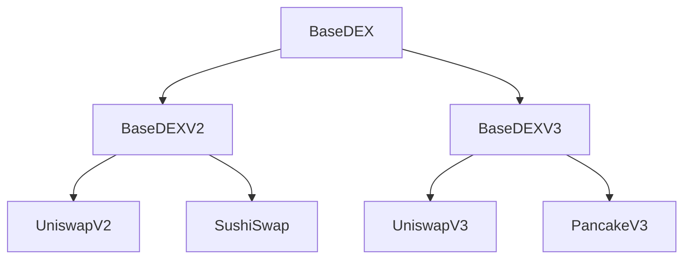
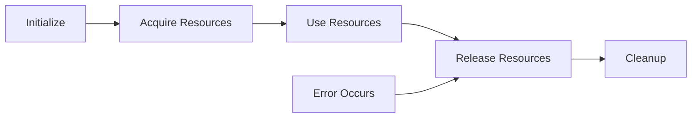
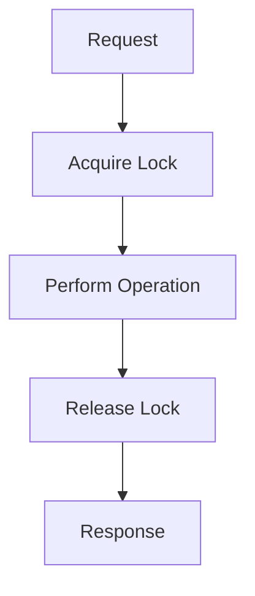
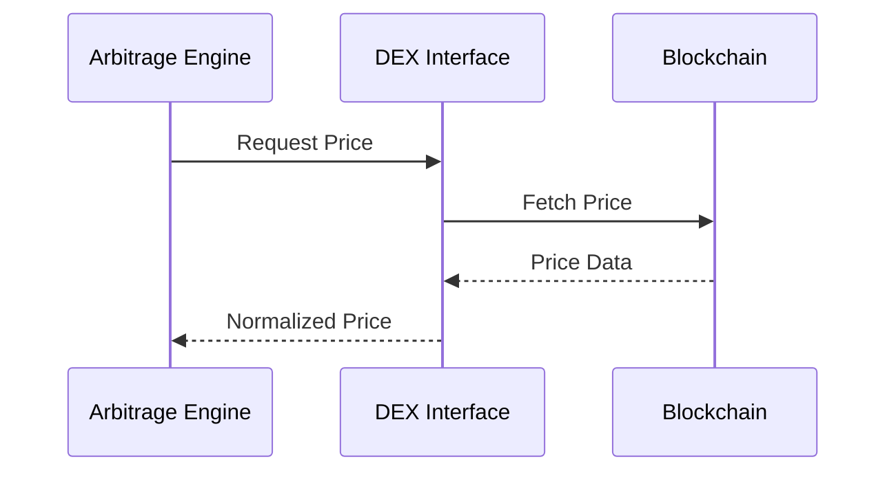
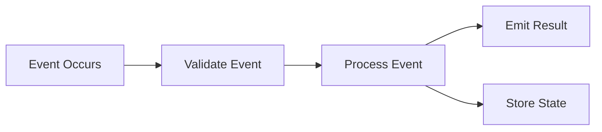

# Listonian Arbitrage Bot - System Patterns

Created: 2025-03-23T15:57:58Z

## Architectural Patterns

### DEX Integration Pattern

### Resource Management Pattern

### Thread Safety Pattern

## Implementation Patterns

### Error Handling
- Standardized error types
- Context preservation
- Retry mechanisms
- Circuit breakers
- Fallback strategies

### State Management
- Memory bank as source of truth
- Atomic operations
- Versioned state
- Rollback capability
- State validation

### Monitoring Pattern
- Health checks
- Performance metrics
- Resource utilization
- Error tracking
- Alert thresholds

## Design Patterns

### Factory Pattern
- DEX instance creation
- Configuration management
- Resource initialization
- Connection pooling
- Contract interaction

### Strategy Pattern
- Price discovery
- Path finding
- Gas optimization
- Profit calculation
- Risk assessment

### Observer Pattern
- Market updates
- State changes
- Error notifications
- Performance alerts
- System events

### Repository Pattern
- Trade history
- Market data
- Configuration
- Metrics storage
- State persistence

## Communication Patterns

### Async Communication

### Event Handling

## Security Patterns

### Input Validation
- Parameter validation
- Address checksumming
- Schema validation
- Type checking
- Boundary validation

### Access Control
- Permission management
- Resource limits
- Rate limiting
- Authentication
- Authorization

### Data Protection
- Encryption at rest
- Secure transmission
- Data integrity
- Backup strategy
- Recovery procedures

## Testing Patterns

### Unit Testing
- Component isolation
- Mock dependencies
- Edge cases
- Error conditions
- Performance benchmarks

### Integration Testing
- Component interaction
- System workflows
- Error propagation
- State transitions
- Recovery scenarios

### Performance Testing
- Load testing
- Stress testing
- Endurance testing
- Scalability testing
- Resource monitoring