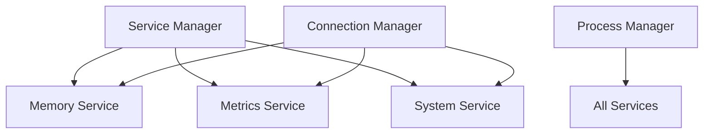
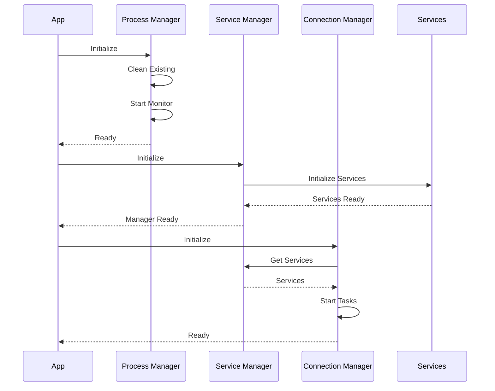

# Dashboard Service Implementation Notes

Created: 2025-03-23T16:48:43Z
Updated: 2025-03-23T20:53:00Z

## Current Status

We have implemented a robust service architecture with proper initialization order and process management. The key components are:

1. Service Manager
   - Enforces correct initialization order
   - Handles service dependencies
   - Provides health checks
   - Implements proper cleanup procedures

2. Connection Manager
   - Manages service connections
   - Handles connection retries
   - Monitors connection health
   - Implements graceful disconnection

3. Process Manager
   - Handles process lifecycle
   - Provides process isolation
   - Implements resource cleanup
   - Monitors process health

## Implementation Details

### Service Architecture

### Initialization Flow

### Process Management Flow

## Key Features

1. Service Initialization
   - Memory service initializes first
   - Proper dependency resolution
   - Health checks during startup
   - Error recovery procedures
   - State validation

2. Connection Management
   - Automatic connection retries
   - Health monitoring
   - Graceful disconnection
   - Error handling with backoff

3. Process Management
   - Clean process termination
   - Resource cleanup between restarts
   - Process isolation
   - Health monitoring
   - Auto-recovery

4. Error Handling
   - Comprehensive error capture
   - Recovery procedures
   - Error reporting
   - Enhanced logging

## Implementation Guidelines

1. Service Management
   - Always initialize service manager first
   - Validate service state before use
   - Handle initialization errors gracefully
   - Maintain proper dependency order

2. Connection Handling
   - Implement connection retries
   - Monitor connection health
   - Handle disconnections gracefully
   - Maintain connection state

3. Process Management
   - Use targeted process termination
   - Ensure proper resource cleanup
   - Implement health monitoring
   - Handle process errors gracefully

4. Error Handling
   - Log all errors with context
   - Implement recovery procedures
   - Maintain system state
   - Provide error reporting

## Testing Requirements

1. Service Tests
   - Initialization sequence
   - Dependency resolution
   - Error handling
   - State management

2. Connection Tests
   - Connection establishment
   - Retry logic
   - Health monitoring
   - Disconnection handling

3. Process Tests
   - Process cleanup
   - Resource management
   - Error recovery
   - Health monitoring

4. Integration Tests
   - Full system startup
   - Service interaction
   - Process management
   - Error scenarios

## Next Steps

1. Service Improvements
   - Add service metrics collection
   - Enhance health check logic
   - Implement service discovery
   - Add service scaling

2. Connection Enhancements
   - Add connection pooling
   - Implement circuit breakers
   - Add connection metrics
   - Enhance retry strategies

3. Process Improvements
   - Add process resource limits
   - Enhance monitoring metrics
   - Implement process scaling
   - Add process groups

4. System Enhancements
   - Add system-wide metrics
   - Enhance logging
   - Improve error handling
   - Add performance monitoring

## Documentation Updates

Keep this document updated with:
- New implementation details
- Challenge resolutions
- Pattern improvements
- Testing results
- Error handling updates

## Recent Changes

2025-03-23:
- Implemented ServiceManager with proper dependency resolution
- Added ConnectionManager with health monitoring
- Created ProcessManager with lifecycle management
- Enhanced error handling and recovery procedures
- Added comprehensive logging
- Improved resource cleanup
- Implemented health checks