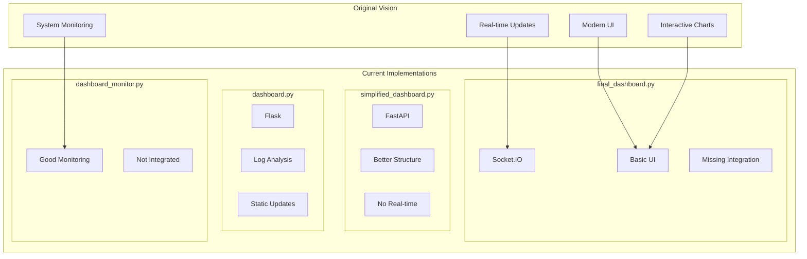

# Dashboard Implementation Analysis

## Current State Overview

## Strengths and Weaknesses Analysis

### final_dashboard.py
✅ Strengths:
- Socket.IO for real-time updates
- Basic UI implementation
- API structure present

❌ Weaknesses:
- Missing template organization
- Static data instead of real integration
- No error recovery

### simplified_dashboard.py
✅ Strengths:
- Clean FastAPI structure
- Better code organization
- Environment handling

❌ Weaknesses:
- No real-time updates
- Basic UI only
- Limited functionality

### dashboard.py
✅ Strengths:
- Good log analysis
- MEV protection status
- Config file handling

❌ Weaknesses:
- No real-time updates
- Flask limitations
- Basic templating

### dashboard_monitor.py
✅ Strengths:
- Comprehensive monitoring
- Good error handling
- Data collection structure

❌ Weaknesses:
- Not integrated with UI
- Standalone operation
- Mock data usage

## Core Issues Identified

1. Data Integration
   - No unified data access layer
   - Inconsistent data formats
   - Missing real-time updates
   - Mock data throughout

2. User Interface
   - Template fragmentation
   - Inconsistent styling
   - No component reuse
   - Limited interactivity

3. Architecture
   - Mixed framework usage
   - No clear separation of concerns
   - Duplicate functionality
   - Poor error handling

4. Monitoring
   - Scattered across implementations
   - Inconsistent metrics
   - No unified logging
   - Limited alerting

## What's Working

1. Socket.IO Implementation (final_dashboard.py)
   - Connection management
   - Event handling
   - Real-time capability

2. FastAPI Structure (simplified_dashboard.py)
   - Clean routing
   - API organization
   - Environment handling

3. Log Analysis (dashboard.py)
   - MEV protection status
   - Config handling
   - File management

4. Monitoring System (dashboard_monitor.py)
   - Comprehensive metrics
   - Error handling
   - Data collection

## What's Missing

1. Data Layer
   - Real-time data integration
   - Consistent formats
   - Error handling
   - Caching strategy

2. UI Components
   - Reusable components
   - Consistent styling
   - Interactive features
   - Mobile support

3. System Integration
   - Unified monitoring
   - Centralized logging
   - Alert system
   - Error recovery

4. Development Support
   - Testing framework
   - Development tools
   - Documentation
   - Deployment process

## Recommendations

1. Unified Architecture
   - Combine FastAPI and Socket.IO
   - Centralize data handling
   - Implement proper caching
   - Standardize error handling

2. UI Modernization
   - Use template inheritance
   - Create component library
   - Implement responsive design
   - Add interactive features

3. Data Integration
   - Create data access layer
   - Implement real-time updates
   - Add historical data
   - Improve caching

4. Monitoring Enhancement
   - Centralize monitoring
   - Add alerting system
   - Improve logging
   - Add metrics dashboard

## Technical Requirements

1. Backend
   - FastAPI with WebSocket support
   - Async data handling
   - Proper error management
   - Caching layer

2. Frontend
   - Template inheritance
   - Component system
   - Real-time updates
   - Interactive charts

3. Data
   - Unified data models
   - Real-time integration
   - Historical storage
   - Cache management

4. Monitoring
   - Centralized metrics
   - Alert system
   - Log aggregation
   - Performance tracking

## Next Steps

1. Phase 1: Foundation
   - Merge best parts of each implementation
   - Set up unified architecture
   - Create base templates
   - Implement data layer

2. Phase 2: Integration
   - Add real-time updates
   - Implement monitoring
   - Create UI components
   - Add interactive features

3. Phase 3: Enhancement
   - Add historical data
   - Improve performance
   - Add advanced features
   - Enhance monitoring

4. Phase 4: Polish
   - Add documentation
   - Improve testing
   - Optimize performance
   - Add deployment tools