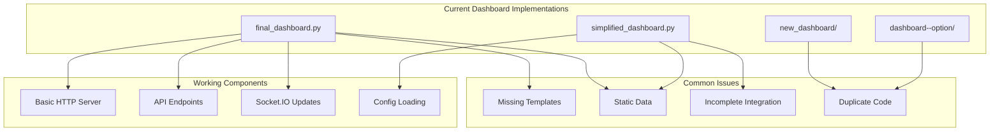
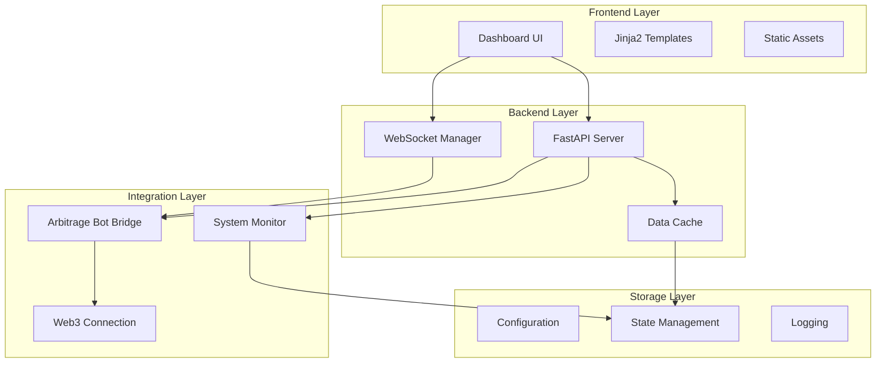
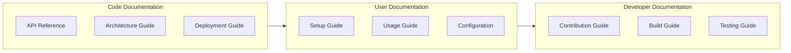

# Dashboard Refactoring Plan

## Current State Analysis

## Core Issues

### Architectural Issues
- Multiple competing implementations causing confusion
- No clear separation between data and presentation layers
- Inconsistent error handling across implementations
- Missing template organization and structure
- Duplicate code across different versions

### Integration Issues
- Static/mock data instead of real-time integration
- Incomplete arbitrage bot integration
- Missing WebSocket error recovery mechanisms
- No data validation or sanitization
- Inconsistent data formats

### User Interface Issues
- Basic HTML without proper styling
- No component organization
- Missing responsive design
- Limited interactivity
- Inconsistent user experience

## Proposed Architecture

## Implementation Strategy

### Phase 1: Foundation
1. Create unified configuration system
   - Merge existing configs
   - Implement validation
   - Add environment support

2. Set up proper template structure
   - Organize Jinja2 templates
   - Create base templates
   - Implement component system

3. Implement basic UI framework
   - Set up CSS structure
   - Create core components
   - Implement responsive design

4. Establish logging and monitoring
   - Unified logging system
   - Performance monitoring
   - Error tracking

### Phase 2: Core Features
1. Real-time data integration
   - WebSocket implementation
   - Data synchronization
   - State management

2. WebSocket management
   - Connection handling
   - Reconnection logic
   - Error recovery

3. Error handling and recovery
   - Error boundaries
   - Fallback mechanisms
   - User notifications

4. Basic visualization
   - Data charts
   - Status indicators
   - Performance metrics

### Phase 3: Enhancement
1. Advanced UI components
   - Interactive charts
   - Custom controls
   - Advanced filters

2. Data validation
   - Input validation
   - Output sanitization
   - Type checking

3. Performance optimization
   - Caching strategy
   - Load balancing
   - Resource management

4. User customization
   - Layout options
   - Theme support
   - Preference management

## Documentation Structure

## Key Technical Decisions

### Framework Selection
- FastAPI for backend
  - Existing working implementation
  - Good async support
  - Built-in WebSocket
  - OpenAPI documentation

- Jinja2 for templates
  - Python native
  - Extensible
  - Good performance
  - Easy to maintain

- Simple CSS framework
  - No heavy dependencies
  - Custom components
  - Responsive design
  - Easy to modify

### Data Flow
- WebSocket for real-time updates
  - Efficient updates
  - Reduced server load
  - Better user experience

- REST API for historical data
  - Standard interfaces
  - Easy to cache
  - Better compatibility

- Local cache for performance
  - Reduced latency
  - Lower server load
  - Better offline support

### Integration Approach
- Bridge pattern for bot integration
  - Clean separation
  - Easy to modify
  - Better testing

- Fallback to mock data
  - Development support
  - Testing support
  - Error handling

- Clear error states
  - User feedback
  - System monitoring
  - Debug support

### Development Process
- Incremental improvements
  - Regular updates
  - Easy to test
  - Quick feedback

- Continuous testing
  - Automated tests
  - Integration tests
  - Performance tests

- Documentation updates
  - Keep in sync
  - Clear examples
  - Good coverage

## Next Steps
1. Review and approve plan
2. Set up development environment
3. Begin Phase 1 implementation
4. Regular progress reviews