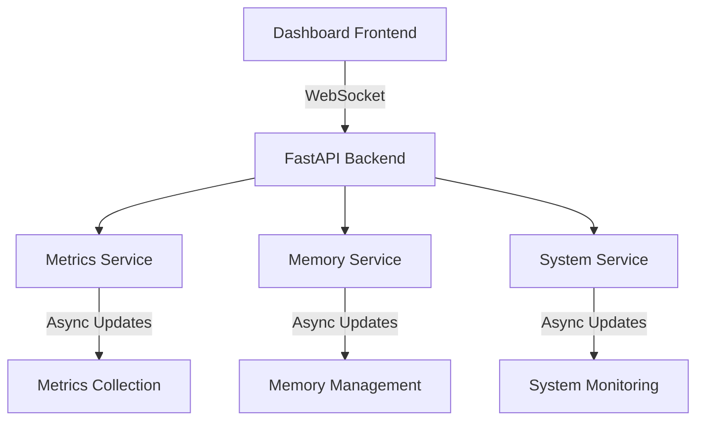

# Dashboard Metrics Implementation Summary

## Current Implementation Status

### Working Components
- Real-time metrics display via WebSocket
- System resource monitoring (CPU, Memory)
- Basic WebSocket connection management
- Initial state transmission
- Basic cleanup with context managers

### Technical Stack
- FastAPI for web framework
- asyncio for async operations
- WebSocket for real-time updates
- Jinja2 for templating
- Pure Python for metrics collection

## Architecture Overview



## Implementation Details

### Services Layer
- MetricsService: Handles metrics collection and distribution
- MemoryService: Manages memory-related metrics
- SystemService: Monitors system resources
- ServiceManager: Coordinates service lifecycle

### Connection Layer
- ConnectionManager: Handles WebSocket connections
- TaskManager: Manages async tasks
- State tracking for connections and tasks

### Data Flow
1. Services collect metrics asynchronously
2. Updates pushed to connected clients
3. Frontend renders updates in real-time
4. Cleanup on disconnection

## Current Challenges

1. WebSocket Management
   - Connection cleanup issues
   - Task cancellation problems
   - Resource leaks

2. Performance
   - High CPU usage during updates
   - Memory growth over time
   - Connection overhead

3. Error Handling
   - Disconnection errors
   - Task cancellation errors
   - Resource cleanup issues

## Next Implementation Phase

### 1. Connection Management
- Implement robust state machine
- Add proper task lifecycle
- Improve resource cleanup
- Add connection monitoring

### 2. Performance Optimization
- Add metrics batching
- Implement update throttling
- Optimize message serialization
- Add connection pooling

### 3. Resource Management
- Implement proper memory tracking
- Add resource pooling
- Optimize task handling
- Add comprehensive monitoring

## Implementation Priorities

1. Fix WebSocket cleanup
   - Task cancellation
   - Resource cleanup
   - Error handling

2. Optimize Performance
   - Message batching
   - Update throttling
   - Connection pooling

3. Improve Monitoring
   - Add metrics collection
   - Implement alerting
   - Add performance tracking

## Code Structure

### Core Components
```python
# Service Layer
class MetricsService:
    """Handles metrics collection and distribution."""
    def __init__(self):
        self._subscribers = set()
        self._cache = {}
        self._lock = asyncio.Lock()

# Connection Management
class ConnectionManager:
    """Manages WebSocket connections and lifecycle."""
    def __init__(self):
        self._connections = WeakKeyDictionary()
        self._task_manager = TaskManager()
        self._lock = asyncio.Lock()

# Task Management
class TaskManager:
    """Handles async task lifecycle."""
    def __init__(self):
        self._tasks = {}
        self._state = {}
        self._lock = asyncio.Lock()
```

## Testing Strategy

### Unit Tests
- Service layer functionality
- Connection management
- Task handling
- Resource cleanup

### Integration Tests
- End-to-end metrics flow
- WebSocket connection lifecycle
- Service coordination
- Error handling

### Performance Tests
- Connection load testing
- Message throughput
- Resource usage
- Memory leaks

## Monitoring Plan

### Metrics to Track
- Connection count and duration
- Message throughput
- Resource usage
- Error rates

### Alerting
- High resource usage
- Connection failures
- Error rate spikes
- Performance degradation

## Documentation

### Required Updates
- Architecture overview
- Service documentation
- API documentation
- Deployment guide

### Maintenance Guide
- Service management
- Monitoring setup
- Troubleshooting
- Performance tuning

## Next Steps

1. Immediate Tasks
   - Fix WebSocket cleanup
   - Implement proper task cancellation
   - Add connection state machine

2. Short-term Goals
   - Optimize performance
   - Improve resource management
   - Add comprehensive monitoring

3. Long-term Goals
   - Scale connection handling
   - Implement advanced features
   - Enhance monitoring capabilities

## Notes for Next Developer

### Key Files
- websocket.py: WebSocket implementation
- service_manager.py: Service coordination
- metrics_service.py: Metrics handling
- app.py: Main application setup

### Important Considerations
- Follow asyncio patterns
- Implement proper cleanup
- Handle edge cases
- Document changes
- Add comprehensive logging

### Development Guidelines
- Test thoroughly
- Monitor performance
- Handle errors gracefully
- Document changes
- Follow coding standards