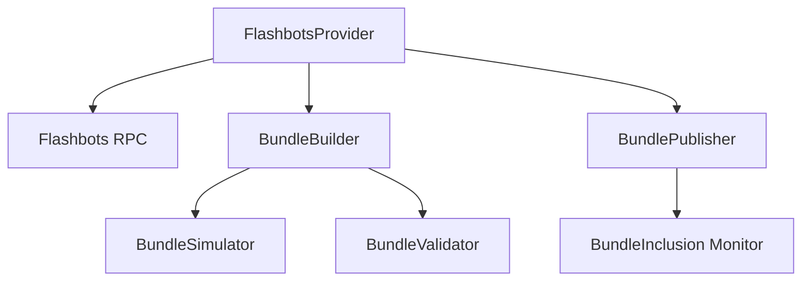

# Flashbots Integration

This document details the integration of Flashbots into the Listonian Arbitrage Bot, focusing on MEV protection, bundle execution, and profit validation.

## Overview

Flashbots provides a crucial layer of protection for arbitrage transactions by:

1. **Preventing Front-Running**: Private transaction submission bypasses the public mempool
2. **Enabling Bundle Submission**: Multiple transactions can be executed atomically
3. **Ensuring Fair Execution**: Transactions are executed without extraction of value by validators/miners
4. **Providing Transaction Simulation**: Bundles can be simulated before submission to verify profitability

## Architecture

The Flashbots integration consists of these key components:



### Core Components

#### FlashbotsProvider

Central coordinator for all Flashbots interactions:

```python
class FlashbotsProvider:
    def __init__(self, web3_client, signing_key, config=None):
        self.web3_client = web3_client
        self.signing_key = signing_key
        self.config = config or {}
        self.flashbots_endpoint = self._get_flashbots_endpoint()
        
    async def initialize(self):
        """Initialize the Flashbots provider."""
        # Validate configuration
        self._validate_config()
        
        # Setup Flashbots connection
        await self._setup_flashbots_connection()
        
    async def create_bundle(self, transactions, target_block_number=None):
        """Create a Flashbots bundle from transactions."""
        if not target_block_number:
            current_block = await self.web3_client.eth.block_number
            target_block_number = current_block + self.config.get("blocks_into_future", 2)
            
        # Convert transactions to bundle format
        bundle_transactions = []
        for tx in transactions:
            bundle_transactions.append(await self._format_transaction(tx))
            
        # Create bundle
        bundle = {
            "transactions": bundle_transactions,
            "blockNumber": target_block_number
        }
        
        return bundle
        
    async def simulate_bundle(self, bundle):
        """Simulate a Flashbots bundle to verify profitability."""
        # Call Flashbots endpoint to simulate
        payload = {
            "jsonrpc": "2.0",
            "id": 1,
            "method": "eth_callBundle",
            "params": [bundle, "latest"]
        }
        
        response = await self._signed_request(payload)
        
        # Process simulation results
        return await self._process_simulation_results(response, bundle)
        
    async def submit_bundle(self, bundle):
        """Submit a bundle to Flashbots for inclusion."""
        payload = {
            "jsonrpc": "2.0",
            "id": 1,
            "method": "eth_sendBundle",
            "params": [bundle]
        }
        
        response = await self._signed_request(payload)
        
        # Process submission results
        return await self._process_submission_results(response, bundle)
        
    async def get_bundle_stats(self, bundle_hash):
        """Get statistics for a submitted bundle."""
        # Implementation details...
```

#### BundleBuilder

Constructs transaction bundles optimized for Flashbots:

```python
class BundleBuilder:
    def __init__(self, web3_client, config=None):
        self.web3_client = web3_client
        self.config = config or {}
        
    async def build_bundle(self, transactions, strategy="sequential"):
        """Build a bundle from transactions using the specified strategy."""
        if strategy == "sequential":
            return await self._build_sequential_bundle(transactions)
        elif strategy == "parallel":
            return await self._build_parallel_bundle(transactions)
        elif strategy == "backrun":
            return await self._build_backrun_bundle(transactions)
        else:
            raise ValueError(f"Unknown bundle strategy: {strategy}")
            
    async def _build_sequential_bundle(self, transactions):
        """Build a bundle where transactions execute in sequence."""
        # Implementation details...
        
    async def _build_parallel_bundle(self, transactions):
        """Build a bundle where transactions can execute in parallel."""
        # Implementation details...
        
    async def _build_backrun_bundle(self, transactions):
        """Build a bundle that backruns a target transaction."""
        # Implementation details...
```

#### BundleSimulator

Simulates bundle execution to verify profitability:

```python
class BundleSimulator:
    def __init__(self, web3_client, flashbots_provider):
        self.web3_client = web3_client
        self.flashbots_provider = flashbots_provider
        
    async def simulate(self, bundle, params=None):
        """Simulate a bundle and return detailed results."""
        # Call Flashbots simulation
        simulation_result = await self.flashbots_provider.simulate_bundle(bundle)
        
        # Extract profit information
        profit_analysis = await self._analyze_profit(simulation_result)
        
        # Extract gas usage
        gas_analysis = await self._analyze_gas(simulation_result)
        
        # Detect potential issues
        issues = await self._detect_issues(simulation_result)
        
        return {
            "success": simulation_result.success,
            "profit": profit_analysis,
            "gas": gas_analysis,
            "issues": issues,
            "raw_results": simulation_result
        }
        
    async def _analyze_profit(self, simulation_result):
        """Analyze the profit from a simulation result."""
        # Implementation details...
        
    async def _analyze_gas(self, simulation_result):
        """Analyze gas usage from a simulation result."""
        # Implementation details...
        
    async def _detect_issues(self, simulation_result):
        """Detect potential issues in the simulation result."""
        # Implementation details...
```

## Integration with Arbitrage System

### Multi-Path Strategy Integration

The multi-path arbitrage system leverages Flashbots for atomic execution:

```python
class MultiPathStrategy(BaseExecutionStrategy):
    def __init__(self, web3_client, flashbots_provider, flash_loan_factory=None, config=None):
        self.web3_client = web3_client
        self.flashbots_provider = flashbots_provider
        self.flash_loan_factory = flash_loan_factory
        self.config = config or {}
        
    async def execute(self, opportunity, execution_params=None):
        """Execute a multi-path arbitrage opportunity using Flashbots."""
        # Create transactions for all paths
        transactions = await self._create_transactions(opportunity)
        
        # Create Flashbots bundle
        bundle = await self.flashbots_provider.create_bundle(
            transactions,
            target_block_number=await self._get_target_block_number()
        )
        
        # Simulate bundle to verify profitability
        simulation_result = await self.flashbots_provider.simulate_bundle(bundle)
        
        # Verify the simulation succeeded
        if not simulation_result.success:
            raise ExecutionError(f"Bundle simulation failed: {simulation_result.error}")
            
        # Verify the profit meets minimum threshold
        min_profit = execution_params.get("min_profit_threshold", 0)
        if simulation_result.profit < min_profit:
            raise InsufficientProfitError(
                f"Simulated profit {simulation_result.profit} below threshold {min_profit}"
            )
            
        # Submit bundle
        submission_result = await self.flashbots_provider.submit_bundle(bundle)
        
        # Wait for inclusion
        inclusion_result = await self._wait_for_inclusion(
            submission_result.bundle_hash,
            max_blocks=self.config.get("max_wait_blocks", 5)
        )
        
        return inclusion_result
```

### Flash Loan Integration

Flash loans and Flashbots work together for capital-efficient arbitrage:

```python
async def _create_flash_loan_transactions(self, opportunity):
    """Create flash loan transactions for a multi-path opportunity."""
    # Get flash loan provider
    flash_loan_provider = await self.flash_loan_factory.get_provider(
        opportunity.token_address,
        opportunity.required_amount
    )
    
    # Create callback data for all paths
    callback_data = await self._create_multi_path_callback(opportunity)
    
    # Create flash loan transaction
    flash_loan_tx = await flash_loan_provider.create_flash_loan_transaction(
        token=opportunity.token_address,
        amount=opportunity.required_amount,
        callback_data=callback_data
    )
    
    return [flash_loan_tx]
```

## MEV Protection Strategies

The system implements several MEV protection strategies:

### 1. Private Transaction Routing

All transactions are submitted via Flashbots, bypassing the public mempool:

```python
async def _signed_request(self, payload):
    """Sign and send a request to the Flashbots endpoint."""
    # Sign the request with Flashbots-specific format
    signature = self._sign_payload(payload)
    
    # Add signature to headers
    headers = {
        "Content-Type": "application/json",
        "X-Flashbots-Signature": signature
    }
    
    # Send to Flashbots RPC
    async with aiohttp.ClientSession() as session:
        async with session.post(
            self.flashbots_endpoint,
            json=payload,
            headers=headers
        ) as response:
            return await response.json()
```

### 2. Bundle Submission

Transactions are bundled for atomic execution:

```python
async def _build_sequential_bundle(self, transactions):
    """Build a bundle where transactions execute in sequence."""
    # Ensure transactions have ascending nonces
    sorted_txs = sorted(transactions, key=lambda x: x.nonce)
    
    # Ensure gas prices are appropriate for Flashbots
    for i, tx in enumerate(sorted_txs):
        # First tx pays for everything
        if i == 0:
            # Set gas price based on current market and priority
            tx.gas_price = await self._get_optimal_gas_price()
        else:
            # Subsequent transactions have zero gas price
            tx.gas_price = 0
    
    return sorted_txs
```

### 3. Profit Validation

All bundles are simulated to ensure profitability:

```python
async def _analyze_profit(self, simulation_result):
    """Analyze the profit from a simulation result."""
    # Get balances before
    balances_before = simulation_result.state_diff.balances.before
    
    # Get balances after
    balances_after = simulation_result.state_diff.balances.after
    
    # Calculate profit for each token
    profit_by_token = {}
    for token, balance_before in balances_before.items():
        balance_after = balances_after.get(token, 0)
        profit = balance_after - balance_before
        
        if profit != 0:
            profit_by_token[token] = profit
    
    # Calculate gas costs
    gas_cost = simulation_result.gas_used * simulation_result.gas_price
    
    # Calculate net profit
    net_profit = sum(profit_by_token.values()) - gas_cost
    
    return {
        "by_token": profit_by_token,
        "gas_cost": gas_cost,
        "net_profit": net_profit
    }
```

## Bundle Types

The system supports several bundle types for different scenarios:

### 1. Sequential Bundle

Transactions execute in sequence, with the first transaction paying for all gas:

```
tx1 (with gas price) -> tx2 (zero gas price) -> tx3 (zero gas price)
```

### 2. Backrun Bundle

Transactions execute after a target transaction:

```
target_tx -> our_tx1 -> our_tx2
```

### 3. Concurrent Bundle

Multiple independent transactions execute in the same block:

```
tx1
tx2
tx3
```

## Gas Optimization

The system optimizes gas usage for higher profitability:

### 1. Gas Price Strategy

```python
async def _get_optimal_gas_price(self):
    """Calculate optimal gas price for Flashbots bundle."""
    # Get base fee
    latest_block = await self.web3_client.eth.get_block('latest')
    base_fee = latest_block.base_fee_per_gas
    
    # Add priority fee
    priority_fee = await self._get_priority_fee()
    
    # Apply multiplier for higher probability of inclusion
    multiplier = self.config.get("gas_price_multiplier", 1.1)
    
    return (base_fee + priority_fee) * multiplier
```

### 2. Gas Limit Optimization

```python
async def _estimate_gas_limit(self, tx):
    """Estimate gas limit with safety margin."""
    # Estimate gas
    estimated_gas = await self.web3_client.eth.estimate_gas(tx)
    
    # Add safety margin
    safety_margin = self.config.get("gas_limit_safety_margin", 1.2)
    
    return int(estimated_gas * safety_margin)
```

## Monitoring and Analytics

The system tracks bundle performance for optimization:

### 1. Inclusion Tracking

```python
async def _wait_for_inclusion(self, bundle_hash, max_blocks=5):
    """Wait for a bundle to be included in a block."""
    start_block = await self.web3_client.eth.block_number
    end_block = start_block + max_blocks
    
    while await self.web3_client.eth.block_number <= end_block:
        # Check bundle status
        status = await self.flashbots_provider.get_bundle_stats(bundle_hash)
        
        if status.included:
            return {
                "status": "EXECUTED",
                "block_number": status.block_number,
                "transaction_hash": status.transaction_hash,
                "profit": status.profit
            }
            
        # Wait for next block
        await asyncio.sleep(self.config.get("block_check_interval", 2))
    
    return {
        "status": "FAILED",
        "error_message": "Bundle not included within max blocks"
    }
```

### 2. Performance Analytics

```python
class FlashbotsAnalytics:
    def __init__(self, db_manager):
        self.db_manager = db_manager
        
    async def record_bundle_submission(self, bundle_hash, bundle_data, simulation_result):
        """Record a bundle submission for analytics."""
        # Implementation details...
        
    async def record_bundle_inclusion(self, bundle_hash, inclusion_data):
        """Record a bundle inclusion for analytics."""
        # Implementation details...
        
    async def get_inclusion_rate(self, time_period=None):
        """Calculate bundle inclusion rate for a time period."""
        # Implementation details...
        
    async def get_profit_statistics(self, time_period=None):
        """Get profit statistics for a time period."""
        # Implementation details...
```

## Configuration

Example configuration for Flashbots integration:

```json
{
  "flashbots": {
    "network": "mainnet",
    "relay_endpoint": "https://relay.flashbots.net",
    "min_bundle_profit": "0.001",
    "blocks_in_future": 2,
    "max_wait_blocks": 5,
    "gas_price_multiplier": 1.2,
    "gas_limit_safety_margin": 1.2,
    "retry_count": 3,
    "bundle_strategies": ["sequential", "backrun"],
    "simulation_timeout": 5000
  }
}
```

## Testing and Validation

The system includes comprehensive testing for Flashbots integration:

### 1. Unit Tests

Tests for individual components:

```python
@pytest.mark.asyncio
async def test_flashbots_provider_initialization():
    """Test initializing the Flashbots provider."""
    # Setup test
    web3_client = MockWeb3Client()
    signing_key = "0x1234..."
    config = {"network": "mainnet"}
    
    # Create provider
    provider = FlashbotsProvider(web3_client, signing_key, config)
    
    # Initialize
    await provider.initialize()
    
    # Assert initialization successful
    assert provider.flashbots_endpoint == "https://relay.flashbots.net"
```

### 2. Integration Tests

Tests for Flashbots interaction:

```python
@pytest.mark.integration
@pytest.mark.asyncio
async def test_bundle_submission():
    """Test submitting a bundle to Flashbots."""
    # Setup test environment
    provider = await setup_flashbots_provider()
    
    # Create test bundle
    bundle = await create_test_bundle()
    
    # Submit bundle
    result = await provider.submit_bundle(bundle)
    
    # Assert submission successful
    assert result.bundle_hash is not None
```

### 3. Simulation Tests

Tests for bundle simulation:

```python
@pytest.mark.asyncio
async def test_bundle_simulation():
    """Test simulating a bundle with Flashbots."""
    # Setup test environment
    provider = await setup_flashbots_provider()
    
    # Create test bundle
    bundle = await create_test_bundle()
    
    # Simulate bundle
    result = await provider.simulate_bundle(bundle)
    
    # Assert simulation successful
    assert result.success
    assert result.profit > 0
```

## Future Improvements

Planned enhancements to the Flashbots integration:

1. **Support for MEV-Boost**
   - Integrate with the next generation MEV-Boost protocol
   - Adapt to Proposer-Builder Separation (PBS) changes

2. **Multiple Relay Support**
   - Submit bundles to multiple relays simultaneously
   - Select relays based on performance and inclusion rates

3. **Advanced Block Building**
   - Direct relationships with block builders
   - Custom bundle prioritization strategies

4. **Predictive Submission**
   - Machine learning models to predict bundle inclusion
   - Dynamic adjustment of gas prices based on success patterns

5. **Cross-Chain MEV Protection**
   - Extend Flashbots integration to other EVM chains
   - Adapt to chain-specific MEV protection mechanisms