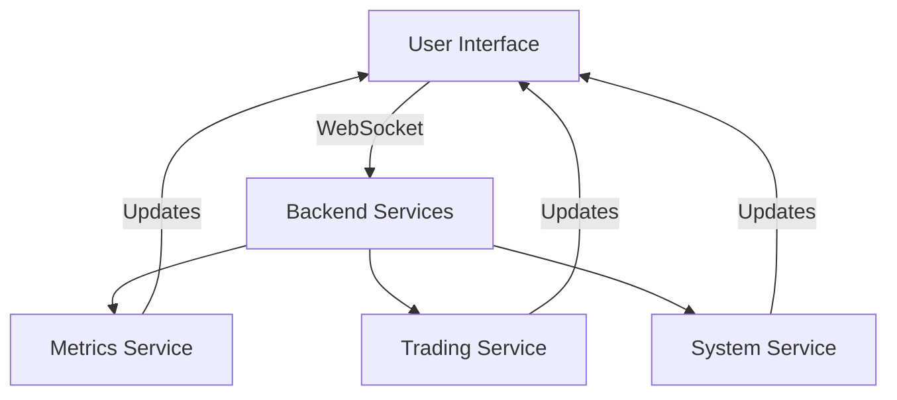

# Product Context - Dashboard Implementation

## Product Overview

The dashboard provides real-time monitoring and management capabilities for the arbitrage bot, focusing on performance metrics, system health, and trading activities.

## User Interface

### Main Dashboard
```
+------------------+------------------+------------------+
|   Performance    |     System      |     Network     |
|   Total Profit   |    CPU Usage    |   Gas Price     |
|   Success Rate   |  Memory Usage   |    Status       |
+------------------+------------------+------------------+
|                  Profit Trend                         |
|     [Chart showing profit over time]                 |
+------------------+------------------+------------------+
|              System Resources                         |
|     [Charts showing CPU and Memory usage]            |
+------------------+------------------+------------------+
```

### Key Metrics Display
1. Performance Section
   - Total Profit (ETH)
   - Success Rate
   - Trade Count
   - Average Profit

2. System Section
   - CPU Usage
   - Memory Usage
   - Disk Usage
   - Network Status

3. Network Section
   - Gas Price
   - Network Status
   - Block Number
   - Node Status

## Real-Time Updates

### Update Frequencies
- System Metrics: Every 1 second
- Trading Data: Real-time
- Network Status: Every block
- Performance Stats: Real-time

### Data Flow


## User Experience

### 1. Performance Monitoring
- Real-time profit tracking
- Success rate visualization
- Trade history display
- Performance analytics

### 2. System Health
- Resource usage monitoring
- System status indicators
- Alert notifications
- Health checks

### 3. Network Status
- Gas price tracking
- Network conditions
- Node status
- Connection health

## Feature Set

### Core Features
1. Real-time Metrics
   - Performance data
   - System resources
   - Network status
   - Trading activity

2. Interactive Charts
   - Profit trends
   - Resource usage
   - Trade patterns
   - Network metrics

3. System Management
   - Status monitoring
   - Resource tracking
   - Alert system
   - Health checks

### Advanced Features
1. Analytics
   - Performance analysis
   - Trend detection
   - Pattern recognition
   - Risk assessment

2. Reporting
   - Performance reports
   - System health
   - Trading summary
   - Resource usage

3. Customization
   - Layout options
   - Metric selection
   - Update frequency
   - Alert thresholds

## Performance Requirements

### Response Times
- UI Updates: < 100ms
- Data Refresh: Real-time
- Chart Updates: < 500ms
- Alert Notifications: Immediate

### Resource Usage
- CPU: < 30%
- Memory: < 50%
- Network: Optimized
- Storage: Minimal

### Reliability
- Uptime: 99.9%
- Data Accuracy: 100%
- Error Rate: < 0.1%
- Recovery: Automatic

## User Interactions

### 1. Monitoring
- View real-time metrics
- Track performance
- Monitor resources
- Check status

### 2. Analysis
- Review trends
- Analyze patterns
- Check performance
- Assess health

### 3. Management
- Set alerts
- Configure displays
- Adjust settings
- Manage resources

## Error Handling

### User Feedback
- Clear error messages
- Status indicators
- Progress updates
- Recovery options

### Recovery Actions
- Automatic reconnection
- Data resynchronization
- State recovery
- Error logging

## Product Requirements

### 1. Functionality
- Real-time updates
- Accurate data
- Reliable operation
- Efficient performance

### 2. Usability
- Intuitive interface
- Clear displays
- Easy navigation
- Helpful feedback

### 3. Reliability
- Stable operation
- Data integrity
- Error recovery
- Resource efficiency

## Success Metrics

### User Experience
- Response time < 100ms
- Clear data presentation
- Intuitive navigation
- Helpful feedback

### System Performance
- CPU usage < 30%
- Memory usage < 50%
- Reliable updates
- Clean operation

### Data Quality
- Accurate metrics
- Real-time updates
- Complete data
- Reliable storage

## Future Enhancements

### Phase 1
- Advanced analytics
- Custom reports
- Enhanced charts
- More metrics

### Phase 2
- Predictive analytics
- Risk assessment
- Pattern detection
- Advanced alerts

### Phase 3
- AI integration
- Advanced optimization
- Custom analytics
- Enhanced UI

## Documentation

### User Guide
- Setup instructions
- Usage guidelines
- Feature overview
- Troubleshooting

### Admin Guide
- System setup
- Configuration
- Maintenance
- Monitoring

### Developer Guide
- Architecture
- Integration
- Customization
- Extension

## Support Requirements

### User Support
- Documentation
- Help system
- Error guidance
- Recovery steps

### System Support
- Monitoring
- Maintenance
- Updates
- Backups

### Technical Support
- Issue resolution
- Performance tuning
- Feature updates
- Security patches

## Quality Assurance

### Testing Areas
- Functionality
- Performance
- Reliability
- Usability

### Test Types
- Unit tests
- Integration tests
- Performance tests
- User testing

### Quality Metrics
- Code coverage
- Error rates
- Performance stats
- User satisfaction

## Deployment

### Requirements
- Python 3.12+
- FastAPI
- WebSocket support
- Modern browser

### Environment
- Production ready
- Scalable
- Maintainable
- Secure

### Monitoring
- Performance tracking
- Error monitoring
- Resource usage
- User activity