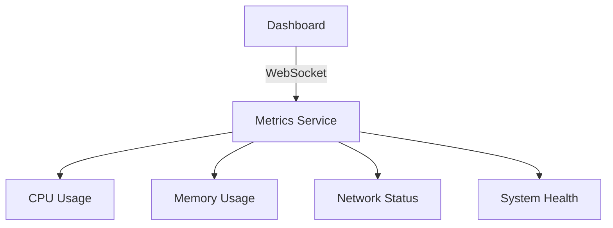
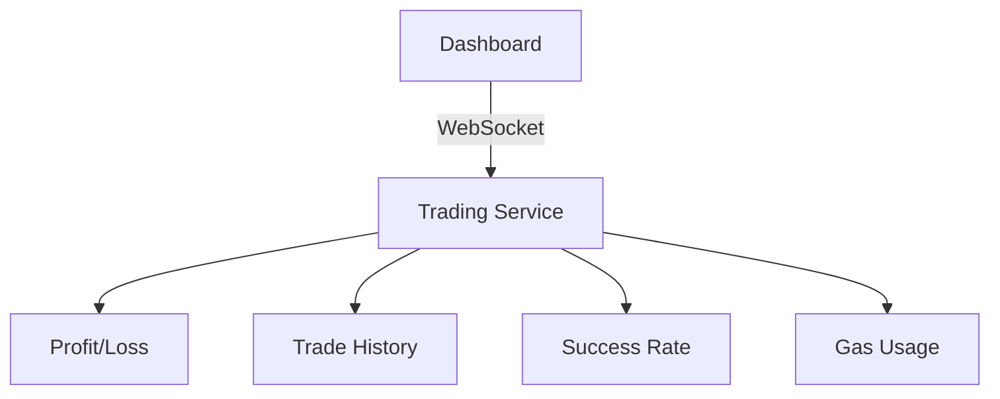
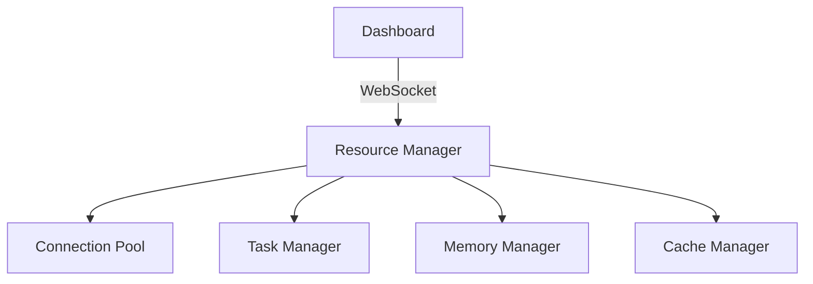

# Project Brief - Real-Time Dashboard Implementation

## Project Overview
Development of a real-time dashboard for monitoring and managing the arbitrage bot's performance, system resources, and trading activities.

## Core Objectives

### 1. Real-Time Monitoring
- Display live system metrics
- Show trading performance
- Monitor resource usage
- Track network status

### 2. Performance Requirements
- Response time < 100ms
- CPU usage < 30%
- Memory usage < 50%
- Clean resource management

### 3. Technical Goals
- Reliable WebSocket connections
- Efficient resource usage
- Proper error handling
- Comprehensive monitoring

## Architecture

### Backend Stack
- FastAPI framework
- Python 3.12+
- asyncio
- WebSocket

### Frontend Stack
- HTML/CSS
- JavaScript
- WebSocket client
- Chart.js

### Communication
- WebSocket for real-time updates
- REST API for static data
- Event-driven architecture
- Async operations

## Key Features

### 1. System Monitoring

### 2. Performance Tracking

### 3. Resource Management

## Implementation Requirements

### 1. Connection Management
- Proper state tracking
- Resource cleanup
- Error handling
- Connection pooling

### 2. Performance Optimization
- Message batching
- Update throttling
- Efficient serialization
- Resource pooling

### 3. Monitoring
- System metrics
- Performance data
- Error tracking
- Resource usage

## Technical Requirements

### 1. Code Quality
- Type hints
- Comprehensive testing
- Error handling
- Documentation

### 2. Performance
- Async operations
- Resource efficiency
- Connection management
- Cache optimization

### 3. Security
- Input validation
- Resource protection
- Error handling
- Access control

## Success Criteria

### 1. Performance Metrics
- Real-time updates < 100ms
- CPU usage < 30%
- Memory usage < 50%
- Zero resource leaks

### 2. Reliability Metrics
- 99.9% uptime
- Zero data loss
- Clean disconnections
- Proper error recovery

### 3. Quality Metrics
- Test coverage > 90%
- Zero critical bugs
- Documentation complete
- Code review approved

## Development Phases

### Phase 1: Foundation
- ✅ Basic WebSocket setup
- ✅ Service architecture
- ✅ Metrics collection
- ✅ Initial UI

### Phase 2: Enhancement
- 🔄 Connection management
- 🔄 Resource optimization
- 🔄 Error handling
- 🔄 Performance tuning

### Phase 3: Optimization
- ⏳ Advanced features
- ⏳ Performance optimization
- ⏳ Comprehensive monitoring
- ⏳ Enhanced UI/UX

## Risk Management

### Technical Risks
1. Resource leaks
   - Impact: High
   - Mitigation: Proper cleanup
   - Status: Being addressed

2. Performance issues
   - Impact: Medium
   - Mitigation: Optimization
   - Status: Planned

3. Connection stability
   - Impact: High
   - Mitigation: Error handling
   - Status: In progress

## Testing Strategy

### Unit Testing
- Service components
- Connection handling
- Resource management
- Error handling

### Integration Testing
- End-to-end flow
- Service interaction
- Error scenarios
- Performance

### Performance Testing
- Load testing
- Resource usage
- Connection limits
- Error conditions

## Monitoring Plan

### System Metrics
- CPU usage
- Memory usage
- Network status
- Error rates

### Performance Metrics
- Response times
- Update frequency
- Resource efficiency
- Connection stats

### Error Tracking
- Error rates
- Error types
- Recovery success
- System impact

## Documentation Requirements

### Technical Documentation
- Architecture overview
- API documentation
- Service documentation
- Deployment guide

### User Documentation
- Setup guide
- Usage instructions
- Troubleshooting
- Best practices

### Development Documentation
- Code standards
- Testing guide
- Deployment process
- Monitoring setup

## Maintenance Plan

### Regular Tasks
- Monitor performance
- Check resource usage
- Review error logs
- Update documentation

### Periodic Reviews
- Code review
- Performance audit
- Security check
- Documentation update

## Next Steps

### Immediate Actions
1. Fix WebSocket cleanup
2. Implement task management
3. Optimize resource usage
4. Improve monitoring

### Short-term Goals
1. Complete Phase 2
2. Add advanced features
3. Optimize performance
4. Enhance monitoring

### Long-term Vision
1. Scale system
2. Add features
3. Improve UX
4. Enhance monitoring

## Team Guidelines

### Development Practices
- Follow async patterns
- Document changes
- Test thoroughly
- Review code

### Code Standards
- Use type hints
- Handle errors
- Add logging
- Write tests

### Review Process
- Code review
- Performance check
- Security audit
- Documentation review