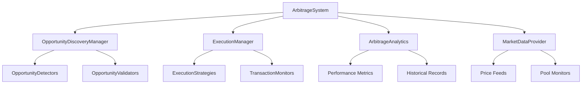

# Listonian Arbitrage Bot - System Patterns

## Architecture Overview

The Listonian Arbitrage Bot follows a modular, component-based architecture with clean separation of concerns. The system is designed around well-defined interfaces that enable easy testing, extension, and maintenance.



## Core Components

### ArbitrageSystem

The central orchestrator that coordinates all components and provides the main API for interacting with the system. Responsibilities include:
- Starting and stopping the system
- Coordinating opportunity discovery and execution
- Providing access to historical data and performance metrics
- Managing system configuration

### OpportunityDiscoveryManager

Responsible for discovering arbitrage opportunities by:
- Coordinating multiple detection strategies
- Filtering and ranking opportunities
- Validating opportunities before execution
- Enriching opportunities with metadata

### ExecutionManager

Handles the execution of arbitrage opportunities by:
- Selecting appropriate execution strategies
- Managing transaction submission
- Monitoring transaction status
- Handling retries and fallbacks

### MarketDataProvider

Supplies real-time market data to other components:
- Fetches and caches on-chain price data
- Monitors liquidity pools for changes
- Calculates gas prices and estimates
- Provides notifications for market updates

### ArbitrageAnalytics

Tracks system performance and provides insights:
- Records opportunities and executions
- Calculates performance metrics
- Provides historical analysis
- Generates reports and visualizations

## Key Design Patterns

### Protocol-Based Design

The system uses Protocol interfaces (runtime_checkable) to define component contracts. This allows:
- Multiple implementations of each component
- Easy mock creation for testing
- Runtime verification of protocol compliance
- Extension without modifying existing code

```python
@runtime_checkable
class OpportunityDetector(Protocol):
    async def detect_opportunities(
        self, 
        market_condition: Dict[str, Any], 
        **kwargs
    ) -> List['ArbitrageOpportunity']:
        ...
```

### Factory Pattern

Factory functions are used to create and wire components together. This provides:
- Centralized creation logic
- Configuration-driven initialization
- Dependency injection for components
- Easy testing with mock dependencies

```python
async def create_arbitrage_system(
    config: Dict[str, Any],
    use_legacy: bool = False
) -> ArbitrageSystem:
    # Create components based on configuration
    discovery_manager = await create_discovery_manager(config)
    execution_manager = await create_execution_manager(config)
    analytics_manager = await create_analytics_manager(config)
    market_data_provider = await create_market_data_provider(config)
    
    # Create arbitrage system
    return BaseArbitrageSystem(
        discovery_manager=discovery_manager,
        execution_manager=execution_manager,
        analytics_manager=analytics_manager,
        market_data_provider=market_data_provider,
        config=config
    )
```

### Adapter Pattern

The system uses adapters to integrate with legacy code or external systems:
- Legacy adapters implement new interfaces but delegate to old code
- External adapters convert between system models and external APIs
- Adapters enable gradual migration and integration

```python
class LegacyDiscoveryManagerAdapter(OpportunityDiscoveryManager):
    def __init__(self, config: Dict[str, Any]):
        self.legacy_manager = LegacyManager(config)
        
    async def discover_opportunities(self, *args, **kwargs):
        legacy_opportunities = await self.legacy_manager.find_opportunities(*args, **kwargs)
        return [convert_legacy_to_new(opp) for opp in legacy_opportunities]
```

### Async Resource Management

The system follows structured resource management patterns for async resources:
- Components have explicit start/stop lifecycle methods
- Resources are acquired in start and released in stop
- Context managers are used for self-cleaning resources
- Background tasks are properly registered and cancelled

```python
async def start(self):
    # Start resources in order
    await self.market_data_provider.start()
    
    # Start background tasks
    self._discovery_task = asyncio.create_task(self._discovery_loop())
    
async def stop(self):
    # Cancel background tasks
    if self._discovery_task:
        self._discovery_task.cancel()
        try:
            await self._discovery_task
        except asyncio.CancelledError:
            pass
    
    # Stop resources in reverse order
    await self.market_data_provider.stop()
```

### Observer Pattern

Components use callbacks and pub/sub mechanisms for notifications:
- Components register callbacks for events
- Publishers notify observers of relevant changes
- Events are strongly typed for clarity
- Callbacks are processed asynchronously

```python
async def register_market_update_callback(self, callback):
    self._market_callbacks.append(callback)
    
async def _notify_market_update(self, market_condition):
    for callback in self._market_callbacks:
        try:
            await callback(market_condition)
        except Exception as e:
            logging.error(f"Error in market update callback: {e}")
```

### Data Transfer Objects

The system uses well-defined data models to communicate between components:
- DTOs represent opportunities, routes, execution results, etc.
- Each DTO has a specific purpose and structure
- Validation is performed on construction
- Immutable where appropriate to prevent accidental modification

```python
@dataclass
class ArbitrageOpportunity:
    id: str
    strategy_type: StrategyType
    route: ArbitrageRoute
    input_amount: int
    expected_output: int
    expected_profit: int
    confidence_score: float
    # ... other fields
```

### Error Handling Strategy

The system implements comprehensive error handling:
- Errors are wrapped with context for better debugging
- Recovery mechanisms are in place for transient failures
- Specific error types enable precise handling
- Logging captures error details for analysis

```python
try:
    result = await execution_strategy.execute_opportunity(opportunity)
except ExecutionError as e:
    logger.error(f"Execution failed: {e.message}", exc_info=e)
    if e.is_retryable and retry_count < max_retries:
        # Implement retry logic
    else:
        # Handle terminal failure
except ValidationError as e:
    logger.error(f"Validation failed: {e.message}")
    # Handle validation error
except Exception as e:
    logger.error(f"Unexpected error: {str(e)}", exc_info=e)
    # Handle unexpected error
```

## Concurrency Model

The system is built around asyncio for efficient concurrency:
- All I/O operations are async/await
- Thread safety is ensured with locks for shared resources
- Background tasks are properly managed with task groups
- Proper cancellation handling for clean shutdowns

```python
async with asyncio.TaskGroup() as tg:
    for detector in self.detectors.values():
        tg.create_task(detector.detect_opportunities(market_condition))

async with self._lock:
    # Thread-safe update of shared resources
    self._cached_data = updated_data
```

## Extension Points

The system is designed with specific extension points:
- OpportunityDetector for new detection strategies
- OpportunityValidator for new validation approaches
- ExecutionStrategy for new execution methods
- TransactionMonitor for different monitoring approaches

New implementations can be registered with their respective managers:
```python
await discovery_manager.register_detector(
    TriangularArbitrageDetector(config),
    "triangular"
)
```

## Architectural Constraints

The architecture enforces several key constraints to ensure system quality:
- All operations must be async/await compatible
- Components must implement specified protocol interfaces
- Error handling must preserve context
- Resources must be properly managed
- Data models must be well-defined and validated
- Operations should be idempotent where possible
- Configurations should be externalized