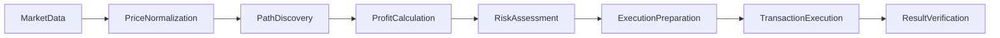

# System Patterns - Listonian Arbitrage Bot

This document outlines the key architectural patterns, design decisions, and system components that form the foundation of the Listonian Arbitrage Bot.

## System Architecture

The system follows a modular, layered architecture with clear separation of concerns:

```mermaid
flowchart TD
    subgraph User Interface
        Dashboard[Dashboard]
        CLI[Command Line Interface]
    end

    subgraph Core System
        AM[Arbitrage Manager]
        DM[DEX Manager]
        WM[Web3 Manager]
        FB[Flashbots Integration]
        FL[Flash Loan Manager]
    end

    subgraph Arbitrage Engine
        PF[Path Finder]
        BA[Balance Allocator]
        ES[Execution Strategies]
    end

    subgraph Infrastructure
        BC[Blockchain Connectors]
        MN[Monitoring & Logging]
        CF[Configuration]
    end

    User Interface --> Core System
    Core System --> Arbitrage Engine
    Core System --> Infrastructure
    Arbitrage Engine --> Infrastructure
```

### Key Components

1. **Arbitrage Manager**
   - Central coordinator for the system
   - Manages arbitrage lifecycle from detection to execution
   - Implements safety checks and validation

2. **DEX Manager**
   - Unified interface to multiple DEXs
   - Abstracts DEX-specific implementation details
   - Manages DEX discovery and registration

3. **Web3 Manager**
   - Handles blockchain interactions
   - Manages connections to RPC endpoints
   - Handles transaction signing and submission

4. **Path Finder**
   - Discovers arbitrage opportunities
   - Implements graph-based search algorithms
   - Evaluates path profitability

5. **Balance Allocator**
   - Manages capital allocation across opportunities
   - Implements risk-based position sizing
   - Tracks capital utilization and returns

6. **Execution Strategies**
   - Implements different execution approaches
   - Handles direct execution, flash loans, and Flashbots
   - Manages execution lifecycle and error handling

## Design Patterns

### 1. Factory Pattern

The system extensively uses factories to create and manage components:

```python
# Example: Flash Loan Factory
class FlashLoanFactory:
    async def get_provider(self, token_address, amount):
        # Select the best provider based on token, amount, and fees
        if self._is_aave_best(token_address, amount):
            return await self._create_aave_provider()
        elif self._is_balancer_best(token_address, amount):
            return await self._create_balancer_provider()
        # ...
```

Key factory implementations:
- `DexFactory`: Creates appropriate DEX instances
- `FlashLoanFactory`: Creates flash loan provider instances
- `StrategyFactory`: Creates execution strategy instances
- `PathFinderFactory`: Creates path finder instances

### 2. Strategy Pattern

The execution system implements the strategy pattern to support multiple execution approaches:

```python
# Base strategy interface
class ExecutionStrategy(ABC):
    @abstractmethod
    async def execute(self, opportunity, execution_params=None):
        pass

    @abstractmethod
    async def is_applicable(self, opportunity):
        pass
```

Key strategy implementations:
- `DirectExecutionStrategy`: Simple direct execution
- `FlashLoanStrategy`: Flash loan-based execution
- `MultiPathStrategy`: Multi-path arbitrage with batched execution
- `FlashbotsStrategy`: MEV-protected execution

### 3. Repository Pattern

Data access and persistence follows the repository pattern:

```python
# Example: Pool Repository
class PoolRepository:
    async def get_pools_by_dex(self, dex_name):
        # ...

    async def get_pools_by_token(self, token_address):
        # ...

    async def save_pool(self, pool):
        # ...
```

Key repositories:
- `PoolRepository`: Manages liquidity pool data
- `TokenRepository`: Manages token metadata
- `TransactionRepository`: Tracks transaction history
- `OpportunityRepository`: Records arbitrage opportunities

### 4. Observer Pattern

The system uses observers for real-time monitoring and event handling:

```python
# Example: Pool Observer
class PoolObserver:
    def __init__(self):
        self.subscribers = []

    def subscribe(self, callback):
        self.subscribers.append(callback)

    def notify(self, pool, event_type, data):
        for subscriber in self.subscribers:
            asyncio.create_task(subscriber(pool, event_type, data))
```

Key observers:
- `PriceObserver`: Monitors price changes
- `GasObserver`: Tracks gas price fluctuations
- `PoolObserver`: Monitors liquidity pool changes
- `BlockObserver`: Tracks new blocks and chain reorganizations

### 5. Adapter Pattern

The system uses adapters to integrate external systems with consistent interfaces:

```python
# Example: DEX Adapter
class UniswapV3Adapter(BaseDEXAdapter):
    async def get_price(self, token_a, token_b, amount):
        # Adapt UniswapV3-specific implementation to common interface
        # ...

    async def execute_swap(self, token_a, token_b, amount):
        # Adapt UniswapV3-specific swap to common interface
        # ...
```

Key adapters:
- `DexAdapter`: Standardizes DEX interactions
- `RpcAdapter`: Standardizes RPC endpoint interactions
- `FlashLoanAdapter`: Standardizes flash loan provider interactions
- `PriceOracleAdapter`: Standardizes price oracle interactions

### 6. Singleton Pattern

Critical system components are implemented as singletons:

```python
# Example: Configuration Manager
class ConfigurationManager:
    _instance = None

    def __new__(cls):
        if cls._instance is None:
            cls._instance = super(ConfigurationManager, cls).__new__(cls)
            cls._instance.initialize()
        return cls._instance
```

Key singletons:
- `ConfigurationManager`: Manages system configuration
- `LoggingManager`: Centralizes logging configuration
- `ConnectionManager`: Manages network connections
- `SecurityManager`: Handles security policies

### 7. Builder Pattern

Complex objects are constructed using builders:

```python
# Example: Transaction Builder
class TransactionBuilder:
    def __init__(self):
        self.reset()

    def reset(self):
        self.transaction = Transaction()

    def set_from_address(self, address):
        self.transaction.from_address = address
        return self

    def set_to_address(self, address):
        self.transaction.to_address = address
        return self

    def set_data(self, data):
        self.transaction.data = data
        return self

    # More setters...

    def build(self):
        result = self.transaction
        self.reset()
        return result
```

Key builders:
- `TransactionBuilder`: Constructs blockchain transactions
- `BundleBuilder`: Constructs Flashbots bundles
- `FlashLoanBuilder`: Constructs flash loan transactions
- `QueryBuilder`: Constructs complex queries for path finding

## Concurrency Model

The system uses a pure asyncio approach with careful attention to thread safety:

### 1. Async Task Management

```python
# Example: Task Management
class TaskManager:
    def __init__(self):
        self.running_tasks = set()
        self._lock = asyncio.Lock()

    async def start_task(self, coro):
        async with self._lock:
            task = asyncio.create_task(coro)
            self.running_tasks.add(task)
            task.add_done_callback(self._task_done)
        return task

    def _task_done(self, task):
        self.running_tasks.discard(task)
```

### 2. Resource Management

```python
# Example: Resource Context Manager
class AsyncResource:
    async def __aenter__(self):
        await self.initialize()
        return self

    async def __aexit__(self, exc_type, exc_val, exc_tb):
        await self.cleanup()
```

### 3. Lock Management

```python
# Example: Lock Management
class PriceCache:
    def __init__(self):
        self._cache = {}
        self._locks = {}

    async def get_price(self, token_pair):
        # Create lock if it doesn't exist
        if token_pair not in self._locks:
            self._locks[token_pair] = asyncio.Lock()

        # Acquire lock for this specific token pair
        async with self._locks[token_pair]:
            # Check cache and fetch price if needed
            # ...
```

## Error Handling Patterns

### 1. Typed Exceptions

```python
# Base exception
class ArbitrageError(Exception):
    """Base exception for all arbitrage errors"""
    pass

# Specific exceptions
class ValidationError(ArbitrageError):
    """Raised when validation fails"""
    pass

class ExecutionError(ArbitrageError):
    """Raised when execution fails"""
    pass

class InsufficientLiquidityError(ArbitrageError):
    """Raised when there is insufficient liquidity"""
    pass
```

### 2. Error Context Preservation

```python
# Example: Context-preserving error handling
async def execute_arbitrage(opportunity):
    try:
        return await _execute_arbitrage_internal(opportunity)
    except web3.exceptions.ContractLogicError as e:
        # Add context to the exception
        raise ExecutionError(f"Contract logic error during execution: {e}") from e
    except web3.exceptions.TransactionFailed as e:
        # Add context to the exception
        raise ExecutionError(f"Transaction failed during execution: {e}") from e
```

### 3. Retry Mechanisms

```python
# Example: Retry mechanism
async def with_retry(coro, max_retries=3, retry_delay=1.0):
    retries = 0
    last_exception = None

    while retries < max_retries:
        try:
            return await coro
        except Exception as e:
            retries += 1
            last_exception = e
            
            if retries < max_retries:
                # Exponential backoff
                delay = retry_delay * (2 ** (retries - 1))
                logging.warning(f"Retry {retries}/{max_retries} after error: {e}, waiting {delay}s")
                await asyncio.sleep(delay)
    
    # Re-raise the last exception with context
    raise RetryExhaustedError(f"Failed after {max_retries} retries") from last_exception
```

## Data Flow Patterns

### 1. Pipeline Processing



### 2. Event-Driven Architecture

```python
# Example: Event bus
class EventBus:
    def __init__(self):
        self._subscribers = defaultdict(list)
        
    def subscribe(self, event_type, callback):
        self._subscribers[event_type].append(callback)
        
    def publish(self, event_type, data):
        if event_type not in self._subscribers:
            return
            
        for callback in self._subscribers[event_type]:
            asyncio.create_task(callback(data))
```

Key events:
- `ArbitrageOpportunityDetected`
- `ExecutionStarted`
- `ExecutionCompleted`
- `ErrorOccurred`
- `PriceChanged`

### 3. Data Transformation

```python
# Example: Data transformation
class DataTransformer:
    @staticmethod
    def pool_to_graph_edge(pool):
        """Transform a Pool object into a graph edge representation"""
        return {
            "token0": pool.token0,
            "token1": pool.token1,
            "weight": -math.log(1 - pool.fee / 10000),
            "pool": pool,
            "liquidity": pool.liquidity
        }
```

## Deployment Patterns

### 1. Configuration Management

```python
# Example: Configuration loader
class ConfigLoader:
    @staticmethod
    async def load(path):
        """Load configuration from a file"""
        with open(path, 'r') as f:
            config = json.load(f)
            
        # Validate configuration
        ConfigValidator.validate(config)
        
        # Apply environment variable overrides
        config = ConfigLoader._apply_env_overrides(config)
        
        return config
```

### 2. Feature Flags

```python
# Example: Feature flag system
class FeatureFlags:
    def __init__(self, config):
        self.flags = config.get('feature_flags', {})
        self.override_flags = {}
        
    def is_enabled(self, flag_name):
        """Check if a feature flag is enabled"""
        # Override has precedence
        if flag_name in self.override_flags:
            return self.override_flags[flag_name]
            
        # Fall back to configured value
        return self.flags.get(flag_name, False)
```

### 3. Health Checks

```python
# Example: Health check system
class HealthCheck:
    @staticmethod
    async def check_all():
        """Run all health checks and return results"""
        results = {}
        
        # Check RPC connections
        results['rpc'] = await HealthCheck.check_rpc()
        
        # Check database connections
        results['database'] = await HealthCheck.check_database()
        
        # Check memory usage
        results['memory'] = await HealthCheck.check_memory()
        
        # Overall health is based on all individual checks
        results['overall'] = all(r['status'] == 'healthy' for r in results.values())
        
        return results
```

## Testing Patterns

### 1. Test Fixtures

```python
# Example: Test fixtures
@pytest.fixture
async def eth_pool():
    """Create a test ETH pool"""
    return Pool(
        address="0xTestPool",
        token0="0xTokenA",
        token1="0xTokenB",
        fee=3000,  # 0.3%
        reserves0=Decimal("100"),
        reserves1=Decimal("10000"),
        liquidity=Decimal("1000000")
    )
```

### 2. Mocked Dependencies

```python
# Example: Mocked Web3 provider
class MockWeb3Provider:
    def __init__(self):
        self.blocks = {}
        self.transactions = {}
        self.current_block = 0
        
    async def get_block_number(self):
        return self.current_block
        
    async def add_block(self, transactions=None):
        self.current_block += 1
        self.blocks[self.current_block] = {
            'number': self.current_block,
            'transactions': transactions or []
        }
        return self.current_block
```

### 3. Integration Tests

```python
# Example: Integration test
@pytest.mark.integration
async def test_uniswap_arbitrage_integration():
    """Test an end-to-end Uniswap arbitrage flow"""
    # Setup
    config = load_test_config()
    web3_client = await setup_web3_client(config)
    dex_manager = await setup_dex_manager(web3_client, config)
    
    # Execute test
    finder = PathFinder(dex_manager, web3_client)
    await finder.initialize()
    
    paths = await finder.find_paths(
        start_token="0xC02aaA39b223FE8D0A0e5C4F27eAD9083C756Cc2",  # WETH
        max_paths=5
    )
    
    # Validate results
    assert len(paths) > 0
    for path in paths:
        assert path.is_cyclic
        assert path.profit > 0
```

## Performance Optimization Patterns

### 1. Caching

```python
# Example: TTL Cache
class TTLCache:
    def __init__(self, ttl=60):
        self.cache = {}
        self.ttl = ttl
        
    async def get(self, key):
        if key not in self.cache:
            return None
            
        entry = self.cache[key]
        if time.time() > entry['expires']:
            del self.cache[key]
            return None
            
        return entry['value']
        
    async def set(self, key, value):
        self.cache[key] = {
            'value': value,
            'expires': time.time() + self.ttl
        }
```

### 2. Batch Processing

```python
# Example: Batch price fetching
class BatchPriceFetcher:
    async def fetch_prices_batch(self, token_pairs):
        """Fetch prices for multiple token pairs in a batch"""
        # Group by DEX to minimize RPC calls
        by_dex = self._group_by_dex(token_pairs)
        
        # Fetch prices in parallel
        tasks = []
        for dex, pairs in by_dex.items():
            tasks.append(self._fetch_dex_prices(dex, pairs))
            
        # Wait for all fetches to complete
        results = await asyncio.gather(*tasks)
        
        # Combine results
        return self._combine_results(results)
```

### 3. Parallel Execution

```python
# Example: Parallel market scanning
class ParallelMarketScanner:
    async def scan_all_markets(self):
        """Scan all markets in parallel"""
        # Get all DEXs
        dexes = await self.dex_manager.get_all_dexes()
        
        # Scan each DEX in parallel
        tasks = []
        for dex in dexes:
            tasks.append(self._scan_dex(dex))
            
        # Wait for all scans to complete
        return await asyncio.gather(*tasks)
```

## Security Patterns

### 1. Input Validation

```python
# Example: Parameter validation
def validate_params(params, schema):
    """Validate parameters against a schema"""
    try:
        return schema.validate(params)
    except ValidationError as e:
        raise InvalidParametersError(str(e)) from e
```

### 2. Transaction Simulation

```python
# Example: Transaction simulation
async def simulate_transaction(tx):
    """Simulate a transaction before executing it"""
    try:
        # Call with call_trace=True to get detailed execution trace
        result = await web3_client.eth.call(
            {
                'to': tx.to,
                'from': tx.from_address,
                'data': tx.data,
                'value': tx.value
            },
            'latest',
            {'call_trace': True}
        )
        
        # Analyze trace for potential issues
        issues = analyze_trace(result.trace)
        if issues:
            return (False, issues)
            
        return (True, None)
        
    except Exception as e:
        return (False, str(e))
```

### 3. Rate Limiting

```python
# Example: Rate limiter
class RateLimiter:
    def __init__(self, limit=10, window=1.0):
        self.limit = limit
        self.window = window
        self.tokens = limit
        self.last_refill = time.time()
        self.lock = asyncio.Lock()
        
    async def acquire(self):
        """Acquire a token from the rate limiter"""
        async with self.lock:
            await self._refill()
            
            if self.tokens <= 0:
                return False
                
            self.tokens -= 1
            return True
            
    async def _refill(self):
        now = time.time()
        elapsed = now - self.last_refill
        
        if elapsed > self.window:
            self.tokens = min(self.limit, self.tokens + int(elapsed / self.window * self.limit))
            self.last_refill = now