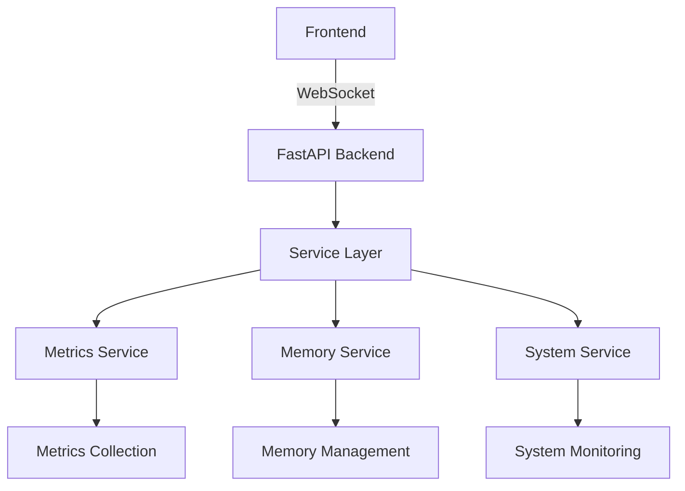

# Technical Context - Dashboard Implementation

## Architecture Overview

### Core Components


## Technical Stack

### Backend
- FastAPI: Web framework
- asyncio: Asynchronous operations
- WebSocket: Real-time communication
- Python 3.12+: Language runtime

### Frontend
- HTML/CSS: Base structure
- JavaScript: Dynamic updates
- WebSocket: Real-time data
- Chart.js: Data visualization

## Implementation Details

### Service Architecture
```python
# Service pattern for all services
class BaseService:
    def __init__(self):
        self._initialized = False
        self._lock = asyncio.Lock()
        self._subscribers = set()

    async def initialize(self):
        async with self._lock:
            if not self._initialized:
                await self._do_initialize()
                self._initialized = True

    async def shutdown(self):
        async with self._lock:
            if self._initialized:
                await self._do_shutdown()
                self._initialized = False
```

### Connection Management
```python
# WebSocket connection lifecycle
class ConnectionState:
    CONNECTING = "connecting"
    CONNECTED = "connected"
    DISCONNECTING = "disconnecting"
    DISCONNECTED = "disconnected"

class ConnectionManager:
    def __init__(self):
        self._connections = WeakKeyDictionary()
        self._task_manager = TaskManager()
        self._lock = asyncio.Lock()
```

### Task Management
```python
# Async task handling
class TaskState:
    RUNNING = "running"
    CANCELLING = "cancelling"
    CANCELLED = "cancelled"
    COMPLETED = "completed"

class TaskManager:
    def __init__(self):
        self._tasks = {}
        self._state = {}
        self._lock = asyncio.Lock()
```

## Design Decisions

### 1. Asynchronous Architecture
- **Decision**: Use pure asyncio
- **Rationale**: Better performance and resource usage
- **Impact**: All operations must be async-aware

### 2. Service Pattern
- **Decision**: Implement service-based architecture
- **Rationale**: Better separation of concerns
- **Impact**: More modular and maintainable code

### 3. WebSocket Management
- **Decision**: Use context managers
- **Rationale**: Better resource cleanup
- **Impact**: More reliable connection handling

## Performance Considerations

### Resource Management
- Use WeakKeyDictionary for connections
- Implement proper task cancellation
- Handle cleanup in context managers

### Memory Optimization
- Batch updates when possible
- Use connection pooling
- Implement TTL for cached data

### CPU Usage
- Throttle update frequency
- Batch operations where possible
- Use efficient serialization

## Error Handling

### Connection Errors
```python
async def handle_connection_error(websocket, error):
    logger.error(f"Connection error: {error}")
    await manager.disconnect(websocket)
    await cleanup_resources(websocket)
```

### Task Errors
```python
async def handle_task_error(task, error):
    logger.error(f"Task error: {error}")
    await cancel_dependent_tasks(task)
    await cleanup_task_resources(task)
```

## Monitoring Strategy

### Metrics Collection
- System resource usage
- Connection statistics
- Task performance
- Error rates

### Alerting
- Resource thresholds
- Error frequency
- Performance degradation
- Connection issues

## Testing Strategy

### Unit Tests
```python
async def test_connection_lifecycle():
    manager = ConnectionManager()
    websocket = MockWebSocket()
    
    await manager.connect(websocket)
    assert manager.is_active(websocket)
    
    await manager.disconnect(websocket)
    assert not manager.is_active(websocket)
```

### Integration Tests
```python
async def test_metrics_flow():
    service = MetricsService()
    await service.initialize()
    
    metrics = await service.get_metrics()
    assert metrics["cpu_usage"] is not None
    assert metrics["memory_usage"] is not None
```

## Security Considerations

### Connection Security
- Validate connection states
- Implement timeouts
- Handle disconnections gracefully

### Resource Protection
- Limit connection count
- Implement rate limiting
- Monitor resource usage

## Deployment Notes

### Requirements
- Python 3.12+
- FastAPI
- asyncio
- WebSocket support

### Configuration
```python
class Config:
    MAX_CONNECTIONS = 100
    UPDATE_INTERVAL = 1.0  # seconds
    CLEANUP_INTERVAL = 60.0  # seconds
    RESOURCE_LIMITS = {
        "cpu": 75.0,  # percent
        "memory": 80.0  # percent
    }
```

## Development Guidelines

### Code Style
- Use type hints
- Follow asyncio patterns
- Document all functions
- Handle all errors

### Best Practices
- Test thoroughly
- Log appropriately
- Clean up resources
- Monitor performance

## Future Improvements

### Short-term
- Implement connection state machine
- Add comprehensive monitoring
- Improve error handling
- Optimize performance

### Long-term
- Scale connection handling
- Add advanced features
- Improve UI/UX
- Enhance monitoring

## Technical Debt

### Current Issues
- WebSocket cleanup
- Task cancellation
- Resource management
- Error handling

### Planned Solutions
- Implement proper state machine
- Add robust task management
- Improve resource cleanup
- Enhance error handling

## Notes for Developers

### Key Files
- websocket.py: Connection handling
- service_manager.py: Service coordination
- metrics_service.py: Metrics collection
- app.py: Main application

### Important Patterns
- Use async/await consistently
- Implement proper cleanup
- Handle all edge cases
- Log appropriately

### Development Flow
1. Read documentation
2. Understand architecture
3. Follow patterns
4. Test thoroughly
5. Document changes