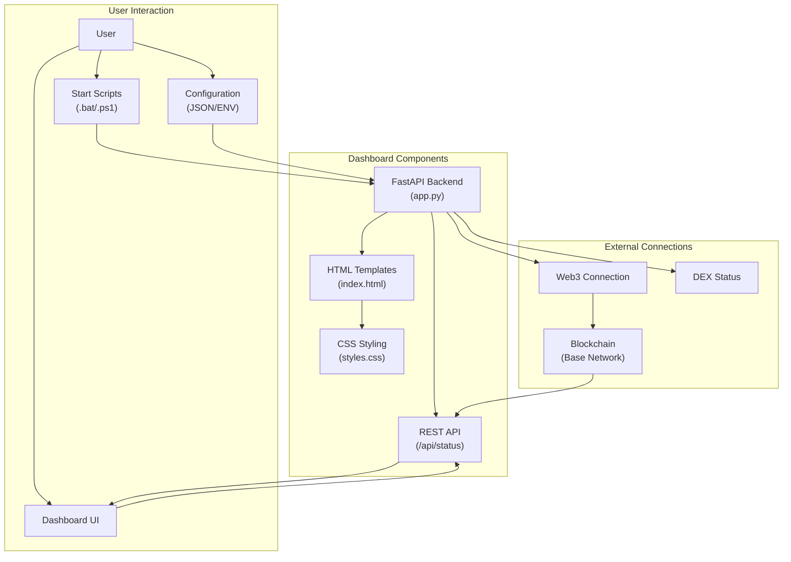

# Arbitrage Bot Project File Structure

This document provides a visual representation of the project's file structure and the relationships between components.

## Directory Structure

## Component Relationships

## Data Flow

## File Descriptions

### Entry Points
- `start_new_dashboard.bat` / `start_new_dashboard.ps1`: Root-level scripts to launch the dashboard
- `new_dashboard/start_dashboard.bat` / `new_dashboard/start_dashboard.ps1`: Internal scripts for dashboard startup

### Dashboard Core
- `new_dashboard/app.py`: Main FastAPI application that processes requests and serves the dashboard
- `new_dashboard/dashboard_requirements.txt`: Lists all Python dependencies for the dashboard
- `new_dashboard/README.md`: Documentation for the dashboard setup and usage

### UI Components
- `new_dashboard/templates/index.html`: HTML template for the dashboard UI
- `new_dashboard/static/css/styles.css`: CSS styling for the dashboard

### Configuration
- `configs/config.json`: Main configuration file for the arbitrage system
- `configs/production.json`: Production-specific configuration

### Old Dashboard (Being Replaced)
- `minimal_dashboard.py`: Old Flask-based dashboard implementation
- `start_dashboard.bat` / `start_dashboard.ps1`: Old dashboard startup scripts

## Implementation Notes

1. The new dashboard is a standalone component that reads from the same configuration files as the main arbitrage system.

2. It connects directly to the blockchain using Web3.py rather than relying on the main system's components.

3. This approach increases reliability by reducing dependencies and simplifying the architecture.

4. Data is refreshed automatically every 30 seconds, with an option for manual refresh.

5. The modular design allows for easier maintenance and extension.