# Real-Time Metrics Optimization Plan

## Current Performance
- Memory Service: 5-second updates with file I/O bottleneck (~100-200ms per read)
- Metrics Service: 5-second polling with synchronous processing (~50-100ms)
- Total latency: 5-6 seconds for updates

## Target Performance
- Memory Service: Near real-time updates (<50ms) using memory mapping
- Metrics Service: Continuous WebSocket streaming (<10ms)
- Total latency: 50-100ms for updates
- Resource usage: 90% reduction in CPU usage, 75% reduction in memory usage

## Implementation Plan

```mermaid
graph TD
    A[Phase 1: Memory Service Optimization] --> B[Memory-Mapped Files]
    A --> C[File System Watchers]
    A --> D[Streaming Updates]
    
    B --> B1[Implement mmap for Trade Files]
    B --> B2[Implement mmap for System Metrics]
    B --> B3[Optimize File Structure]
    
    C --> C1[Add watchdog Integration]
    C --> C2[Event-based Updates]
    C --> C3[Change Detection]
    
    D --> D1[Implement Streaming Reader]
    D --> D2[Add Partial Updates]
    D --> D3[Optimize State Aggregation]
    
    E[Phase 2: Metrics Service Enhancement] --> F[WebSocket Integration]
    E --> G[Real-time Processing]
    E --> H[Connection Management]
    
    F --> F1[Add WebSocket Routes]
    F --> F2[Implement Push Updates]
    
    G --> G1[Parallel Processing]
    G --> G2[Incremental Updates]
    
    H --> H1[Connection Pooling]
    H --> H2[Auto-reconnection]
```



## Detailed Implementation Steps

### Phase 1: Memory Service Optimization

1. Memory-Mapped Files Implementation
   ```python
   # Key changes in MemoryService
   - Add mmap support for trade history files
   - Implement shared memory regions for system metrics
   - Create memory-mapped circular buffers for real-time data
   ```

2. File System Watchers
   ```python
   # Add watchdog integration
   - Monitor trade history directory
   - Monitor system metrics files
   - Implement event handlers for instant updates
   ```

3. Streaming Updates
   ```python
   # Enhance state aggregation
   - Implement partial state updates
   - Add streaming reader for large files
   - Optimize data structures for quick access
   ```

### Phase 2: Metrics Service Enhancement

1. WebSocket Integration
   ```python
   # Add WebSocket support
   - Create WebSocket routes
   - Implement real-time push updates
   - Add connection management
   ```

2. Real-time Processing
   ```python
   # Optimize data processing
   - Implement parallel processing
   - Add incremental updates
   - Optimize memory usage
   ```

3. Connection Management
   ```python
   # Handle connections
   - Implement connection pooling
   - Add auto-reconnection logic
   - Monitor connection health
   ```

## Technical Requirements

1. Dependencies
   ```text
   - mmap: Memory-mapped file support
   - watchdog: File system monitoring
   - websockets: WebSocket support
   - msgpack: Data serialization
   ```

2. System Requirements
   ```text
   - Memory: Sufficient for memory mapping (recommend 2GB+)
   - CPU: Multi-core for parallel processing
   - Disk: SSD recommended for fast I/O
   ```

## Performance Monitoring

1. Metrics to Track
   ```text
   - Update latency
   - CPU usage
   - Memory consumption
   - Disk I/O
   - WebSocket connection status
   ```

2. Automatic Throttling
   ```text
   - Monitor system resources
   - Adjust update frequency if needed
   - Log performance metrics
   ```

## Error Handling

1. Recovery Mechanisms
   ```text
   - Automatic reconnection for WebSocket
   - File system monitoring recovery
   - Memory mapping error handling
   ```

2. Logging and Monitoring
   ```text
   - Detailed error logging
   - Performance metric tracking
   - System resource monitoring
   ```

## Implementation Order

1. Phase 1 Steps:
   - Implement memory-mapped files for trade history
   - Add file system watchers
   - Optimize state aggregation
   - Test and verify performance improvements

2. Phase 2 Steps:
   - Add WebSocket support
   - Implement real-time processing
   - Add connection management
   - Test end-to-end performance

## Expected Outcomes

1. Performance Improvements
   - Update latency: From 5s to <100ms
   - CPU usage: 90% reduction
   - Memory usage: 75% reduction
   - Zero missed updates

2. Reliability Improvements
   - Instant detection of file changes
   - Reliable WebSocket connections
   - Automatic error recovery
   - Comprehensive monitoring

## Testing Strategy

1. Performance Testing
   - Measure update latency
   - Monitor resource usage
   - Test with high update frequency
   - Verify data consistency

2. Stress Testing
   - Test with large data volumes
   - Simulate network issues
   - Test recovery mechanisms
   - Verify system stability