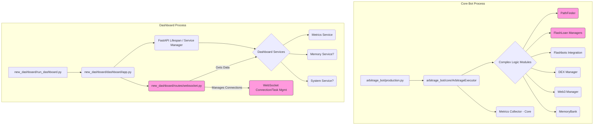

# Refactoring Plan - Listonian Arbitrage Bot

**Date Created:** 2025-04-10 06:58 AM (America/Indianapolis, UTC-4:00)

**Goal:** Improve codebase stability, maintainability, and clarity through targeted refactoring, addressing known issues and enhancing documentation.

**Diagram: High-Level Components & Focus Areas**

**Refactoring Steps (Prioritized):**

1.  **Stabilize Dashboard WebSockets (Highest Priority):**
    *   **Action:** Analyze and refactor `new_dashboard/routes/websocket.py` and any related connection/task management classes (likely within `new_dashboard/services` or `new_dashboard/core`).
    *   **Goal:** Implement robust connection state tracking, ensure proper async task cancellation *before* connection closure, fix resource leaks, and add detailed logging for the connection lifecycle. Address the "sending after close" errors.
    *   **Rationale:** This directly tackles the most critical known stability issue mentioned in the documentation. A stable monitoring system is essential.

2.  **Consolidate Core Logic Components:**
    *   **Action:** Review the multiple Flash Loan manager implementations (`flash_loan_manager.py`, `flash_loan_manager_async.py`, `unified_flash_loan_manager.py`) in `arbitrage_bot/core`.
    *   **Goal:** Consolidate into a single, clear, and well-tested `AsyncFlashLoanManager`, removing redundant code. Ensure it integrates correctly with the `ArbitrageExecutor`.
    *   **Rationale:** Reduces code duplication and confusion, improving maintainability.

3.  **Clarify Code Structure & Responsibilities:**
    *   **Action:** Investigate the purpose of `arbitrage_bot/dashboard` and `arbitrage_bot/core/websocket.py`.
    *   **Goal:** Determine if these are redundant or serve a specific purpose (e.g., bot-to-bot communication?). If redundant, remove them. If necessary, clearly document their role distinctly from `new_dashboard`. Ensure clear boundaries between the `arbitrage_bot` core logic and the `new_dashboard` presentation/monitoring layer.
    *   **Rationale:** Removes ambiguity and potential sources of conflicting logic.

4.  **Code Quality & Maintainability Pass:**
    *   **Action:** Apply automated tooling (e.g., Black for formatting, Flake8/Pylint for linting, MyPy for type checking) across the entire codebase (`arbitrage_bot` and `new_dashboard`).
    *   **Goal:** Enforce consistent code style, identify potential bugs/anti-patterns, and improve type safety.
    *   **Action:** Review core modules (`PathFinder`, `ArbitrageExecutor`, `DEXManager`) for clarity, adding docstrings and comments where needed. Break down overly large functions/methods.
    *   **Goal:** Improve readability and ease of future modifications.
    *   **Rationale:** General "tune-up" addressing maintainability debt.

5.  **Add Directory Index Files (README.md):**
    *   **Action:** Create a `README.md` in key directories (e.g., `arbitrage_bot/core`, `arbitrage_bot/dex`, `new_dashboard/core`, `new_dashboard/dashboard`, `new_dashboard/routes`, `new_dashboard/services`, etc.) explaining the purpose of the directory and summarizing the files within it.
    *   **Goal:** Improve code navigation and understanding for developers.
    *   **Rationale:** Enhances documentation and maintainability.

6.  **Review & Simplify Complex Features (Optional - Based on Discussion):**
    *   **Action (If desired):** Analyze `arbitrage_bot/core/path_finder.py`. Consider replacing the Bellman-Ford implementation with a simpler approach (e.g., limiting path depth to 3) if the complexity outweighs the current benefits.
    *   **Action (If desired):** Review the metrics gathered and broadcasted by the dashboard services and `websocket.py`. Reduce the scope if the current list is too extensive and contributes to performance/stability issues.
    *   **Rationale:** Reduces inherent complexity in specific high-impact areas, but involves feature trade-offs.

7.  **Enhance Testing:**
    *   **Action:** Add specific integration tests for WebSocket connection/disconnection scenarios, simulating abrupt closures and multiple clients.
    *   **Action:** Add unit tests for the consolidated Flash Loan manager.
    *   **Action:** Increase test coverage for core arbitrage logic and error handling paths.
    *   **Rationale:** Ensures stability and correctness after refactoring.